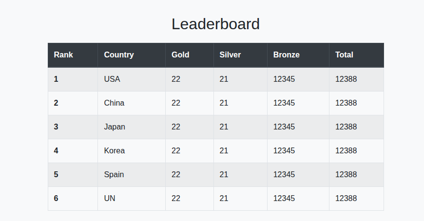
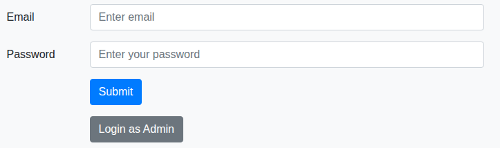
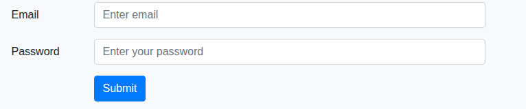
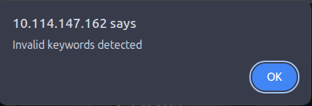
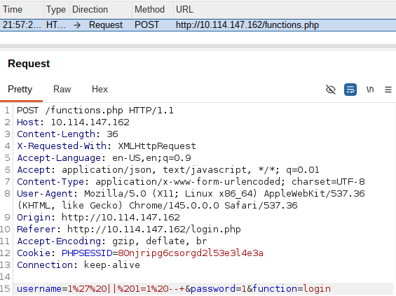
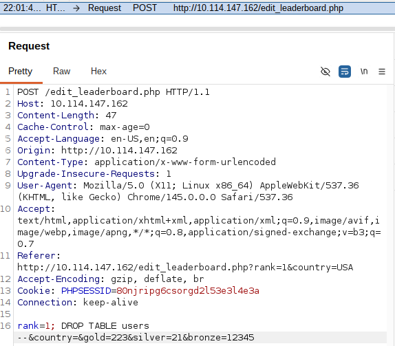
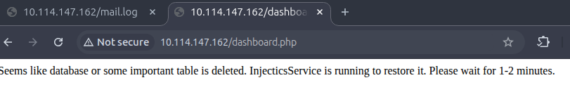
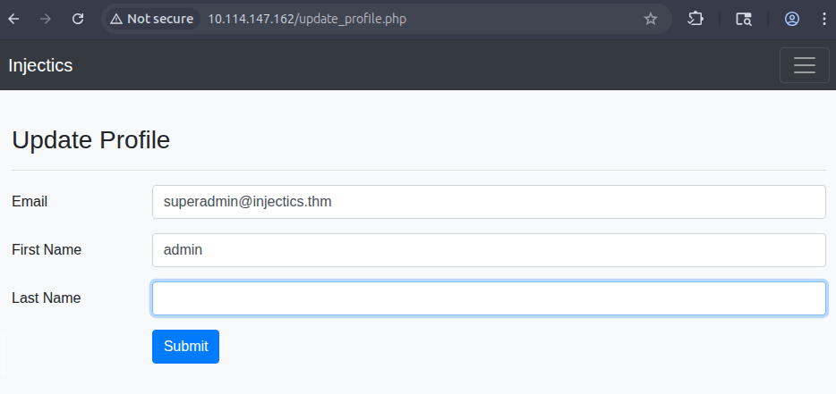

# Injectics

> Эксплуатация SQL-инъекции и механизма автоматического восстановления БД для получения административного доступа, после чего SSTI в Twig была преобразована в выполнение системных команд.

## Общая информация

| Параметр | Значение |
| --- | --- |
| Платформа | TryHackMe |
| ОС | Ubuntu Linux |
| Категория | Web |
| Основные техники | Client-side filter bypass, SQL injection, database state manipulation, Twig SSTI, command execution |

## Краткое резюме

Публичный `/mail.log` раскрыл внутренний механизм `Injectics`: при удалении или повреждении таблицы `users` служба раз в минуту восстанавливает её и добавляет стандартные административные учётные записи. Основная форма входа использовала только клиентский JavaScript-фильтр, который был обойдён путём модификации HTTP-запроса в `Burp Suite`, что подтвердило SQL-инъекцию.

Через уязвимый запрос таблица `users` была удалена, после чего служба восстановила её вместе с административной учётной записью. В профиле администратора была обнаружена SSTI: значение `{{ 1 + 1 }}` вычислялось сервером. Вызов `passthru` через Twig-фильтр `sort` позволил выполнить команды и прочитать второй флаг.

## Разведка

### Сканирование портов и служб

Первым этапом было выполнено полное сканирование TCP-портов целевого узла `TARGET_IP` с определением запущенных служб.

```text
Nmap scan report for TARGET_IP
Host is up (0.00086s latency).
Not shown: 65533 closed tcp ports (reset)

PORT   STATE SERVICE VERSION
22/tcp open  ssh     OpenSSH 8.2p1 Ubuntu 4ubuntu0.11
80/tcp open  http    Apache httpd 2.4.41 ((Ubuntu))

Service Info: OS: Linux; CPE: cpe:/o:linux:linux_kernel
Network Distance: 1 hop
```

На целевой системе были обнаружены две доступные службы:

- `22/tcp` — OpenSSH 8.2p1;
- `80/tcp` — Apache HTTP Server 2.4.41.

На данном этапе признаков, указывающих на возможность непосредственной эксплуатации SSH, обнаружено не было. Поэтому дальнейшее исследование было сосредоточено на веб-приложении, размещённом на порту `80/tcp`.

### Перечисление веб-ресурсов

Для поиска доступных файлов и директорий использовалась утилита `gobuster`:

```bash
gobuster dir \
  -u "http://TARGET_IP:80" \
  -w /usr/share/wordlists/dirbuster/directory-list-lowercase-2.3-medium.txt \
  -x html,php,js,log
```

Наиболее значимые результаты сканирования:

```text
/index.php          (Status: 200)
/login.php          (Status: 200)
/mail.log           (Status: 200)
/flags              (Status: 301)
/script.js          (Status: 200)
/dashboard.php      (Status: 302)
/functions.php      (Status: 200)
/conn.php           (Status: 200)
/phpmyadmin         (Status: 301)
/server-status      (Status: 403)
```

Особый интерес представлял ресурс `/mail.log`, доступный без аутентификации. В нём находилось внутреннее сообщение разработчика:

```text
From: dev@injectics.thm
To: superadmin@injectics.thm
Subject: Update before holidays

Hey,

Before heading off on holidays, I wanted to update you on the latest changes to the website. I have implemented several enhancements and enabled a special service called Injectics. This service continuously monitors the database to ensure it remains in a stable state.

To add an extra layer of safety, I have configured the service to automatically insert default credentials into the `users` table if it is ever deleted or becomes corrupted. This ensures that we always have a way to access the system and perform necessary maintenance. I have scheduled the service to run every minute.

Here are the default credentials that will be added:

| Email                    | Password             |
|--------------------------|----------------------|
| superadmin@injectics.thm | ******************** |
| dev@injectics.thm        | **************       |

Please let me know if there are any further updates or changes needed.

Best regards,
Dev Team
```

Из сообщения следовало, что специальная служба `Injectics` раз в минуту проверяет состояние базы данных. Если таблица `users` будет удалена или повреждена, служба автоматически восстановит её и добавит стандартные учётные записи, включая пользователя с административными привилегиями.

Эта информация определила дальнейший вектор атаки: требовалось найти способ повлиять на содержимое базы данных и инициировать восстановление таблицы пользователей.

### Анализ веб-приложения

Исследование приложения выполнялось с помощью браузера и прокси-модуля Burp Suite.

На главной странице располагались приветственный блок и таблица результатов.



Ресурс `/login.php` содержал стандартную форму аутентификации.



Кнопка **Login as Admin** перенаправляла пользователя на `/adminLogin007.php`, где находилась отдельная форма входа для администратора.



Для первичной проверки обеих форм на SQL-инъекцию в поле `Email` была введена тестовая полезная нагрузка:

```sql
' OR 1=1
```

В поле `Password` использовалось произвольное значение.

#### Анализ основной формы аутентификации

При отправке тестовой SQL-нагрузки через форму `/login.php` приложение отобразило сообщение об ошибке.



Анализ исходного HTML-кода показал, что страница подключает JavaScript-файл `/script.js`. В нём был реализован примитивный фильтр пользовательского ввода:

```javascript
const invalidKeywords = ['or', 'and', 'union', 'select', '"', "'"];
```

Фильтрация выполнялась исключительно на стороне клиента. Следовательно, она не обеспечивала реальной защиты серверной части: проверку можно было обойти, изменив HTTP-запрос после его формирования браузером.

Для этого в форму были введены значения, проходящие клиентскую проверку. Затем запрос был перехвачен через Burp Suite Proxy, а его параметры были заменены на SQL-нагрузку перед отправкой серверу.



Таким образом удалось обойти JavaScript-фильтр и подтвердить наличие SQL-инъекции на серверной стороне.

## Анализ и эксплуатация

### Доступ к панели управления

После обхода механизма аутентификации был получен доступ к панели `/dashboard.php`. На ней отображалась таблица результатов, содержимое которой можно было изменять через отдельную форму.

Функциональность редактирования представляла особый интерес, поскольку отправляемые значения обрабатывались сервером и сохранялись в базе данных.

### Удаление таблицы пользователей

Для проверки формы редактирования в неё сначала были введены корректные произвольные значения. Отправляемый запрос был перехвачен в Burp Suite, после чего один из параметров был заменён на SQL-выражение, приводящее к удалению таблицы `users`.



После отправки изменённого запроса приложение вернуло сообщение об ошибке базы данных.



Такое поведение соответствовало ожидаемому результату: приложение больше не могло обратиться к удалённой таблице пользователей.

Согласно информации из `/mail.log`, служба `Injectics` должна была обнаружить повреждение базы данных и в течение следующего цикла проверки автоматически восстановить таблицу `users` вместе со стандартными учётными записями.

После восстановления таблицы стало возможно выполнить вход через `/adminLogin007.php` с использованием административной учётной записи. В результате был получен первый флаг.

### Обнаружение SSTI

В меню профиля административной панели находилась страница `/update_profile.php`, позволяющая изменять данные текущего пользователя.



Чтобы проверить обработку введённых значений шаблонизатором, в поле **First Name** была помещена арифметическая SSTI-нагрузка:

```twig
{{ 1 + 1 }}
```

После сохранения изменений и перехода на `/dashboard.php` имя администратора отобразилось как `2`, а не как исходная строка `{{ 1 + 1 }}`.

Это подтвердило, что введённое значение интерпретируется серверным шаблонизатором. Следовательно, приложение уязвимо к **Server-Side Template Injection**.

### Выполнение команд на сервере

Согласно условию задания, второй флаг находился в директории:

```text
/var/www/html/flags
```

Для перехода от SSTI к выполнению системных команд использовалась техника вызова PHP-функции `passthru` через фильтр Twig `sort`.

Сначала было получено содержимое каталога с флагами:

```twig
{{ ['ls /var/www/html/flags', ''] | sort('passthru') }}
```

Вывод команды отображался на странице `/dashboard.php`. После определения имени файла его содержимое было прочитано следующей нагрузкой:

```twig
{{ ['cat /var/www/html/flags/FILE_NAME', ''] | sort('passthru') }}
```

После сохранения значения в профиле и повторного открытия `/dashboard.php` приложение выполнило команду на сервере и отобразило содержимое файла со вторым флагом.

Использованный подход к эксплуатации Twig SSTI описан в репозитории [PayloadsAllTheThings](https://github.com/swisskyrepo/PayloadsAllTheThings/blob/master/Server%20Side%20Template%20Injection/PHP.md#twig---code-execution).

## Итог

В ходе прохождения комнаты была построена следующая цепочка атаки:

```text
Открытый mail.log
        ↓
Информация о механизме восстановления БД
        ↓
Обход клиентской фильтрации
        ↓
SQL-инъекция
        ↓
Удаление таблицы users
        ↓
Автоматическое восстановление учётных записей
        ↓
Доступ к административной панели
        ↓
SSTI в профиле пользователя
        ↓
Удалённое выполнение команд
        ↓
Получение второго флага
```

Ключевыми проблемами безопасности приложения являлись:

- раскрытие внутренней служебной информации через публично доступный файл `/mail.log`;
- использование клиентской JavaScript-фильтрации в качестве механизма защиты;
- отсутствие безопасной параметризации SQL-запросов;
- возможность изменения критичных данных базы через уязвимый запрос;
- обработка пользовательского ввода как шаблонного кода;
- возможность перехода от SSTI к выполнению произвольных команд операционной системы.

Комбинация этих недостатков позволила последовательно получить административный доступ и выполнить команды на целевой системе.

## Ключевые выводы

- Клиентская фильтрация не является механизмом безопасности, поскольку HTTP-запрос можно изменить до отправки серверу.
- Служебные логи не должны раскрывать детали механизмов восстановления и стандартные учётные записи.
- Автоматическое восстановление базы с известными стандартными credentials создаёт предсказуемое состояние, которое можно намеренно инициировать через SQL-инъекцию.
- Если пользовательский ввод попадает в Twig как шаблон, SSTI может быть эскалирована до выполнения системных команд.

## Использованные инструменты

| Инструмент | Использование |
| --- | --- |
| `Nmap` | Сканирование сетевых служб |
| `Gobuster` | Перечисление веб-ресурсов |
| `Burp Suite` | Обход клиентского фильтра и модификация SQL-запросов |

## Дополнительные материалы

- Twig SSTI payloads: https://github.com/swisskyrepo/PayloadsAllTheThings/blob/master/Server%20Side%20Template%20Injection/PHP.md#twig---code-execution

## Примечание

> Материал подготовлен в образовательных целях. Все действия выполнялись в контролируемой лабораторной среде TryHackMe.
