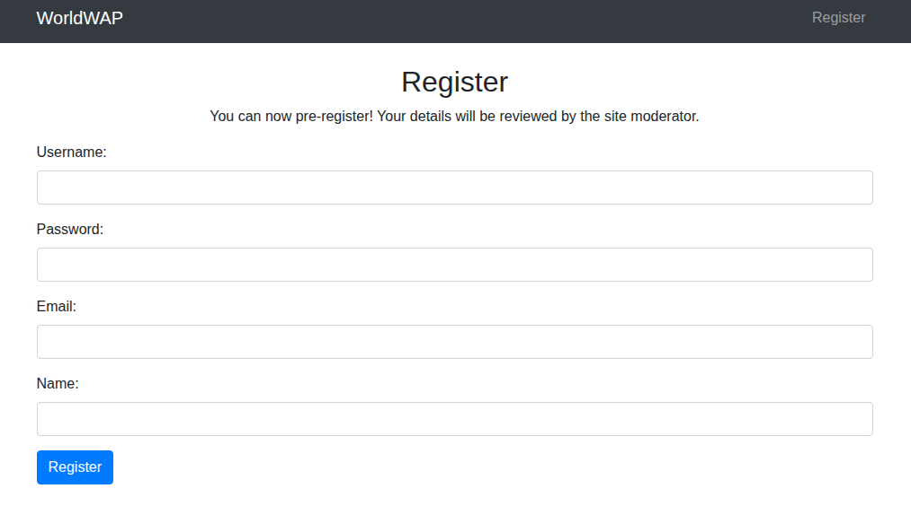
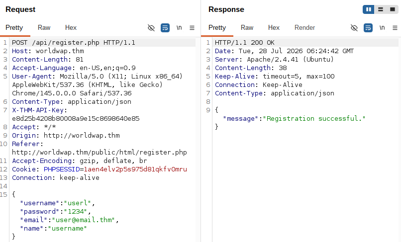
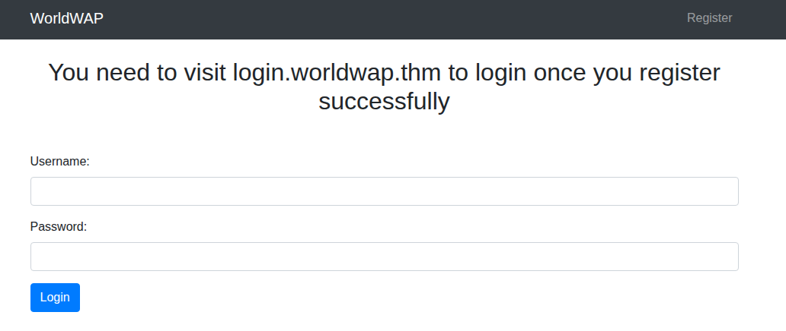
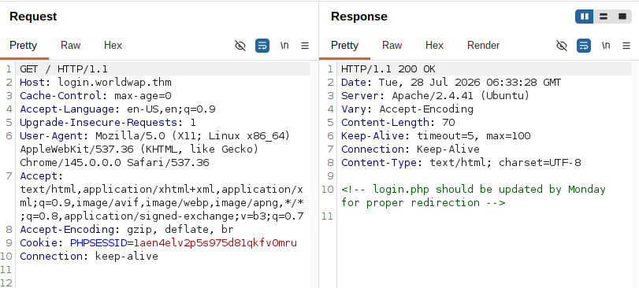
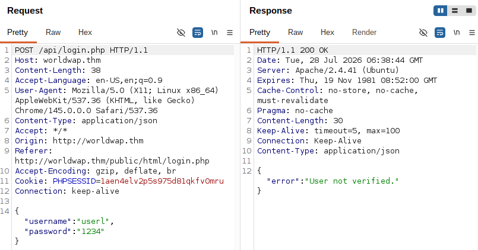
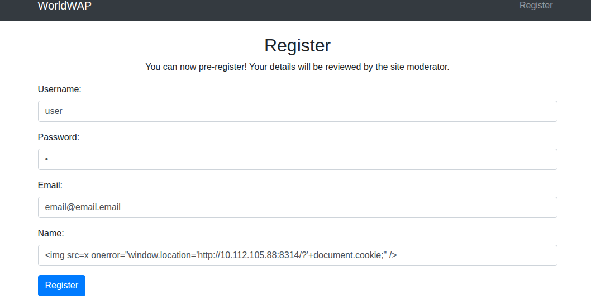
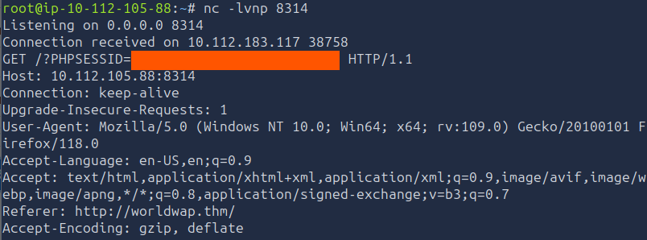
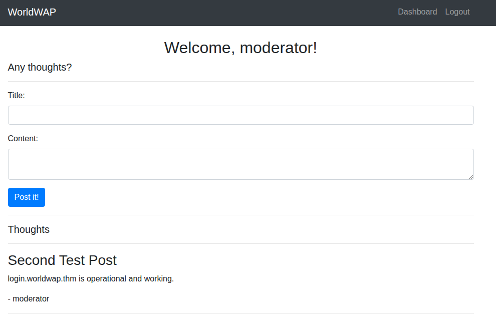

# What's Your Name?

> Исследование веб-приложения с ручной модерацией регистраций, в котором хранимая XSS позволила перехватить сессию модератора, а открытый служебный файл раскрыл административные учётные данные.

## Общая информация

| Параметр | Значение |
| --- | --- |
| Платформа | TryHackMe |
| ОС | Ubuntu Linux |
| Категория | Web |
| Основные техники | Stored XSS, кража cookie, перехват сессии, раскрытие учётных данных |

## Краткое резюме

Первичная разведка выявила HTTP-сервисы на `80/tcp` и `8081/tcp`. Перечисление веб-ресурсов и анализ клиентского JavaScript показали механизм ручного одобрения новых пользователей. Хранимая XSS в поле `Name` выполнилась в контексте модератора, что позволило получить его cookie и захватить привилегированную сессию. Дополнительно доступный файл `admin.py` раскрыл данные административной учётной записи, которые были использованы для получения второго флага.

Цепочка прохождения: `разведка → анализ клиентской логики → stored XSS → кража cookie → session hijacking → доступ модератора → раскрытые credentials → административный доступ`.

## Разведка

### Первичное сканирование TCP-портов

На начальном этапе было выполнено TCP-сканирование всех портов целевой машины с помощью утилиты `nmap`:

```bash
nmap -sV -n -p- TARGET_IP
```

В результате были обнаружены следующие открытые порты и сервисы:

```text
Nmap scan report for TARGET_IP
Host is up (0.00034s latency).
Not shown: 65532 closed tcp ports (reset)
PORT     STATE SERVICE VERSION
22/tcp   open  ssh     OpenSSH 8.2p1 Ubuntu 4ubuntu0.3 (Ubuntu Linux; protocol 2.0)
80/tcp   open  http    Apache httpd 2.4.41 ((Ubuntu))
8081/tcp open  http    Apache httpd 2.4.41 ((Ubuntu))
Service Info: OS: Linux; CPE: cpe:/o:linux:linux_kernel
```

| PORT     | SERVICE |
| -------- | ------- |
| 22/tcp   | SSH     |
| 80/tcp   | HTTP    |
| 8081/tcp | HTTP    |

#### Поиск директорий

Для поиска доступных директорий и файлов была использована утилита `gobuster`:

```bash
gobuster dir -u TARGET_IP:80 -w '/usr/share/wordlists/dirbuster/directory-list-lowercase-2.3-medium.txt' -x php,js,html,py,txt,log,bak,old,conf,zip,sql
```

```text
/index.php            (Status: 200) [Size: 70]
/login.php            (Status: 200) [Size: 3108]
/profile.php          (Status: 302) [Size: 0] []] login.php]
/clear.php            (Status: 200) [Size: 4]
/admin.py             (Status: 200) [Size: 5537]
/assets               (Status: 301) [Size: 317]
/chat.php             (Status: 302) [Size: 0] []] login.php]
/test.py              (Status: 200) [Size: 687]
/db.php               (Status: 200) [Size: 0]
/javascript           (Status: 301) [Size: 321] [http://TARGET_IP/javascript/]
/logout.php           (Status: 302) [Size: 0] []] login.php]
/setup.php            (Status: 200) [Size: 149]
/block.php            (Status: 200) [Size: 15]
/logs.txt             (Status: 200) [Size: 0]
/phpmyadmin           (Status: 301) [Size: 321]
```

Аналогичное сканирование было выполнено для порта `8081`:

```bash
gobuster dir -u TARGET_IP:8081 -w '/usr/share/wordlists/dirbuster/directory-list-lowercase-2.3-medium.txt' -x php,js,html,py,txt,log,bak,old,conf,zip,sql
```

```text
/.html                (Status: 403) [Size: 281]
/.php                 (Status: 403) [Size: 281]
/index.php            (Status: 200) [Size: 70]
/login.php            (Status: 200) [Size: 3108]
/profile.php          (Status: 302) [Size: 0] []] login.php]
/clear.php            (Status: 200) [Size: 4]
/admin.py             (Status: 200) [Size: 5537]
/assets               (Status: 301) [Size: 324]
/chat.php             (Status: 302) [Size: 0] []] login.php]
/test.py              (Status: 200) [Size: 687]
/db.php               (Status: 200) [Size: 0]
/javascript           (Status: 301) [Size: 328]
/logout.php           (Status: 302) [Size: 0] []] login.php]
/setup.php            (Status: 200) [Size: 149]
/block.php            (Status: 200) [Size: 15]
/logs.txt             (Status: 200) [Size: 0]
/phpmyadmin           (Status: 301) [Size: 328]
```

Обнаруженные `.php`-файлы не содержали информации, представляющей интерес для дальнейшего исследования. При этом в файле `admin.py` были обнаружены данные учётной записи администратора.

### Анализ веб-приложения

Анализ веб-приложения и взаимодействие с ним выполнялись с помощью `Burp Suite` и встроенного браузера.

На главной странице приложения располагались текстовый блок, изображение и кнопка перехода на страницу регистрации.


Анализ исходного кода страницы не выявил очевидных уязвимостей. Из особенностей разметки была отмечена относительная ссылка на изображение:

```html

```

На странице регистрации располагалась форма создания учётной записи.



На странице указывалось, что регистрация нового пользователя должна быть одобрена модератором. Это позволило предположить возможный вектор атаки, связанный с внедрением XSS-payload и последующим получением cookie модератора.

Назначение поля `Name` на данном этапе оставалось неочевидным. С учётом механизма модерации было выдвинуто предположение, что данное поле может быть использовано для проверки возможности внедрения XSS-payload.

В ходе анализа исходного кода было установлено, что при нажатии кнопки `Register` вызывается функция `register()` из файла `../js/register.js`.

Файл `register.js` содержал функцию `register()` и формирование POST-запроса к ресурсу `../../api/register.php`:

```js
...
fetch('../../api/register.php', {
      method: 'POST',
      headers: {
        'Content-Type': 'application/json',
        'X-THM-API-Key': 'XXXXXXXXXXXXXXXXXXXXXXXX'
      },
      body: JSON.stringify({
        username: username,
        password: password,
        email: email,
        name: name,
      }),
...
```

После определения расположения `register.js` было продолжено исследование связанных директорий. В результате были обнаружены файлы `admin.js`, `dashboard.js`, `login.js`, `logout.js` и `mod.js`.

Данные JavaScript-файлы реализовывали основной функционал веб-приложения и формировали HTTP-запросы с данными в формате JSON. Несколько фрагментов представляли дополнительный интерес:

```js
dashboard.js
postDiv.innerHTML = `<h3>${post.title}</h3><p>${post.content}</p><p>- ${post.username}</p><hr>`;
```

```js
login.js
window.location.href = data.role == 'moderator' ? 'admin.php' : 'dashboard.php';
```

```js
mod.js
actionLink.href = `../../../api/mod_update.php?userId=${user.id}`; // Assuming 'id' is the identifier in your user data
```

## Получение первоначального доступа

### Регистрация аккаунта

Для дальнейшего исследования была создана учётная запись со следующими данными:

```text
Username: userl
Password: 1234
E-mail: user@email.thm
Name: username
```

После нажатия кнопки `Register` запрос к ресурсу `/api/register.php` и ответ сервера были перехвачены с помощью модуля `Proxy` в `Burp Suite`:



После завершения регистрации приложение перенаправило пользователя на ресурс `/public/html/login.php`.



При анализе HTTP-запросов к `login.worldwap.thm` был обнаружен комментарий разработчика, указывающий, что ресурс `login.php` должен быть обновлён до понедельника.



Исходный код главной страницы `login.worldwap.thm/` при этом был пуст.

При попытке авторизации через `login.php` сервер возвращал JSON-ответ, содержащий свойство `error`:



Логика обработки ответа была определена на основании содержимого `login.js`:

```js
.then(response => response.json())
    .then(data => {
      if (data.error) {
        alert(data.error);
      } else {
        // Redirect to the dashboard or the admin page based on the role
        window.location.href = data.role == 'moderator' ? 'admin.php' : 'dashboard.php';
      }
```

Если в ответе присутствовало поле `error`, скрипт отображал сообщение об ошибке. При его отсутствии дальнейшее перенаправление зависело от значения поля `role`: значение `moderator` приводило к переходу на `admin.php`, а любое другое значение — на `dashboard.php`.

Для проверки этой логики тело ответа было последовательно изменено на:

```json
{"role": "user"}
```

и:

```json
{"role": "admin"}
```

Оба значения отличались от `moderator`, поэтому клиентский скрипт выполнял переход на `dashboard.php`. Однако непосредственный доступ к защищённым ресурсам по-прежнему завершался ответом `403 Forbidden`, что указывало на наличие серверной проверки доступа.

### Эксплуатация XSS и кража cookie

Для приёма cookie на машине атакующего был запущен `netcat`:

```bash
nc -lvnp PORT
```

На странице регистрации в поле `Name` был введён следующий XSS-payload:

```html

```

Payload: Farid Hajiyev.



После обработки регистрации модератором внедрённый код выполнился в контексте его сессии, в результате чего были получены сессионные cookie.

Полученные cookie были использованы для подмены текущей сессии в веб-приложении, включая `login.worldwap.thm`.



### Получение доступа и первого флага

После замены собственных cookie на cookie модератора стал доступен ресурс `dashboard.php`.



На этой странице было установлено, что `login.worldwap.thm` функционирует. Переход на `login.worldwap.thm/login` привёл на страницу социальной сети, где находился первый флаг.


### Повышение привилегий и получение второго флага

На этапе разведки в файле `admin.py` были обнаружены данные учётной записи администратора. Для получения более высоких привилегий текущая сессия модератора была завершена, после чего была выполнена авторизация под учётной записью администратора через `login.worldwap.thm`.

После успешной авторизации был получен второй флаг.


## Итог

В ходе выполнения задания была последовательно исследована поверхность атаки веб-приложения: определены доступные сетевые сервисы, обнаружены скрытые ресурсы и проанализирована клиентская логика приложения.

Ключевой уязвимостью стала хранимая XSS в поле `Name` формы регистрации. Механизм ручного одобрения новых пользователей модератором создавал условия, при которых внедрённый payload выполнялся в привилегированном контексте. Это позволило получить сессионные cookie модератора, выполнить перехват его сессии и получить доступ к первому флагу.

Дополнительным недостатком безопасности стало раскрытие данных учётной записи администратора через доступный файл `admin.py`. Использование этих данных позволило авторизоваться с административными привилегиями и получить второй флаг.

Таким образом, прохождение задания продемонстрировало сочетание нескольких классов проблем: недостаточной фильтрации пользовательского ввода, небезопасной работы с сессионными данными и раскрытия чувствительной информации через доступные веб-ресурсы. Наиболее значимым этапом эксплуатации стала XSS-атака, поскольку именно она позволила перейти от обычной пользовательской регистрации к захвату привилегированной сессии.

## Ключевые выводы

- Ручная модерация пользовательского контента превращает хранимую XSS в особенно опасный вектор, если payload выполняется в привилегированной сессии.
- Клиентская логика перенаправления не заменяет серверный контроль доступа: изменение поля `role` в ответе не позволило обойти серверную проверку.
- Служебные файлы, доступные через web root, могут раскрывать учётные данные даже при отсутствии уязвимости в самой форме входа.
- Сессионные cookie должны быть защищены от доступа JavaScript, где это возможно, а привилегированные действия — дополнительно защищены серверной авторизацией.

## Использованные инструменты

| Инструмент | Использование |
| --- | --- |
| `Nmap` | Сканирование портов и определение сервисов |
| `Gobuster` | Перечисление директорий и файлов |
| `Burp Suite` | Анализ и модификация HTTP-трафика |
| `Netcat` | Приём HTTP-запроса с похищенными cookie |

## Примечание

> Материал подготовлен в образовательных целях. Все действия выполнялись в контролируемой лабораторной среде TryHackMe.
